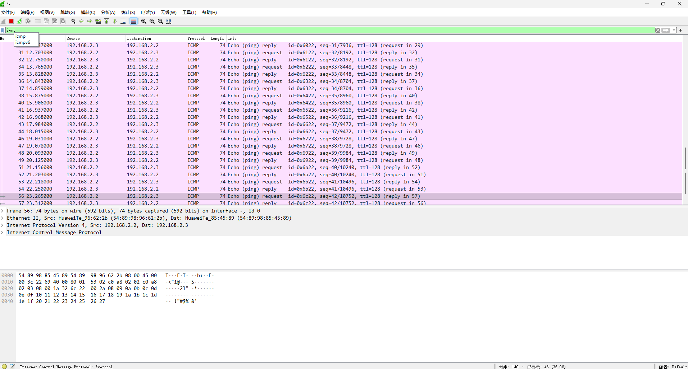
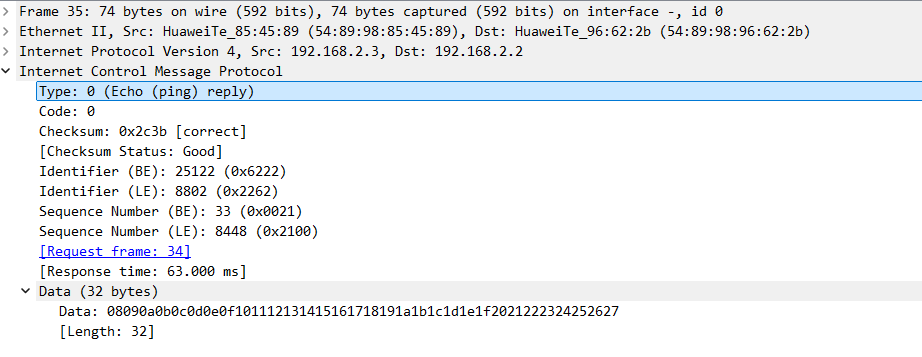
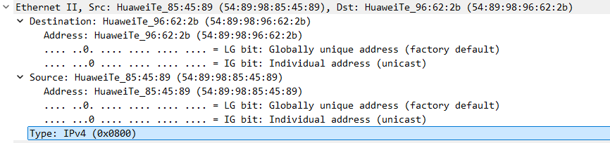
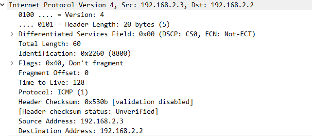
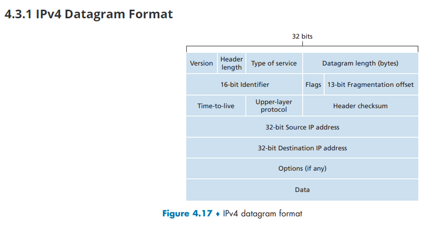
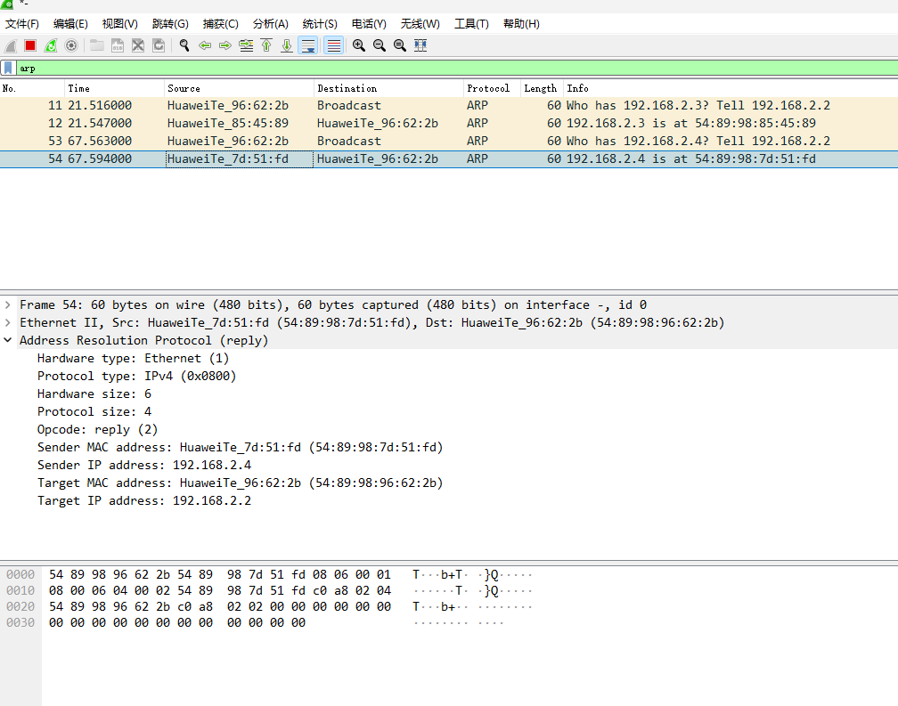
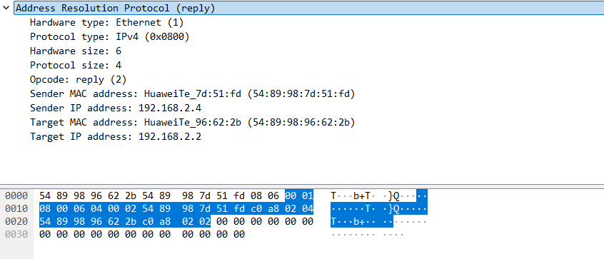

# 使用ping命令测试三台PC之间的连通性

```text
产生流量最简单的方法是使用ping命令发送ICMP报文。在命令行界面输入ping <ip address>命令，其中<ip address>设置为对端设备的IP地址。
例：测试PC1和PC2的连通性，在PC1的命令行界面输入ping  
生成的流量会在该界面的回显信息中显示，包含发送的报文和接收的报文。显示系统已经连通。如果使用ping ip address -t,表示不间断的向目的主机发送数据，使用ctrl+c结束。
```

```shell
# 启动 PC1
PC>ping 192.168.2.3

Ping 192.168.2.3: 32 data bytes, Press Ctrl_C to break
From 192.168.2.3: bytes=32 seq=1 ttl=128 time=62 ms
From 192.168.2.3: bytes=32 seq=2 ttl=128 time=63 ms
From 192.168.2.3: bytes=32 seq=3 ttl=128 time=47 ms
From 192.168.2.3: bytes=32 seq=4 ttl=128 time=62 ms
From 192.168.2.3: bytes=32 seq=5 ttl=128 time=63 ms

--- 192.168.2.3 ping statistics ---
  5 packet(s) transmitted
  5 packet(s) received
  0.00% packet loss
  round-trip min/avg/max = 47/59/63 ms

PC>ping 192.168.2.4

Ping 192.168.2.4: 32 data bytes, Press Ctrl_C to break
From 192.168.2.4: bytes=32 seq=1 ttl=128 time=63 ms
From 192.168.2.4: bytes=32 seq=2 ttl=128 time=46 ms
From 192.168.2.4: bytes=32 seq=3 ttl=128 time=63 ms
From 192.168.2.4: bytes=32 seq=4 ttl=128 time=31 ms
From 192.168.2.4: bytes=32 seq=5 ttl=128 time=47 ms

--- 192.168.2.4 ping statistics ---
  5 packet(s) transmitted
  5 packet(s) received
  0.00% packet loss
  round-trip min/avg/max = 31/50/63 ms
```

```shell
PC>ping 192.168.2.3 -t
```

# 抓包

## ICMP报文



>   [!NOTE]
>
>   思考题：
>
>   1.   ping命令使用的是那种类型的ICMP报文？请截取ICMP的报文，试分析ICMP报文格式。
>   2.   ICMP协议的网络层和数据链路层协议分别是什么？请截取网络层与数据链路层的报文，试分析各层协议数据单元的格式。

1.   ping 命令使用的是 ICMP Echo Request（类型 8） 和 ICMP Echo Reply（类型 0） 报文。
     -   Echo Request：由发送方发出，用于询问目标主机是否可达。
     -   Echo Reply：由接收方返回，表示主机可达并响应。

    
    
    1.   Frame 层（物理帧）

          -   Frame 35，74 bytes on wire
    
          -   到达时间：2025年1月1日 10:59:31.406（中国标准时间）
     2.   数据链路层：Ethernet II
    
          -   目的 MAC：HuaweiTe_96:62:2b (54:89:98:96:62:2b)
    
          -   源 MAC   ：HuaweiTe_85:45:89 (54:89:98:85:45:89)
    
          -   EtherType：0x0800 → 表示上层是 IPv4
    
          -   
     3.   网络层：Internet Protocol Version 4
    
          -   源 IP      ：192.168.2.3
    
          -   目的 IP    ：192.168.2.2
    
          -   TTL        ：128（典型 Windows/华为设备默认值）
    
          -   Protocol   ：1（ICMP）
    
          -   Identification：0x2260 (8800)
          -   
     4.   ICMP 层（核心部分）
    
          -   Type                  ：0 (Echo (ping) reply)
    
          -   Code                  ：0
    
          -   Checksum              ：0x2c3b [correct]
    
          -   Identifier (BE)       ：25122 (0x6222)   → 用于匹配同一进程的 ping
    
          -   Sequence Number (BE)  ：33 (0x0021)      → 第 33 个包
    
          -   Data (32 bytes)       ：（Windows ping 默认填充的递增字节模式）
    
          -   对应请求帧            ：Frame 34
    
          -   响应时间              ：63.000 ms
    
2.   ICMP 协议的网络层和数据链路层协议分别是什么？请分析各层协议数据单元格式

     - 网络层协议：IPv4  
         - 

     - 数据链路层协议：Ethernet II
     - > ```text
       > 0                   1                   2                   3
       > 0 1 2 3 4 5 6 7 8 9 0 1 2 3 4 5 6 7 8 9 0 1 2 3 4 5 6 7 8 9 0 1
       > +-+-+-+-+-+-+-+-+-+-+-+-+-+-+-+-+-+-+-+-+-+-+-+-+-+-+-+-+-+-+-+-+
       > |    Destination MAC (6 bytes)  |      Source MAC (6 bytes)     |
       > +-+-+-+-+-+-+-+-+-+-+-+-+-+-+-+-+-+-+-+-+-+-+-+-+-+-+-+-+-+-+-+-+
       > |          EtherType (2 bytes)  |                               |
       > +-+-+-+-+-+-+-+-+-+-+-+-+-+-+-+-+                               |
       > |                          Payload (46–1500 bytes)              |
       > +-+-+-+-+-+-+-+-+-+-+-+-+-+-+-+-+-+-+-+-+-+-+-+-+-+-+-+-+-+-+-+-+
       > |                          Frame Check Sequence (4 bytes)       |
       > +-+-+-+-+-+-+-+-+-+-+-+-+-+-+-+-+-+-+-+-+-+-+-+-+-+-+-+-+-+-+-+-+
       > ```
       > 
       > - Destination MAC：目标物理地址，如 `54:89:98:85:45:89`
       > - Source MAC：源物理地址，如 `54:89:98:96:62:2b`
       > - EtherType：标识上层协议，`0x0800` 表示 IPv4
       > - Payload：携带 IP 数据包
       > - FCS：帧校验序列（Wireshark 中一般不显示）


## ARP报文

### 操作

#### A+B

```shell
PC>arp -a

Internet Address    Physical Address    Type

PC>ping 192.168.2.3
  0.00% packet loss
  round-trip min/avg/max = 46/53/63 ms

PC>ping 192.168.2.4
  0.00% packet loss
  round-trip min/avg/max = 47/53/63 ms

PC>arp -a

Internet Address    Physical Address    Type
192.168.2.4         54-89-98-7D-51-FD   dynamic
192.168.2.3         54-89-98-85-45-89   dynamic

```

#### C



### 解读



*   **Hardware type: Ethernet (1)**
    *   硬件类型为 1，表示这是以太网。
*   **Protocol type: IPv4 (0x0800)**
    *   协议类型为 0x0800，表示要解析的地址是 IPv4 地址。
*   **Hardware size: 6**
    *   MAC 地址的长度，以太网地址为 6 字节。
*   **Protocol size: 4**
    *   IP 地址的长度，IPv4 地址为 4 字节。
*   **Opcode: reply (2)**
    *   操作码为 2，代表这是一个 ARP 回复。
*   **Sender MAC address: HuaweiTe_7d:51:fd (54:89:98:7d:51:fd)**
    *   **发送方MAC地址**：这是回复此消息的设备的物理地址。前三个字节 `54:89:98` 是 OUI，属于华为公司。
*   **Sender IP address: 192.168.2.4**
    *   **发送方IP地址**：这是回复此消息的设备的逻辑地址。
*   **Target MAC address: HuaweiTe_96:62:2b (54:89:98:96:62:2b)**
    *   **目标MAC地址**：这是最初发送ARP请求的设备的物理地址。同样属于华为设备。
*   **Target IP address: 192.168.2.2**
    *   **目标IP地址**：这是最初发送ARP请求的设备的逻辑地址。


