# Transport Layer

**Residing between the application and network layers, the transport layer is a central  piece of the layered network architecture.** 

It has the critical role of providing communication services directly to the application processes running on different hosts.  

As usual, particular emphasis will be given to Internet protocols, in particular the **TCP and UDP transport-layer protocols**.

We’ll begin by discussing the relationship between the transport and network layers. This **sets the stage** for examining the first critical function of the transport layer—extending the network layer’s delivery service between two end systems to a delivery service between two application-layer processes running on the end systems. We’ll illustrate this function in our coverage of the Internet’s connectionless transport protocol, UDP.

然后会回到两个基础的问题 : 

1.   how two entities can communicate reliably over a  medium that may lose and corrupt data.
2.   controlling the transmission rate of transport-layer entities in order to avoid, or recover from, **congestion** within the network.

## 3.1 Introduction and Transport-Layer Services

运输层协议为运行在不同主机上的应用进程提供了 **逻辑通信 logic communication** 功能 . 应用层得以"直接连接不同进程的主机"而无需考虑承载这些报文的物理基础设施的细节 .

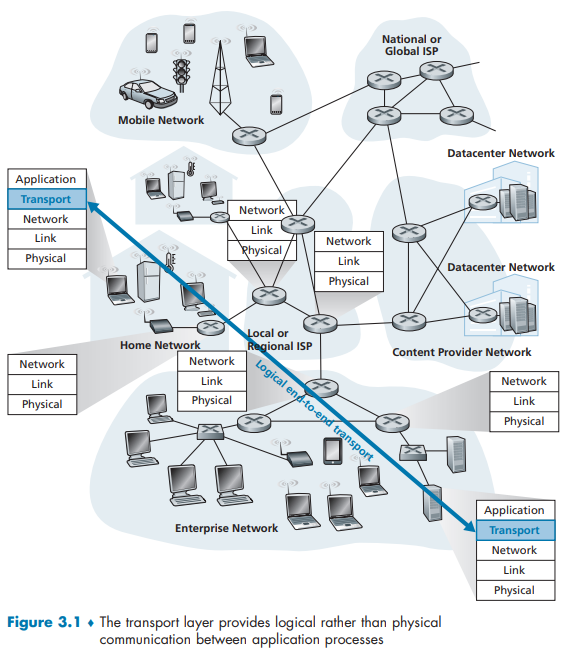

运输层协议是在端系统而不是在路由器中实现的 .

>   [!NOTE]
>
>   [原书晦涩 求助AI]
>
>   好的 , 我们来系统地概述一下计算机网络中的运输层。
>
>   ### 一、 运输层的核心作用：承上启下
>
>   我们可以把整个网络通信想象成一次送快递的过程：
>   *   **网络层(IP层)**：只负责将数据包从一个主机送到另一个主机 , 就像快递公司把包裹从一个城市的分拣中心送到另一个城市的分拣中心。它不关心包裹里是什么 , 也不关心收件人是张三还是李四。
>   *   **运输层**：负责将数据准确地送达主机上的**特定应用程序进程**。它就像公司前台的文员 , 收到快递总包后 , 根据包裹上的具体姓名(如“销售部-小王”、“技术部-小李”)将包裹分发给正确的部门和个人。**它真正实现了进程与进程之间的通信**。
>
>   **总结：网络层提供主机之间的逻辑通信 , 而运输层提供应用进程之间的逻辑通信。**
>
>   ---
>
>   ### 二、 运输层的主要功能
>
>   为了实现上述核心作用 , 运输层具备以下关键功能：
>
>   1.  **复用和分用**
>       *   **复用**：发送方不同的应用进程(如浏览器、电子邮件客户端)都可以使用同一个运输层协议来传输数据。
>       *   **分用**：接收方的运输层在剥去报文的首部后 , 能把数据正确交付给目的应用进程。
>
>   2.  **对收到的报文进行差错检测**
>       *   运输层会对报文的首部和数据部分进行校验 , 确保数据在传输过程中没有出现比特差错。这比网络层只检查IP首部的校验和要严格得多。
>
>   3.  **提供两种不同的传输协议**
>       *   这是运输层最核心的贡献。网络世界主要的两大运输层协议是 **TCP** 和 **UDP** , 它们为应用程序提供了截然不同的服务模型。
>
>   ---
>
>   ### 三、 两大核心协议：TCP vs. UDP
>
>   |     特性     | **TCP(传输控制协议)**                                        | **UDP(用户数据报协议)**                                      |
>   | :----------: | :----------------------------------------------------------- | :----------------------------------------------------------- |
>   |  **连接性**  | **面向连接的**                                               | **无连接的**                                                 |
>   |  **可靠性**  | **可靠的**。提供确认、重传机制 , 确保数据无差错、不丢失、不重复且按序到达。 | **不可靠的**。尽最大努力交付 , 但不保证数据一定能到达。      |
>   | **传输单位** | **字节流**。应用程序交付的数据被视为无结构的字节流 , TCP会自行分组。 | **报文**。应用程序交付的数据报会被完整发送 , 保留边界。      |
>   | **流量控制** | **有**。通过滑动窗口机制 , 防止发送方发送过快导致接收方缓冲区溢出。 | **无**。                                                     |
>   | **拥塞控制** | **有**。通过慢启动、拥塞避免等算法 , 降低网络拥塞风险。      | **无**。                                                     |
>   | **首部开销** | 大(通常20字节 , 另有可选项)                                  | 小(仅8字节)                                                  |
>   | **传输效率** | 慢 , 延迟高(由于建立连接、确认、重传等机制)                  | 快 , 延迟低                                                  |
>   | **典型应用** | 要求数据完整性的应用：<br> • Web浏览(HTTP/HTTPS)<br> • 电子邮件(SMTP, POP3)<br> • 文件传输(FTP)<br> • 远程登录(SSH) | 要求速度、容忍部分丢失的应用：<br> • 实时视频/语音通话<br> • 在线视频流<br> • DNS查询<br> • SNMP网络管理 |
>
>   ---
>
>   ### 四、 关键概念：端口号
>
>   运输层使用 **端口号** 来标识主机上的不同应用进程。它是一个16位的数字(0-65535)。
>
>   *   **知名端口号**：0-1023 , 分配给系统级或著名服务。如：HTTP-80, HTTPS-443, FTP-21, SSH-22。
>   *   **注册端口号**：1024-49151 , 分配给用户注册的应用程序。
>   *   **动态/私有端口号**：49152-65535 , 留给客户端程序动态使用。
>
>   **套接字**：一个通信端点由 **IP地址(网络层)** 和 **端口号(运输层)** 唯一确定 , 即 `(IP地址：端口号)`。TCP连接则由两个套接字唯一确定。
>
>   ---
>
>   ### 五、 多路复用与多路分解的工作原理
>
>   这是理解运输层如何工作的关键：
>
>   1.  **发送方(复用)**：
>       *   应用程序(如浏览器)将数据交给运输层 , 并指定目标端口(如80)。
>       *   运输层将数据封装成**段** , 并在段的首部写上源端口号和目的端口号。
>       *   然后将段交给网络层。
>
>   2.  **接收方(分用)**：
>       *   运输层从网络层收到IP数据报 , 提取出运输层段。
>       *   检查段首部中的**目的端口号**。
>       *   根据这个端口号 , 将段中的数据交付给正在监听该端口的相应应用进程(如Web服务器进程)。
>
>   ### 总结
>
>   运输层是计算机网络体系结构中的关键一层 , 它弥补了网络层服务的不足 , 为应用层提供了直接的服务。通过 **TCP** 和 **UDP** 两种协议模型 , 以及 **端口号** 和 **复用/分用** 机制 , 它实现了运行在不同主机上的应用进程之间高效、可靠(或低延迟)的通信 , 是整个互联网应用生态的基石。

网络层和运输层都会进行拆分和重新封装 :

>   [!NOTE]
>
>   好的 , 我们先来梳理一下这段文字的核心意思 , 然后解释两次封装的目的。  
>
>   ---
>
>   ## 1. 段落大意  
>   这段文字描述的是**网络分层模型中运输层和网络层的关系**以及数据封装的过程：  
>
>   1. **运输层在端系统(电脑、服务器)实现** , 不在路由器中。  
>   2. 发送端 , 运输层把从应用层收到的数据(应用报文)划分成较小的块 , 加上运输层头部 , 形成**运输层报文段(segment)**。  
>   3. 运输层把报文段交给网络层 , 网络层再加上自己的头部 , 封装成**网络层分组(数据报)**。  
>   4. 路由器只读取和处理网络层头部的信息(比如 IP 地址) , 不关心里面的运输层内容。  
>   5. 接收端 , 网络层拆掉网络层头部 , 把报文段交给运输层 , 运输层再处理并交给应用进程。  
>
>   ---
>
>   ## 2. 两次拆分与封装的目的  
>
>   ### (1)运输层的拆分与封装  
>   - **拆分原因**：应用层报文可能很大(比如一个大文件) , 直接交给网络层发送会效率低或受限于网络层最大传输单元(MTU)。  
>   - **运输层封装**：在数据块前加上运输层头部(比如 TCP 或 UDP 头部) , 包含**端口号、序列号、校验和**等 , 以便实现：  
>     - 进程到进程的交付(通过端口号区分应用程序)  
>     - 可靠性传输(TCP 的序列号、确认机制)  
>     - 流量控制、拥塞控制等  
>
>   ---
>
>   ### (2)网络层的拆分与封装  
>   - **网络层封装**：将运输层报文段当作数据 , 在前面加上网络层头部(比如 IP 头部) , 包含**源 IP 地址、目的 IP 地址**等。  
>   - **作用**：  
>     - 实现主机到主机的逻辑寻址(通过 IP 地址)  
>     - 路由选择(路由器根据 IP 头决定下一跳)  
>     - 可能的分片(如果数据包超过链路 MTU , IP 层会分片)  
>
>   ---
>
>   ## 3. 总结  
>   - **运输层封装**：为了进程间通信、可靠传输等端到端服务。  
>   - **网络层封装**：为了在不同网络间路由数据包 , 实现主机级的寻址。  
>   - 路由器只看网络层头部 , 不关心运输层内容 , 所以运输层功能只能在端系统实现。

### 3.1.1 Relationship Between Transport and Network Layers

Recall that the transport layer lies just above the network layer in the protocol  stack. 

**Whereas a transport-layer protocol provides logical communication between processes running on different hosts, a network-layer protocol provides logical communication between hosts.** This distinction is subtle but important. 

>   [!NOTE]
>
>   **以家庭为类比说明这个问题** :
>
>   考虑有两个家庭 , 一家位于美国东海岸 , 一家位于美国西海岸 , 每家有12个孩子。东海岸家庭的孩子们是西海岸家庭孩子们的堂兄弟姐妹。这两个家庭的孩子们喜欢彼此通信 , 每个人每星期要互相写一封信 , 每封信都用单独的信封通过传统的邮政服务传送。因此 , 每个家庭每星期向另一家发送144封信。
>
>   每一个家庭有个孩子负责收发邮件 , 西海岸家庭是Ann而东海岸家庭是Bill。每星期Ann去她的所有兄弟姐妹那里收集信件 , 并将这些信件交到每天到家门口来的邮政服务的邮车上。当信件到达西海岸家庭时 , Ann也负责将信件分发到她的兄弟姐妹手上。在东海岸家庭中的Bill也负责类似的工作。
>
>   在这个例子中 , 邮政服务为两个家庭间提供逻辑通信 , 邮政服务将信件从一家送往另一家 , 而不是从一个人送往另一个人。在另一方面 , Ann和Bill为堂兄弟姐妹之间提供了逻辑通信 , Ann和Bill从兄弟姐妹那里收取信件或到兄弟姐妹那里交付信件。注意到从堂兄弟姐妹们的角度来看 , Ann和Bill就是邮件服务 , 尽管他们只是端到端交付过程的一部分(即端系统部分)。在解释运输层和网络层之间的关系时 , 这个家庭的例子是一个非常好的类比。
>
>   ```
>   应用层报文         = 信封上的字符
>   进程              = 堂兄弟姐妹
>   主机(又称为端系统) = 家庭
>   运输层协议         = Ann和Bill
>   网络层协议         = 邮政服务(包括邮车)
>   ```
>
>   要点在于
>
>   1.   运输层协议只限定在系统中 对于这些报文在网络核心中如何移动完全不关心
>   2.   网络层协议 丝毫不负责家庭内部的事务
>
>   ---
>
>   使用不同的运输层协议会有不同的服务类型提供 但是他们还是无法插手网络层的事务 所以无法对网速上有保证
>
>   ---
>
>   **运输层协议的另一个重点是 : 还能提供检查分组丢失 , 篡改 , 冗余 甚至 加密 的功能**

### 3.1.2 Overview of the Transport Layer in the Internet

>   [!NOTE]
>
>   在介绍运输层之前 还需先介绍一下网络层中的IP协议 即 因特网网络层协议 .
>
>   IP的服务模型是 **尽力而为交付服务** . 它所谓的最大的努力 也是无法保证任何事情(不一定交付 不一定按顺序 不一定完整) . 所以IP被称为不可靠的服务 . 
>
>   同时 每一台主机至少有一个IP地址 也就是 网络层地址

**UDP和TCP所提供的服务模型最基本的责任就是 : 将两个端系统间的IP交互服务 / 拓展为运行在端系统上的 / 两个进程之间的 / 交互服务 .**

-   将主机间的交互服务扩展到进程间的交互服务被称为运输层的**多路复用(transport-layer multiplexing)**与**多路分解(transport-layer demultiplexing)** .
-   同时 UDP和TCP 还会提供最基础的完整性检查(通过报文首部中最低限度的运输层服务).

上面这些是UDP仅有的服务 TCP 还会提供另外的几种附加服务 :

-   提供可靠的数据传输 数据可以按照正确的顺序交付给接收进程
-   拥塞控制 这更像是一种提供给整个因特网的服务 它防止一条TCP连接占用过多流量来淹没主机之间的链路和交换设备 可以调节其流量速率

## 3.2 Multiplexing and Demultiplexing

我们首先需要明确的一点就是 应用层 会**自行选择一个套接字**并把数据推出来 但是这并不意味着你把数据给套接字它就能找到对应的进程. 每一个套接字都有唯一的**标识符** , 标识符的格式决定它是UDP套接字还是TCP套接字 . 综上所述 运输层中用到的信息就要包括 :

-   源端口号     | source port number field          | 16 bit
-   目的端口号  |destination port number field  | 16 bit
    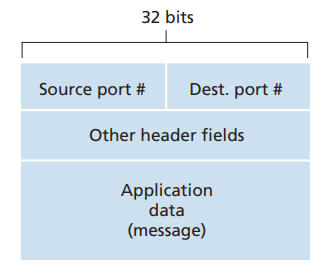

>   [!NOTE]
>
>   端口号当然是16bit的数 0-65535
>
>   0-1023 是周知端口号 是受限制的 是应用层协议本身调用 而不是应用层协议用户来使用 .

这两个概念很好理解 就是从门口分发到每个成员的过程 [这里沿用了之前所举的家庭成员分发信件的例子]

-   多路分解 : 查看收信人名字并亲手交付给成员
-   多路复用 : 从发信人手中发信件然后交给邮递员

接下来我们来看一下**多路分解**和**多路复用**实际是怎么工作的 . 

### Connectionless Multiplexing and Demultiplexing-UDP

注意到下述事实是重要的：**一个 UDP 套接字是由一个二元组标识的 , 该二元组包含一个目的 IP 地址和一个目的端口号。**

因此 , 如果两个 UDP 报文段有不同的源 IP 地址和/或源端口号 , 但具有相同的目的 IP 地址和目的端口号 , 那么这两个报文段将通过相同的目的套接字被定向到相同的目的进程。

你也许现在想知道 , **源端口号的用途**是什么呢？在 A 到 B 的报文段中 , 源端口号用作“返回地址”的一部分 , 即当 B 需要回发一个报文段给 A 时 , B 到 A 的报文段中的目的端口号便从 A 到 B 的报文段中的源端口号中取值。(完整的返回地址是 A 的 IP 地址和源端口号。)举一个例子 , 在 UDP 服务器程序中 , 服务器使用 `recvfrom()` 方法从其自客户接收到的报文段中提取出客户端(源)端口号 , 然后 , 它将所提取的源端口号作为目的端口号 , 向客户发送一个新的报文段。

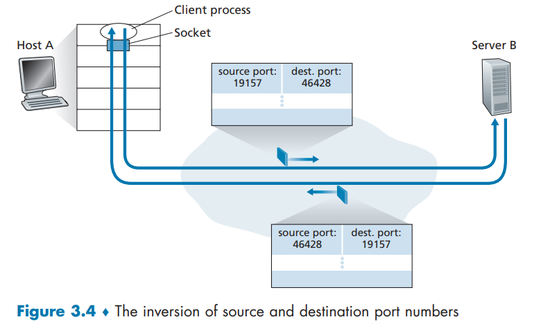

### Connection-Oriented Multiplexing and Demultiplexing-TCP

TCP 套接字是由一个四元组(源 IP 地址 , 源端口号 , 目的 IP 地址 , 目的端口号)来标识的。因此 , 当一个 TCP 报文段从网络到达一台主机时 , 该主机使用全部 4 个值来将报文段定向(分解)到相应的套接字。**特别与 UDP 不同的是 , 两个具有不同源 IP 地址或源端口号的到达 TCP 报文段将被定向到两个不同的套接字 , 除非 TCP 报文段携带了初始创建连接的请求。**

>   [!NOTE]
>
>   我们再来重新考虑 TCP 客户-服务器编程的例子：
>
>   -   TCP 服务器应用程序有一个“欢迎套接字” , 它在 12000 号端口上等待来自 TCP 客户的连接建立请求。
>   -   TCP 客户使用下面的代码创建一个套接字并发送一个连接建立请求报文段：
>       `clientSocket = socket(AF_INET, SOCK_STREAM)`
>       `clientSocket.connect((serverName, 12000))`
>   -   一条连接建立请求只不过是一个目的端口号为 12000 , TCP 首部的特定“连接建立位”置位的 TCP 报文段。这个报文段也包含一个由客户选择的源端口号。
>   -   当运行服务器进程的计算机的主机操作系统接收到具有目的端口 12000 的入连接请求报文段后 , 它就定位服务器进程、该进程正在端口号 12000 等待接受连接。该服务器进程则创建一个新的套接字：
>       `connectionSocket, addr = serverSocket.accept()`
>   -   该服务器的运输层还注意到连接请求报文段中的下列 4 个值：①该报文段中的源端口号；②源主机 IP 地址；③该报文段中的目的端口号；④自身的 IP 地址。新创建的连接套接字通过这 4 个值来标识。所有后续到达的报文段 , 如果它们的源端口号、源主机 IP 地址、目的端口号和目的 IP 地址都与这 4 个值匹配 , 则被分解到这个套接字。随着 TCP 连接完成 , 客户和服务器便可相互发送数据了。

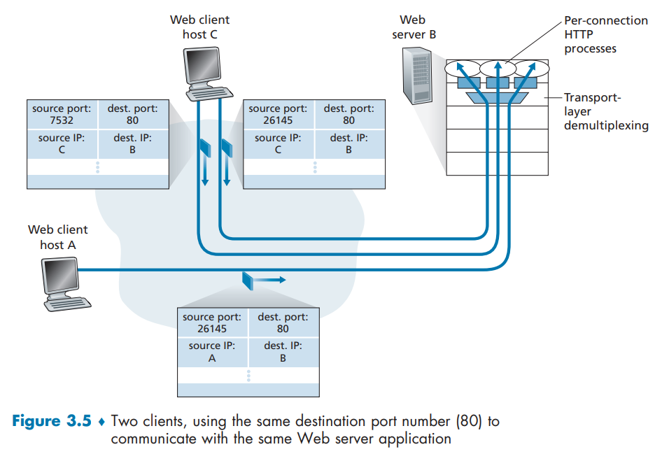

图中体现了其定向连接的特点 .

### ! Web Servers and TCP

高性能的网络服务器为了更大的承载能力会有一些变化 .

>   [!NOTE]
>
>   对于原文 来自`Gemini`
>
>   ---
>
>   **Web 服务器传输层设计概述**
>
>   根据您提供的图片内容 , Web 服务器在传输层的设计方面 , 主要涉及以下几个关键点：
>
>   ### **一、图中文本介绍的内容**
>
>   #### **1. 端口号的使用**
>
>   * **HTTP 端口号：** Web 服务器通常在 **80 端口**上运行 , 这是一个约定俗成的标准端口。
>   * **报文目标：** 客户端(如浏览器)向服务器发送报文时 , 报文的目的端口号通常为 **80**。
>   * **客户端区分：** 服务器通过 **源 IP 地址** 和 **源端口号** 来区分来自不同客户端的报文 , 从而正确地将响应发送回对应的客户端。
>
>   #### **2. 进程/连接套接字模型**
>
>   图中文本提到了两种连接处理模型：
>
>   * 模型一：每个连接一个新进程(图 3-5 所示)
>       * 工作方式： Web 服务器为每条连接创建一个**新进程**。
>       * 连接处理： 每个进程都有自己的**连接套接字** , 通过该套接字接收 HTTP 请求并发送 HTTP 响应。
>       * 局限性： 这种为每个连接创建新进程的方式 , 在处理大量并发连接时 , 可能会因为进程切换和资源消耗导致性能瓶颈。
>
>   * **模型二：高性能 Web 服务器模型(基于线程)**
>       * **工作方式：** 当今高性能的 Web 服务器通常**只使用一个进程** , 但会为每个新的客户端连接创建一个**新连接套接字的** **新线程**。
>       * **线程优势：** 线程被视为轻量级的子进程 , 相比于进程 , 线程的创建和切换开销更小 , 有助于提高并发性能。
>
>   #### **3. 持久连接与非持久连接对性能的影响**
>
>   * **持久 HTTP (Persistent HTTP)：** 客户端与服务器在**整个连接持续期间**通过**同一个服务器套接字**交换 HTTP 报文。这种方式减少了连接的创建和关闭开销。
>   * **非持久 HTTP (Non-persistent HTTP)：** 对于**每一个请求/响应** , 都会创建一个**新的 TCP 连接**并在随后关闭。
>       * **影响：** 这种频繁创建和关闭套接字连接的机制 , 会**严重影响**繁忙 Web 服务器的性能。
>
>   ---
>
>   ### **二、对不足之处的补充和拓展**
>
>   图中的内容主要介绍了进程/线程模型和 HTTP 连接类型对性能的影响。在 Web 服务器传输层设计中 , 还有以下几个重要的补充点：
>
>   #### **1. 协议基础：TCP/IP 协议栈**
>
>   * **传输层协议：** Web 服务器使用的是**传输控制协议(TCP)**。
>   * **可靠性：** TCP 提供**可靠的、面向连接的**数据传输服务。这意味着服务器和客户端在传输数据前需要进行**三次握手**建立连接 , 传输过程中 TCP 确保数据按序到达、无丢失 , 并在通信结束后进行**四次挥手**关闭连接。
>   * **拥塞控制和流量控制：** TCP 内置了拥塞控制和流量控制机制 , 这对于稳定和高效地向大量客户端提供服务至关重要。
>
>   #### **2. 连接处理模型(补充)**
>
>   除了文本中提到的**每连接一进程/线程**模型 , 现代 Web 服务器通常还会采用更高效的模型：
>
>   * **多路复用/事件驱动模型(如 Nginx、Node.js)：**
>       * **工作方式：** 仅使用**少量(甚至一个)进程/线程**。这些进程/线程通过 **I/O 多路复用技术(如 epoll, kqueue, select/poll)** 监听**成千上万个**连接套接字。
>       * **优势：** 当任何一个套接字上有数据到达或连接可写时 , 操作系统会通知工作进程/线程去处理。这种模型极大地提高了服务器的**并发能力** , 避免了为每个连接创建新线程或进程带来的开销。
>
>   * **多进程/多线程 + 线程池/进程池(如 Apache)：**
>       * **工作方式：** 服务器启动时创建**固定数量**的工作线程或进程(池)。
>       * **连接分配：** 当新连接到达时 , 连接会被分配给池中空闲的工作线程或进程进行处理。这避免了为每个请求**临时创建**资源的开销。
>
>   #### **3. 负载均衡和反向代理**
>
>   对于大型高流量的 Web 服务 , 单一服务器的处理能力是有限的。传输层设计还需要考虑：
>
>   * **负载均衡器(Load Balancer)：** 在客户端和 Web 服务器群之间 , 负载均衡器负责将传入的客户端连接**分发**到多个后端 Web 服务器上 , 从而提升系统的**整体吞吐量和可用性**。
>   * **反向代理(Reverse Proxy)：** 反向代理(如 Nginx)可以接收客户端的请求 , 并在将请求转发给后端服务器之前 , 进行如 SSL/TLS 终止、缓存、压缩等**传输层优化**操作 , 减轻后端服务器的负担。
>
>   综上所述 , Web 服务器在传输层的设计核心在于如何**高效、可靠**地管理大量的 TCP 连接。这涉及到端口的使用、可靠的 TCP 协议、优化的连接处理模型(进程/线程/事件驱动) , 以及通过持久连接和负载均衡等技术来最大化服务器的性能和并发能力。
>
>   ---
>
>   我觉得还有有些问题 可以尝试问问AI 这里篇幅所限 不想写太多
>   ```text
>   我还是不明白 也就是说个人笔记本电脑在cs模式中成为服务器 只有65536个套接字 而服务器也只有65535个 但是相当于它有很多个虚拟的套接字 实现在一个一个套接字中?
>   ```
>
>   也可以做一下`Lab` , 有相关的`Lab`

## 3.3 Connectionless Transport: UDP

在发送报文段之前 , 发送方和接收方的运输层实体之间没有握手 . UDP把来自DNS的查询报文添加首部字段 , 然后把形成的报文段交给网络层 . 人们使用UDP大概率出于一下考虑 , 这些是UDP的一些优势 :

1. **UDP与TCP的发送机制差异**：  UDP在应用层传递数据后立即发送 , 而TCP有拥塞控制机制 , 可能因重传导致延迟 , 不适合对实时性要求高的应用。

2. **连接建立差异**：  TCP需三次握手建立连接 , UDP无需连接建立 , 因此延迟更低 , 适合如DNS等对时延敏感的应用。

3. **连接状态管理**：  TCP需维护连接状态和多种参数 , UDP无连接状态 , 开销小 , 能支持更多并发客户端。

4. **首部开销对比**：  TCP报文段首部为20字节 , UDP仅为8字节 , 开销更小。

使用TCP或者UDP的一个重要考量是 : TCP 的拥塞机制 , UDP传输本身可以绕过拥塞机制 , 在某些场合下 , 拥塞机制会通过限制自己服务他人 , UDP就更加利己 , 具有更高的传输速率 . 当然一个负面作用是 : 可能导致发送方和接收方之间的高丢包率 , 并挤垮TCP会话 .

另外 , 开发者也可以在应用层实现一些TCP的功能 , 比如查错和三次握手等 , 这样也可以进行可靠通信而无需受制于拥塞机制 .

### 3.3.1 UDP Segment Structure

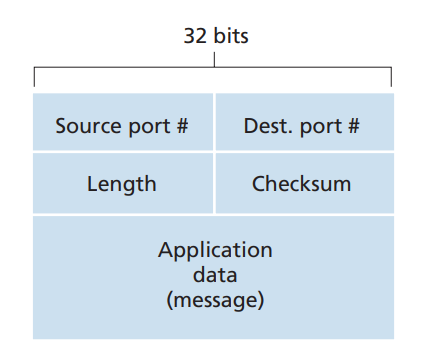

-   **结构简单**：UDP 报文段由 **8 字节首部** 和 **数据字段** 组成 , 首部仅含 4 个字段 , 每个字段 2 字节。
-   **各字段作用**：
    -   **端口号**：用于将数据交付给正确的应用进程(实现多路复用/分解)。
    -   **长度字段**：指明整个 UDP 报文段(首部 + 数据)的字节数。
    -   **校验和**：用于接收方检测传输过程中是否出错(还部分涉及 IP 首部)。
-   **数据字段**：承载应用层数据 , 如 DNS 查询/响应或音频样本。

### 3.3.2 UDP Checksum

检验和就是把UDP报文中所有的数字 每16bit都相加起来 对于进位(只能进位1) 把进位数字拿到最低位上相加 . 最后再把这个结果变成反码形式 . 

```text 
  1101  (十进制 13)
+ 1010  (十进制 10)
---------
=10111  (十进制 23)

# 回卷

= 1000

# 取反

= 0111 = checksum
```

那么在检查方 收到的数据就一定是 `1111 1111 1111 1111` , 如果有一个比特位是`0` 那么该分组就出了差错 .

很显然的 UDP也只能这样`end to end`的查错 而不能纠错 . 这里的端到端是指 在高层次之间 (两个运输层)差错 而不在网络层或者下层之中查错 .

## 3.4 Principles of Reliable Data Transfer

为了实现稳定运输 , 这不仅仅涉及到 **运输层** 还涉及到 **网络层,链路层,物理层** . 下面是我们讨论 可靠数据传输的框架 .


TCP为调用它的因特网应用所提供的服务模型就是这样一个抽象 : 数据可以通过一条可靠的信道进行传输 . 这条信道传输比特就不会受损或者丢失 , 且所有数据都能按照其发送的顺序进行交付 .

### 3.4.1 Building a Reliable Data Transfer Protocol

#### rdt1.0

我们假设有一个完全可靠的信道 那么这个模型的有限状态机中就只用包含 发送端协议 和 接收端协议 .

#### rdt2.0

在数据包可能发生比特错误 , 但不会丢失的信道上实现可靠传输。同时 , 处理确认信息ACK本身可能损坏的情况。

-   自动重传请求 `Automatic Repeat reQuest APQ` 协议

    -   **差错检测** 第五章中会系统学习差错检测技术和纠错技术
    -   **接收方反馈** 理论上 反馈分组只需要一个比特长度 即 0/1 分别表示 `NCK(negative acknowledge)` 和 `ACK(positive acknowledge)`
    -   **重传** 
-   注意 , 当发送方处于等待回应的状态时 , 不能从上层获得更多的数据；所以 , rdt2.0被称为**停等 stop-and-wait **协议。就像一个耐心细致的教师 , 每次都要确认学生完全听懂了才继续后面的教学。

#### rdt2.1 使用序号区分分组的停等机制

`rdt2.0` 的问题在于 反馈可能出错

解决这个问题的简单办法就是让发送方对其数据分组编号 , 并**在分组中添加一个序号字段**。这样接收方就可以根据分组序号来判断收到的是新的分组还是一次重传。

那么就是 :

-   接收到ACK时发送下一个分组
-   非ACK时重传 即使时ACK损坏的情况下 因为我有分组的序号 也可以分辨这个分组 同时传递新的一轮ACK/NCK

#### rdt2.2 免NCK的重传确认机制

一种改进就是 取消NCK 只保留ACK 如果收到重复的ACK当作NCK 同时在ACK中加入确认的分组序号 . 如果发送方若收到 **重复的ACK** , 会将其视作否定确认 , 从而重传当前数据包 . 

[这里找了很多人的笔记 发现大家似乎都是直接贴了这张图 结合AI解释看一下吧]

[注意 下图的 0 和 1 相当于奇偶校验 而不是自然数序列递增]

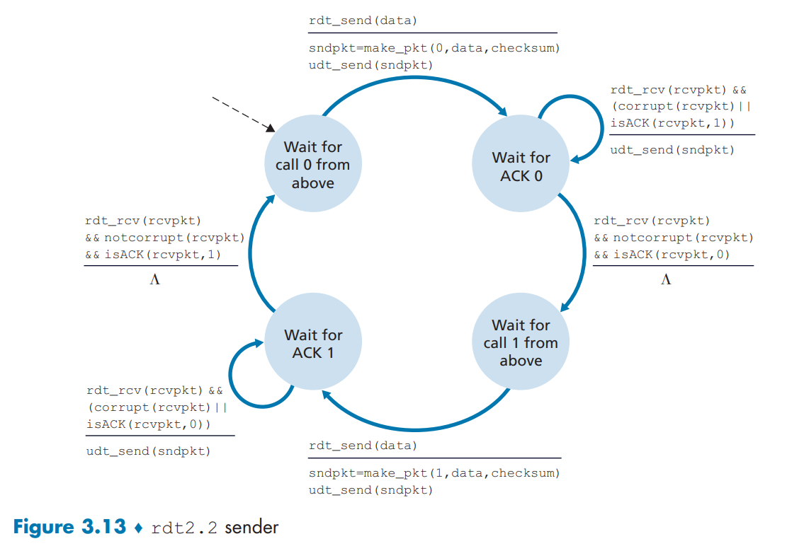

这个 FSM 描述了发送方的行为。发送方在任何时候都处于两种状态之一：**Wait for call 0 from above**(等待上层应用发送序列号为 0 的数据)或 **Wait for call 1 from above**(等待上层应用发送序列号为 1 的数据)。这两种状态交替出现 , 确保了发送方总是发送带有下一个预期序列号的数据包。

-   状态 1: Wait for call 0 from above

    -   **初始状态/事件：** 等待上层应用调用 `rdt_send(data)`。

    -   **动作：**
        1.  创建一个带有**序列号 0** 的数据包：`sndpkt = make_pkt(0, data, checksum)`。
        2.  通过不可靠的信道发送数据包：`udt_send(sndpkt)`。
        3.  **转移到状态：** **Wait for ACK 0**。

-   状态 2: Wait for ACK 0

    -   **当前目标：** 等待接收方对序列号为 0 的数据包的确认 (ACK 0)。

    -   **事件 2.1 (收到预期的 ACK 0)：**
        -   **条件：** 收到数据包 (`rdt_rcv(rcvpkt)`) 并且**没有损坏** (`&& notcorrupt(rcvpkt)`) 并且是**ACK 0** (`&& isACK(rcvpkt, 0)`)。
        -   **动作：** **$\Lambda$** (不执行任何操作 , 即成功接收确认)。
        -   **转移到状态：** **Wait for call 1 from above**。

    -   **事件 2.2 (收到损坏的 ACK 或重复的 ACK 1)：**
        -   **条件：** 收到数据包 (`rdt_rcv(rcvpkt)`) 并且**已损坏** (`&& (corrupt(rcvpkt)`) **或**是**ACK 1** (`|| isACK(rcvpkt, 1))`)。
        -   **动作：** **重发**带有序列号 0 的数据包：`udt_send(sndpkt)`。
        -   **转移到状态：** **Wait for ACK 0** (保持在当前状态)。

-   状态 3: Wait for call 1 from above

    -   **初始状态/事件：** 等待上层应用调用 `rdt_send(data)`。

    -   **动作：**
        1.  创建一个带有**序列号 1** 的数据包：`sndpkt = make_pkt(1, data, checksum)`。
        2.  通过不可靠的信道发送数据包：`udt_send(sndpkt)`。
        3.  **转移到状态：** **Wait for ACK 1**。

-   状态 4: Wait for ACK 1

    -   **当前目标：** 等待接收方对序列号为 1 的数据包的确认 (ACK 1)。

    -   **事件 4.1 (收到预期的 ACK 1)：**
        -   **条件：** 收到数据包 (`rdt_rcv(rcvpkt)`) 并且**没有损坏** (`&& notcorrupt(rcvpkt)`) 并且是**ACK 1** (`&& isACK(rcvpkt, 1)`)。
        -   **动作：** **$\Lambda$** (不执行任何操作)。
        -   **转移到状态：** **Wait for call 0 from above**。

    -   **事件 4.2 (收到损坏的 ACK 或重复的 ACK 0)：**
        -   **条件：** 收到数据包 (`rdt_rcv(rcvpkt)`) 并且**已损坏** (`&& (corrupt(rcvpkt)`) **或**是**ACK 0** (`|| isACK(rcvpkt, 0))`)。
        -   **动作：** **重发**带有序列号 1 的数据包：`udt_send(sndpkt)`。
        -   **转移到状态：** **Wait for ACK 1** (保持在当前状态)。

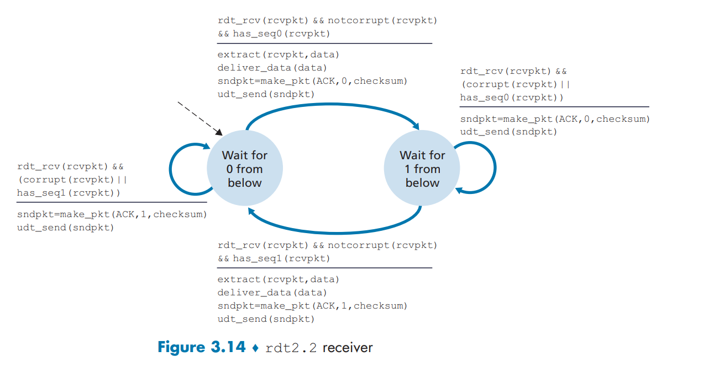

这个 FSM 描述了接收方的行为。接收方在任何时候都处于两种状态之一：**Wait for 0 from below**(等待接收序列号为 0 的数据包)或 **Wait for 1 from below**(等待接收序列号为 1 的数据包)。这两种状态确保了接收方只会接受它当前期望的序列号的数据包。

-   状态 1: Wait for 0 from below

    -   **当前目标：** 等待接收序列号为 0 的数据包。

    -   **事件 1.1 (收到预期的、正确的 seq 0 包)：**
        -   **条件：** 收到数据包 (`rdt_rcv(rcvpkt)`) 并且**没有损坏** (`&& notcorrupt(rcvpkt)`) 并且是**序列号 0** (`&& has_seq0(rcvpkt)`)。
        -   **动作：**
            1.  提取数据：`extract(rcvpkt, data)`。
            2.  向上层交付数据：`deliver_data(data)`。
            3.  创建一个带有**ACK 0**的确认包：`sndpkt = make_pkt(ACK, 0, checksum)`。
            4.  发送 ACK 0：`udt_send(sndpkt)`。
        -   **转移到状态：** **Wait for 1 from below**。

    -   **事件 1.2 (收到损坏的包或重复的 seq 1 包)：**
        -   **条件：** 收到数据包 (`rdt_rcv(rcvpkt)`) 并且**已损坏** (`&& (corrupt(rcvpkt)`) **或**是**序列号 1** (`|| has_seq1(rcvpkt))`)。
        -   **动作：**
            1.  创建一个带有**ACK 1**的确认包(这是对上一个已正确接收的包的确认)：`sndpkt = make_pkt(ACK, 1, checksum)`。
            2.  **重发** ACK 1：`udt_send(sndpkt)`。
        -   **转移到状态：** **Wait for 0 from below** (保持在当前状态)。
        -   *注意：此时接收方收到了一个重复的或损坏的包 , 所以重发上一个包的 ACK (ACK 1) , 告诉发送方它期待 seq 0。*

-   状态 2: Wait for 1 from below

    -   **当前目标：** 等待接收序列号为 1 的数据包。

    -   **事件 2.1 (收到预期的、正确的 seq 1 包)：**
        -   **条件：** 收到数据包 (`rdt_rcv(rcvpkt)`) 并且**没有损坏** (`&& notcorrupt(rcvpkt)`) 并且是**序列号 1** (`&& has_seq1(rcvpkt)`)。
        -   **动作：**
            1.  提取数据：`extract(rcvpkt, data)`。
            2.  向上层交付数据：`deliver_data(data)`。
            3.  创建一个带有**ACK 1**的确认包：`sndpkt = make_pkt(ACK, 1, checksum)`。
            4.  发送 ACK 1：`udt_send(sndpkt)`。
        -   **转移到状态：** **Wait for 0 from below**。

    -   **事件 2.2 (收到损坏的包或重复的 seq 0 包)：**
        -   **条件：** 收到数据包 (`rdt_rcv(rcvpkt)`) 并且**已损坏** (`&& (corrupt(rcvpkt)`) **或**是**序列号 0** (`|| has_seq0(rcvpkt))`)。
        -   **动作：**
            1.  创建一个带有**ACK 0**的确认包(这是对上一个已正确接收的包的确认)：`sndpkt = make_pkt(ACK, 0, checksum)`。
            2.  **重发** ACK 0：`udt_send(sndpkt)`。
        -   **转移到状态：** **Wait for 1 from below** (保持在当前状态)。
        -   *注意：此时接收方收到了一个重复的或损坏的包 , 所以重发上一个包的 ACK (ACK 0) , 告诉发送方它期待 seq 1。*

>   [!NOTE]
>
>   ### **核心机制总结**
>
>   1.  **停等 (Stop-and-Wait)：** 发送方发送一个数据包后 , 必须等待确认 , 才能发送下一个数据包。
>   2.  **1比特序列号 (1-bit Sequence Number)：** 使用序列号 0 和 1 来区分新数据包和重传数据包 , 以及新的 ACK 和重复 ACK。
>   3.  **确认机制 (ACKs)：** 接收方通过发送带有特定序列号(ACK 0 或 ACK 1)的确认包来告诉发送方它期望接收下一个哪个序列号的数据包。
>   4.  **处理损坏和重复：**
>       -   **发送方：** 如果收到**损坏的**或**不期望的(重复的)ACK , 则重发**当前数据包。
>       -   **接收方：** 如果收到**损坏的**或**不期望的(重复的)数据包 , 则重发**上一个正确接收的包的**确认 (ACK)**。这向发送方明确表示 , 它需要重传前一个数据包。

#### rdt3.0

现在的问题是 **信道不但错处 而且会丢包** 这才是最常见的情况 .

解决丢包问题的方法不止一种 [可以参考本章课后习题] 下面的方法基于 让发送方负责检测和恢复丢包工作 .

一个简单的思路是 我**等待一些时间 如果没有收到来自发送方的响应 则确定发生了丢失 , 无论丢失的是`ACK`还是数据分组本身 . 若确定丢失 则会重传这个数据 而且因为在 `2.2`中用到的标号机制 系统可以处理这些 冗余数据分组** 

那么眼下最重要的问题就是 <u>发送方需要等待多久才能确定已经丢失了数据呢 ?</u>

通常来说 会选定一个**最长时延** 考虑来回一次的最短时间加上可能遇到的可接受程度内的时延 .

从实现角度来看 发送方需要维护一个 **倒计时定时器 countdown timer** , 所谓维护 包括 1. 分发一个分组时启动一个定时器 2. 响应定时器中断指令 3. 终止定时器 .

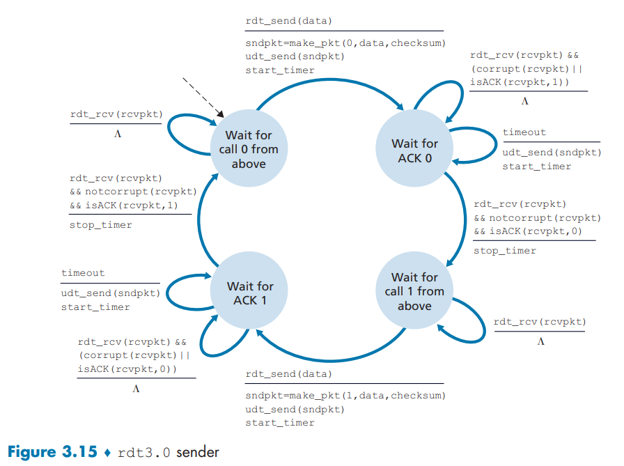

-   状态 1: Wait for call 0 from above (等待上层调用发送 Seq 0)

这是发送方的初始状态。

| **事件 (Event)**      | **条件 (Condition)** | **动作 (Action)**                                            | **下一状态 (Next State)**                 |
| --------------------- | -------------------- | ------------------------------------------------------------ | ----------------------------------------- |
| **上层调用发送**      | `rdt_send(data)`     | 1. 构造 Seq **0** 数据包：`sndpkt = make_pkt(0, data, checksum)` | **Wait for ACK 0**                        |
|                       |                      | 2. 发送数据包：`udt_send(sndpkt)`                            |                                           |
|                       |                      | 3. **启动定时器**：`start_timer`                             |                                           |
| **收到数据包 (无视)** | `rdt_rcv(rcvpkt)`    | **$\Lambda$** (空操作 , 在发送数据之前 , 收到的任何数据包都被忽略) | **Wait for call 0 from above** (保持状态) |

-   状态 2: Wait for ACK 0 (等待序列号 0 的确认)

发送方发送了 Seq 0 包后进入此状态 , 等待 ACK 0。

| **事件 (Event)**               | **条件 (Condition)**                                        | **动作 (Action)**                                | **下一状态 (Next State)**      |
| ------------------------------ | ----------------------------------------------------------- | ------------------------------------------------ | ------------------------------ |
| **成功收到 ACK 0**             | `rdt_rcv(rcvpkt) && notcorrupt(rcvpkt) && isACK(rcvpkt, 0)` | **停止定时器**：`stop_timer`                     | **Wait for call 1 from above** |
| **超时**                       | `timeout`                                                   | 1. **重发** Seq **0** 数据包：`udt_send(sndpkt)` | **Wait for ACK 0** (保持状态)  |
|                                |                                                             | 2. **重启定时器**：`start_timer`                 |                                |
| **收到损坏的包或重复的 ACK 1** | `rdt_rcv(rcvpkt) && (corrupt(rcvpkt)`                       |                                                  | `isACK(rcvpkt, 1))`            |

-   状态 3: Wait for call 1 from above (等待上层调用发送 Seq 1)

在成功发送 Seq 0 并收到 ACK 0 后 , 发送方进入此状态。

| **事件 (Event)**      | **条件 (Condition)** | **动作 (Action)**                                            | **下一状态 (Next State)**                 |
| --------------------- | -------------------- | ------------------------------------------------------------ | ----------------------------------------- |
| **上层调用发送**      | `rdt_send(data)`     | 1. 构造 Seq **1** 数据包：`sndpkt = make_pkt(1, data, checksum)` | **Wait for ACK 1**                        |
|                       |                      | 2. 发送数据包：`udt_send(sndpkt)`                            |                                           |
|                       |                      | 3. **启动定时器**：`start_timer`                             |                                           |
| **收到数据包 (无视)** | `rdt_rcv(rcvpkt)`    | **$\Lambda$** (空操作)                                       | **Wait for call 1 from above** (保持状态) |

-   状态 4: Wait for ACK 1 (等待序列号 1 的确认)

发送方发送了 Seq 1 包后进入此状态 , 等待 ACK 1。

| **事件 (Event)**               | **条件 (Condition)**                                        | **动作 (Action)**                                | **下一状态 (Next State)**      |
| ------------------------------ | ----------------------------------------------------------- | ------------------------------------------------ | ------------------------------ |
| **成功收到 ACK 1**             | `rdt_rcv(rcvpkt) && notcorrupt(rcvpkt) && isACK(rcvpkt, 1)` | **停止定时器**：`stop_timer`                     | **Wait for call 0 from above** |
| **超时**                       | `timeout`                                                   | 1. **重发** Seq **1** 数据包：`udt_send(sndpkt)` | **Wait for ACK 1** (保持状态)  |
|                                |                                                             | 2. **重启定时器**：`start_timer`                 |                                |
| **收到损坏的包或重复的 ACK 0** | `rdt_rcv(rcvpkt) && (corrupt(rcvpkt)`                       |                                                  | `isACK(rcvpkt, 0))`            |

因为分组序号在`0`和`1`之间交换 , 所以 `rdt3.0` 也被称为比特交换协议 .

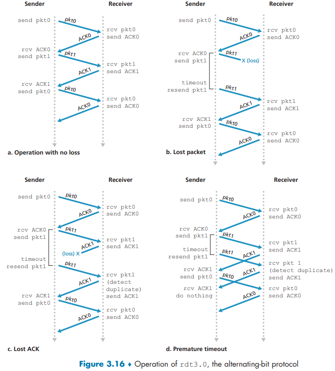

### 3.4.2 Pipelined Reliable Data Transfer Protocols

`rdt3.0`功能上正确 但是其性能并不高 因为它是一个 **停等协议** .

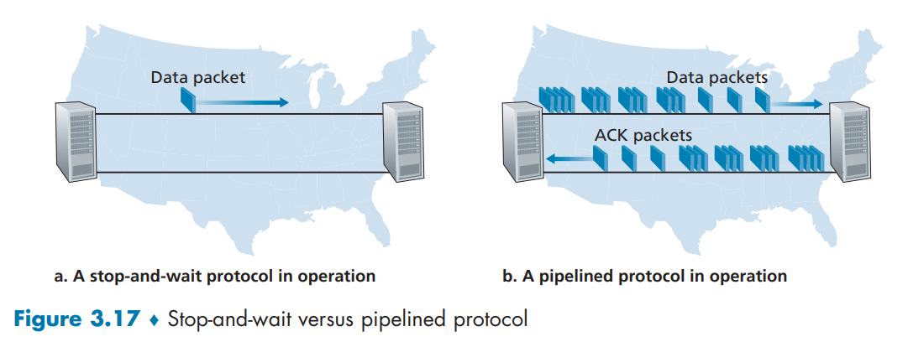

图中展示了停等协议和流水线协议的效率差距 下面的计算证明了 停等协议的效率之低下 .

>   [!NOTE]
>
>   **场景假设：**
>
>   -   **主机位置：** 美国西海岸到东海岸。
>   -   **信道带宽 ($R$)：** $1 \text{ Gbps}$ ($10^9 \text{ bits/sec}$)。
>   -   **数据包大小 ($L$)：** $1,000 \text{ bytes}$ ($8,000 \text{ bits}$)。
>   -   **往返传播延迟 ($\text{RTT}$):** $30 \text{ milliseconds}$ ($0.030 \text{ seconds}$)。
>   -   **ACK 包大小：** 极小 , 忽略其传输时间。
>
>   **核心计算与公式：**
>
>   1.  数据包传输延迟 ($\mathbf{d_{\text{trans}}}$): 将整个数据包推入信道所需的时间。
>
>       $$d_{\text{trans}} = \frac{L}{R} = \frac{8000 \text{ bits}}{10^9 \text{ bits/sec}} = 0.000008 \text{ seconds} = 8 \text{ microseconds} \text{ (ms)}$$
>
>   2.  发送周期 ($\mathbf{RTT + L/R}$): 发送方发送一个数据包并收到其确认 ($\text{ACK}$) 所需的总时间。这是发送方必须等待的时间。
>
>       $$\text{发送周期} = \text{RTT} + d_{\text{trans}} = 30 \text{ ms} + 0.008 \text{ ms} = 30.008 \text{ ms}$$
>
>   3.  发送方利用率 ($\mathbf{U_{\text{sender}}}$): 发送方实际忙于发送数据的时间占总等待周期的比例。
>
>       $$U_{\text{sender}} = \frac{\text{发送数据的时间}}{\text{发送周期}} = \frac{L/R}{\text{RTT} + L/R}$$
>
>   4.  最终计算结果：
>
>       $$U_{\text{sender}} = \frac{0.008 \text{ ms}}{30.008 \text{ ms}} \approx 0.00027$$
>
>   **结论：**
>
>   发送方利用率仅为 **$0.027\%$**。这表明在发送周期内 , 发送方有 **$99.973\%$** 的时间处于空闲等待状态 , 信道资源被严重浪费。因此 , **停等协议在长距离高速网络中效率极其低下**。

优化思路如下 : 不以等停方式运行 允许发送方发送多个分组而无需等待确认 . 比如 在等待确认之前发送3个报文 其利用率基本上也提高3倍 . 即 **pipelining** .

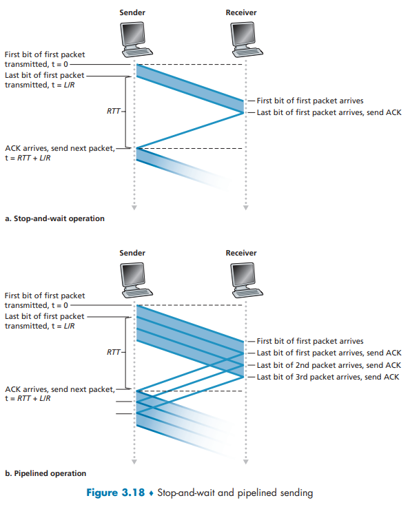

此时 带来的`consequence`有如下三个 :

1.   **必须增加序号范围** , 因为每个输送中的分组(不计算重传的)必须有一个唯一的序号 , 而且也许有多个在输送中的未确认报文。
2.   协议的发送方和接收方两端也许不得不**缓存多个分组**。
     -   <u>发送方最低限度应当能缓冲那些已发送但没有确认的分组</u>。
     -   <u>接收方或许也需要缓存那些已正确接收的分组</u>。
3.   所需序号范围和对缓冲的要求取决于数据传输协议如何处理丢失、损坏及延时过大的分组。
     -   解决流水线的差错恢复有两种基本方法是：回退N步(Go-Back-N , GBN)和选择重传(Selective Repeat , SR)。

### 3.4.3 Go-Back-N (GBN)

[这里推荐查看本书配套的GNB Java小程序] GBN也称为 **滑动窗口协议** .

核心思想 : 发送方可以连续发送多个数据帧而无需等待每个帧的确认 , 但其发送的帧序号是有限制的(由窗口大小$N$决定)。

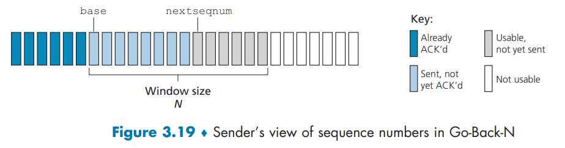

从图中可以看出来 确实是一个长度为$N$的滑动窗口 .

主要特点 :  

-   发送窗口 (Sender Window)：大小为 $N$(可以大于1)。窗口内是允许发送但尚未收到确认的帧。
-   接收窗口 (Receiver Window)：大小**固定为1**。接收方只接受期望的那个序号的帧。
-   **确认机制**：通常采用**累积确认 (Cumulative Acknowledgment)**。一个确认号 (ACK) $n$ 表示接收方已经成功收到了序号直到 $n-1$ 的所有帧。
-   **重传机制**：如果发送方超时或收到一个对某个帧的否定确认 (NAK) , 它会**重传该帧及其之后所有已发送但未被确认的帧**(即“回退N步”)。

优点 :

-   实现简单。
-   信道利用率比停止-等待协议高。

缺点 : 

-   **效率较低**：当一个帧丢失或出错时 , 会导致其后所有正确到达的帧也需要被重传 , 即使它们已经被正确接收。

### 3.4.4 Selective Repeat (SR)

核心思想 : 

发送方可以连续发送多个数据帧。接收方可以缓存**失序到达**的正确帧 , 只要求发送方**重传丢失或出错的那个特定帧**。

_sender_and_receiver_views .png)

主要特点 :

-   发送窗口 (Sender Window)：大小为 $N$(可以大于1)。
-   接收窗口 (Receiver Window)：大小**也为 $N$**(可以大于1)。接收方用这个窗口来缓存失序到达的帧。
-   **确认机制**：**对每个正确收到的帧单独确认**。一个确认号只确认一个帧。接收方会发送一个肯定的确认 (ACK) 来确认正确收到的帧 , 并使用选择性否定确认 (SNAK) 或选择性拒绝 (SREJ) 来要求重传特定的帧。
-   **重传机制**：发送方只重传**发送窗口内被认为丢失或出错的那个帧**。

优点 :

-   **信道利用率高**：只重传丢失或出错的帧 , 避免了不必要的重传 , 效率更高

缺点 :

-   **实现复杂**：发送方和接收方都需要复杂的逻辑来管理窗口和缓存失序的帧。
-   **接收方需要缓存空间**：用于存放失序到达的帧 , 直到它们前面的帧到达并可以按序交付给上层。

>   [!NOTE]
>
>   ### GBN 与 SR 的对比总结
>
>   | **特征**             | **回退N步 (GBN)**                      | **选择重传 (SR)**            |
>   | -------------------- | -------------------------------------- | ---------------------------- |
>   | **发送窗口**         | 大小为 $N$                             | 大小为 $N$                   |
>   | **接收窗口**         | **大小固定为 1**                       | **大小为 $N$**               |
>   | **接收方缓存失序帧** | **否** (直接丢弃 , 等待重传)           | **是** (缓存失序帧)          |
>   | **确认机制**         | 累积确认 (ACK $n$ 确认 $n-1$ 之前所有) | 单独确认 (ACK 仅确认一个帧)  |
>   | **重传范围**         | **丢失帧及其之后所有已发送帧**         | **只重传丢失或出错的特定帧** |
>   | **效率**             | 相对较低                               | 相对较高 (信道利用率高)      |
>   | **复杂度**           | 简单                                   | 复杂                         |
>
>   ### 关于窗口大小的约束
>
>   为了防止序号空间混淆 , 保证可靠传输 , 对于一个有 $K$ 个比特的序号空间(即序号范围为 $[0, 2^K - 1]$)：
>
>   -   **GBN 协议**：发送窗口最大为 **$2^K - 1$** , 接收窗口为 1。
>   -   **SR 协议**：发送窗口 $N_{send}$ 和接收窗口 $N_{recv}$ 都必须满足 **$N_{send} + N_{recv} \le 2^K$** , 且为了最大化利用率 , 通常取 **$N_{send} = N_{recv} = 2^{K-1}$**。
>
>   ---
>
>   **这里写的不全 建议自行阅读原书 3.4.3 和 3.4.4 两节**

## 3.5 Connection-Oriented Transport: TCP

### 3.5.1 The TCP Connection

`TCP`连接被称为是 **面向连接的connection-oriented** 这个说法等价于 在一个应用进程正式向另一个应用进程发送数据之前 两个进程必须先相互 **握手** , 即相互发送某些预备报文段 以**确定**后续数据传输的参数 .

所谓确定 就是说要**初始化** 或者类似java中变量的声明 **与这次TCP连接相关联的许多TCP状态变量** .

>   [!NOTE]
>
>   这里原文使用词汇 `establish` 参考英文翻译 
>
>   -   to cause something or someone to be accepted in or familiar with a place, position, etc.
>   -   使得到承认;使被接受

The TCP “connection” is not an end-to-end TDM or FDM circuit as in a circuit-switched network. Instead, the “connection” is a logical one, with common state residing only in the TCPs in the two communicating end systems. Recall that because the TCP protocol runs only in the end systems and not in the intermediate network elements (routers and link-layer switches), the intermediate network elements do not maintain TCP connection state. In fact, the intermediate routers are completely oblivious to TCP connections; they see datagrams, not connections.

TCP连接并不是指之前提到过的时分复用或者频分复用网络**电路交换网络** , 相反 , 它只是一种逻辑上的抽象概念 . **一个重点是 TCP只运行再端系统上而不经过任何中间网络元素  the intermediate network elements (routers and link-layer switches) , 这些中间网络元素完全不知道什么是TCP连接 他们只看到到 数据报 datagram .**

TCP服务的两个特点是 : **1. 全双工 2. 点对点** . 后者指的是 只能有一个发送方和一个接收方 . 

>   [!NOTE]
>
>   有一种特殊情况叫做 多播  multicasting
>
>   ---
>
>   好的 , 我们来详细介绍一下**多播(Multicasting)** 这个概念。
>
>   首先 , 需要明确一个关键点：**多播通常不使用TCP , 而是使用UDP**。这是一个非常重要的区别 , 我们会在下面详细解释。
>
>   ---
>
>   ### 1. 什么是多播？
>
>   多播是一种网络通信模式 , 它允许**一个发送者(或少数几个发送者)向一组特定的接收者(一个“组”)同时发送单一的数据流**。
>
>   可以把它想象成一个**网络世界的“电视广播”或“网络直播”**：
>   *   **单播(Unicast)**： 你给每一个想看电视的朋友单独打一个电话 , 为他们每一个人单独描述电视节目内容。效率极低 , 浪费带宽。
>   *   **广播(Broadcast)**： 你在小区里用大喇叭喊 , 所有人都能听到 , 不管他们想不想听。会干扰到无关的人 , 且通常无法跨越路由器(出于安全和效率考虑)。
>   *   **多播(Multicast)**： 你开了一个专属的电视频道 , 只有那些主动调到这个频道的朋友才能看到你的节目。网络只会在有必要的地方复制数据包 , 效率最高。
>
>   ### 2. 多播的核心特点
>
>   1.  **一对多或多对多**： 一个数据包可以被多个接收者同时接收。
>   2.  **组成员制**： 接收者需要**主动加入**一个特定的多播组才能收到数据。这个组由一个特殊的IP地址标识 , 即**多播IP地址**。
>   3.  **网络效率高**： 数据包在网络中只在分支点(如路由器)被复制 , 而不是从源端就发送多个副本。这极大地节省了带宽和发送者的处理资源。
>   4.  **使用UDP**： 多播建立在无连接的UDP协议之上 , 这意味着它不提供TCP那样的可靠性保证(如丢包重传、顺序交付)。
>
>   ### 3. 为什么多播不使用TCP？
>
>   这是理解多播的关键。TCP的核心特性与多播的设计目标是根本冲突的：
>
>   *   **TCP是面向连接的(一对一)**： TCP需要在两个端点(一个发送方和一个接收方)之间建立一条独占的、可靠的连接。多播是一对多 , 无法在单一发送者和多个动态变化的接收者之间建立这种“连接”。
>   *   **TCP的可靠性机制不适用于多播**：
>       *   **确认应答(ACK)**： 如果成百上千个接收者都对每个数据包发送ACK确认 , 会造成“ACK风暴” , 瞬间淹没发送者。
>       *   **重传(Retransmission)**： 如果其中一个接收者丢包 , 发送者需要重传。但这个重传的数据包对于其他已经成功接收的接收者来说是多余的 , 浪费带宽。
>       *   **流量控制和拥塞控制**： TCP的滑动窗口和拥塞控制是基于单个连接的。在多播中 , 每个接收者的网络状况不同 , 无法统一管理。
>
>   **结论：多播为了追求效率和一对多的能力 , 牺牲了TCP的可靠性。** 如果需要可靠性 , 必须在应用层自己实现。
>
>   ---
>
>   ### 4. 多播的技术细节
>
>   #### 多播IP地址
>   多播使用特定的IP地址范围：
>   *   **IPv4**： `224.0.0.0` 到 `239.255.255.255`(例如 , `224.0.0.1` 代表所有主机 , `224.0.0.2` 代表所有路由器)。
>   *   **IPv6**： 以 `FF00::/8` 开头的地址。
>
>   应用程序需要将Socket绑定到一个多播IP地址和端口号上。
>
>   #### MAC地址映射(IPv4)
>   在局域网中 , 多播IP地址需要映射到链路层的MAC地址上。
>   *   规则是取多播IP地址的低23位 , 放入一个特殊的OUI(组织唯一标识符)`01:00:5E` 的后23位。
>   *   例如 , IP地址 `224.0.1.1` 会映射到MAC地址 `01:00:5E:00:01:01`。
>
>   #### 组管理协议(IGMP)
>   为了告诉本地路由器“我想加入某个多播组” , 接收主机会使用**IGMP**协议。路由器通过监听IGMP消息 , 知道哪个局域网段上有哪个多播组的成员 , 从而决定是否需要将多播流量转发到该网段。
>
>   #### 多播路由协议
>   要在不同的网络之间(跨越多个路由器)传输多播流量 , 路由器之间需要使用多播路由协议 , 如 **PIM-SM**。这些协议负责在多播源和所有接收者之间建立一棵最优的“分发树”。
>
>   ---
>
>   ### 5. 多播的工作流程
>
>   1.  **接收者加入组**： 接收方应用程序通过Socket API发出“加入组”的请求 , 主机向本地路由器发送IGMP报告。
>   2.  **发送者发送数据**： 发送方将数据包发送到一个多播地址(如 `239.255.10.10:5000`)。
>   3.  **网络分发**：
>       *   本地路由器收到数据包 , 查询IGMP表 , 发现哪些接口有该组的成员 , 然后将数据包转发到那些接口。
>       *   在更大的网络中 , 多播路由器使用多播路由协议协作 , 确保数据包沿着分发树传递到所有有成员的网络中。
>   4.  **接收者接收数据**： 所有加入了该组(`239.255.10.10`)并监听端口5000的应用程序都会收到这个数据包。
>   5.  **接收者离开组**： 当接收者不再想接收时 , 发送IGMP离开消息 , 路由器会停止向该网段转发该组的流量。
>
>   ---
>
>   ### 6. 应用场景
>
>   多播非常适合那些**一个源点 , 大量接收者 , 且对实时性要求高于可靠性**的场景。
>
>   *   **音视频直播**： IPTV、网络视频会议、网络课堂。
>   *   **金融数据分发**： 股票、汇率等实时行情推送。
>   *   **服务发现**： 在局域网内 , 设备通过多播来宣告自己的服务或寻找其他服务。
>   *   **在线游戏**： 一些实时对战游戏用多播来同步所有玩家的状态。
>   *   **软件分发**： 同时向大量客户端推送更新。
>
>   ---
>
>   ### 总结
>
>   | 特性         | 多播(Multicast)                   |
>   | :----------- | :-------------------------------- |
>   | **通信模式** | 一对多 / 多对多                   |
>   | **核心协议** | **UDP**                           |
>   | **可靠性**   | 不可靠(无重传、无确认)            |
>   | **效率**     | **非常高** , 节省带宽和服务器资源 |
>   | **地址**     | 特殊的D类IP地址(如 `224.0.0.0/4`) |
>   | **关键机制** | 组管理(IGMP)、多播路由(PIM)       |
>   | **比喻**     | 电视广播、网络直播                |
>
>   简单来说 , 多播是一种为了**大规模、高效率的数据分发**而设计的网络技术 , 它通过牺牲TCP的可靠性 , 换取了无与伦比的扩展性和效率。

有些内容后面会再介绍 现在我们需要知道以下内容 : 在一次TCP连接中

1.   客户先发送一个特殊的TCP报文段 
2.   服务器用一个特殊的TCP报文段来响应
3.   客户再用第三个特殊报文段作为响应

前两个 不承载有效载荷 也就是不包含应用层数据 而第三个报文才可以承载有效载荷 这就是 **三次握手 three-way handshake** .

**下面详细讲一下 相互传输过程的部分 考虑客户进程向服务器进程发送数据的情况** .

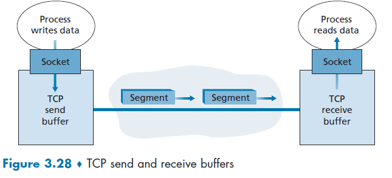

一旦数据通过套接字 它就有客户进程中运行的TCP控制了 . 所谓控制 就是说TCP会将这些数据引导到**发送缓存send buffer**里面 这个缓存是用来发起三次握手的缓存之一 , TCP就会**时不时**地从发送缓存中取出一块数据并将它传到网络层 . 这个"时不时"并没有在规范中明确 , 只是描述为 "在方便的时候发送数据" . 然后就是封装成报文段 + 传递给网络层 .

- **TCP 报文段封装**：
    - 从发送缓存中取出数据块。
    - 加上 TCP 首部 , 形成 TCP 报文段。
    - 受 **MSS(最大报文段长度)** 限制 , 通常为 1460 字节(基于以太网 MTU=1500 字节)。
    - **注意MSS是指不包括首部的报文段长度 也就是纯 应用层数据的的最大长度 .**
- **传递给网络层**：
    - 封装成 IP 数据报。
    - 发送到网络中。

然后在服务器侧(接收进程) :

- **接收缓存(Receive Buffer)**：TCP 接收到报文段后 , 数据被放入接收缓存。
- **应用进程**：从接收缓存中读取数据流。

可以看到 以上所有过程**只涉及** 一台主机上的缓存、变量和与进程连接的套接字 , 以及另一台主机上的另一组缓存、变量和与进程连接的套接字。**路由器 , 交换机 , 中继站 和 TCP 完全没关系 .**

---

### 3.5.2 TCP Segment Structure

由于TCP的首部一般是20 字节(比UDP 首部多12 字节) , 所以像Telnet这样的进程发送的报文段也许只有21字节长。

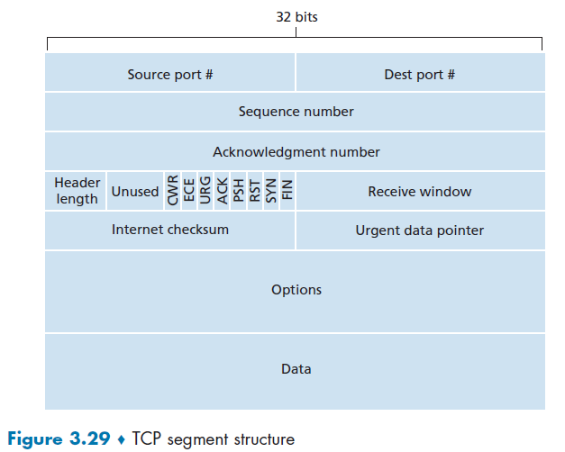

图3.29展示了TCP报文段的结构。与UDP类似 , 其头部包含源端口号和目的端口号 , 用于向上层应用进行数据的多路复用/解复用。同样与UDP类似的是 , 头部还包含一个校验和字段。TCP报文段头部还包含以下字段(后面有更详细的介绍)：

-   32位**序列号字段(Sequence number**)和32位**确认号字段(Acknowledgment number)**由TCP发送方和接收方用于实现可靠数据传输服务 , 如下文所述。
-   16位**接收窗口字段(receive window field )**用于流量控制。我们稍后将看到 , 它用于指示接收方愿意接受的字节数。
-   4位**头部长度字段(header length field)**指明了TCP头部以32位字为单位的长度。
    -   这里指的是还包含了Options字段的长度 .
-   由于**TCP选项字段(Options)**的存在 , TCP头部长度是可变的 . (通常 , 选项字段为空 , 因此典型TCP头部的长度为20字节 . )可选且长度可变的选项字段在发送方和接收方协商最大报文段大小(MSS)时 , 或在高速网络中用作窗口缩放因子时使用。还定义了一个时间戳选项。
-   **标志字段(flag field)**包含6位
    -   ACK位用于指示确认字段中携带的值是有效的；即该报文段包含了对已成功接收报文段的确认。
    -   RST位 , SYN 和 FIN 位用于连接的建立和拆除 , 我们将在本节的末尾讨论这一点。
    -   CWR 和 ECE 位用于显式拥塞通知 , 如 3.7.2 节所述。
    -   设置 **PSH** 位表示接收方应立即将数据传递给上层。
    -   最后 , **URG** 位用于指示该报文段中存在发送端上层实体标记为"紧急"的数据。此紧急数据的最后一个字节的位置由 16 位的 **紧急数据指针字段** 指明。当存在紧急数据时 , TCP 必须通知接收端的上层实体 , 并向其传递一个指向紧急数据结束位置的指针。(实际上 , PSH、URG 和紧急数据指针字段并未被使用。但为了完整性 , 我们仍提及这些字段。

#### Sequence Numbers and Acknowledgment Numbers

首部中最重要的两个字段就是 **序号字段** 和 **确认号字段** 了 .

##### sequence number / 序号字段

发送主机的TCP会隐式地对数据流中的每一个字段编号 , 从 0 开始 . 为了便于理解 , 我们这里假设从 0 开始 , 但是实际上 , TCP连接的双方会随机的选取一个初始序号 , 这样做的原因是 , 不这样的话 , 一些已经终止连接的报文可能被误认为是新产生的报文段 . 随机选择初始报文段可以减小这种事情发生的概率 . 

-   一个报文段的序号 **sequence number** of a segment , 就是该报文段首字节的字节流编号 .

-   主机A填充进报文段的 **确认号** 是主机A期望从主机B收到的下一字节的序号 . 它面对的场景是 TCP 连接是全双工的 你发送数据的同时也可能接收数据 .

    -   假设主机A已从B接收到编号为0至535的所有字节 , 并且即将向主机B发送一个报文段。主机A正在等待B数据流中的字节536及所有后续字节。因此 , 主机A在发送给B的报文段的确认号字段中填入`535+1=536`。
    -   再举一例 , 假设主机A已从主机B接收到一个包含字节0至535的报文段 , 以及另一个包含字节900至1000的报文段。由于某种原因 , 主机A尚未收到字节536至899。在此例中 , 主机A仍为重构B的数据流而等待字节536(及后续字节)。因此 , A发送给B的下一个报文段将在确认号字段中包含536。由于TCP只对数据流中第一个丢失字节之前的字节进行确认 , 因此TCP被称为提供**累积确认**。

-   这最后一个例子也引出了一个重要却微妙的问题。主机A在接收到第二个报文段(字节536至899)之前 , 就先收到了第三个报文段(字节900至1000)。也就是说 , 第三个报文段是失序到达的。

    这个微妙的问题在于：在TCP连接中 , 当主机接收到失序的报文段时 , 应作何处理？有趣的是 , TCP的RFC规范并未在此强制规定任何规则 , 而是将决定权留给了实现TCP的程序员。

    基本上有两种选择：(1)接收方立即丢弃失序的报文段(正如我们之前讨论过的 , 这可以简化接收方设计)；或者(2)**接收方保留失序的字节 , 并等待缺失的字节来填补间隙。**显然 , 后者在网络带宽利用方面更为高效 , 也是实际采用的方法。这也与第二个例子中的情况保持一致 , 也就是说保留了`900-1000`的报文段 .

##### Telnet: A Case Study for Sequence and Acknowledgment Numbers

 pass ;

### 3.5.3 Round-Trip Time Estimation and Timeout

TCP 如同前面 3.4 节所讲的 `rdt` 协议一样  , 它采用超时／重传机制来处理报文段的丢失问题 . 当然这里会复杂很多 详细讨论见下 :

TCP会在某一个时刻取样 得到一个 `SampleRTT` 这次取样会忽略曾经重传过的数据包 . 此后(第一次之后) , 会利用下面的公式得到 `EstimatedRTT` :
$$
\begin{aligned}
\text{EstimatedRTT}_n &= (1 - \alpha) \cdot \text{EstimatedRTT}_{n-1} + \alpha \cdot \text{SampleRTT}_n \\
&= (1-\alpha)^n \cdot \text{EstimatedRTT}_0 + \alpha \sum_{i=1}^{n} (1-\alpha)^{n-i} \cdot \text{SampleRTT}_i
\end{aligned}
$$
 通常来说 $\alpha$ 的推荐值是 `0.125` . 在统计学上这个数学模型被称为是 **指数加权移动平均(Exponential Weighted Moving Average , EWMA)** .

下图是显示了当 $ \alpha = \frac{1}{8} $ 时 , 在 `gaia. cs. umass. edu` (在美国马萨诸塞州的 `Amherst` ) 与 `fantasia. eurecom. fr` (在法国南部) 之间的一条 TCP 连接上的 `SampleRTT` 值与 `EstimatedRTT` 值。显然 , `SampleRTT` 的变化在 `EstimatedRTT`的计算中趋于平缓了 .

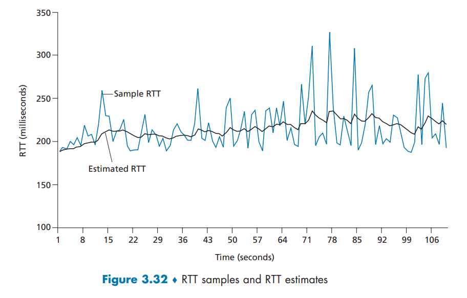

类似的 , 我们还定义了 RTT 的变化值 `DevRTT` 用来表示 `RTT` 的变化 . `[RFC6298]` 给出了定义 .

$$
\begin{aligned}
\text{DevRTT}_n &= (1 - \beta) \cdot \text{DevRTT}_{n-1} + \beta \cdot |\text{SampleRTT}_n - \text{EstimatedRTT}_n| \\
&= (1-\beta)^n \cdot \text{DevRTT}_0 + \beta \sum_{i=1}^{n} (1-\beta)^{n-i} \cdot |\text{SampleRTT}_i - \text{EstimatedRTT}_i|
\end{aligned}
$$

如果`SampleRTT`值波动较小 , 那么`DevRTT`的值就会很小；另一方面 , 如果波动很大 , 那么`DevRTT`的值就会很大。$\beta$的推荐值为 0.25 

综上 我们可以到 最后的 `Timeoutlnterval` 经验公式:
$$
Timeoutlnterval = EstimatedRTT + 4 \times DevRTT
$$
 `Timeoutlnterval` 的初始值通常设定为 `1s` .同时 , 如果没有更新 `EstimatedRTT` 并且出现一次超时 , 则扩大一倍 `Timeoutlnterval`  , 避免即将接收到的报文被重传 ; 如果更新了 `EstimatedRTT`  , 则直接更新 `Timeoutlnterval` .

### 3.5.4 Reliable Data Transfer

TCP协议在IP协议的基础上创建了一种 **可靠数据传输服务** . 为了方便讨论 , 我们仅假设主机A向主机B发送一个大文件 , 这一个基础的情况 .

我们看到 , 在TCP发送端有三个与数据传输和重传相关的主要事件：从上层应用程序接收数据；定时器超时；以及收到确认信号(ACK)。

-   当第一个主要事件发生时 , TCP从应用程序接收数据 , 将数据封装到报文段中 , 并将该报文段传递给网络层(IP)。

    -   每个报文段都包含一个序列号 , 该序列号对应报文段中第一个数据字节在字节流中的编号 , 如第3.5.2节所述。

    -   如果定时器尚未因其他报文段而启动 , TCP会在报文段传递给网络层时启动定时器。(可以理解为 **定时器与最早未确认的报文段 也就是刚刚发送的 相关联**)此定时器的超时间隔由TimeoutInterval决定 , 该值根据EstimatedRTT和DevRTT计算得出 , 具体计算方法如第3.5.3节所述。

-   第二个主要事件是超时 , TCP 通过重传引起超时的报文段来响应超时事件 然后 TCP 重启定时器

-   第三个主要事件 , 是接收端发来的确认报文段(ACK)的到达(更具体地说 , 是一个包含有效ACK字段值的报文段)。

    -   当该事件发生时 , TCP将ACK值 y 与其变量 SendBase 进行比较。TCP状态变量 SendBase 是最早未被确认字节的序列号(因此 SendBase–1 是接收端已知正确且按序接收的最后一个字节的序列号)。如前所述 , TCP使用累积确认 , 因此 y 确认了在字节号 y 之前的所有字节的接收。如果 y > SendBase , 则该ACK确认了一个或多个先前未被确认的报文段。因此 , 发送端会更新其 SendBase 变量；如果当前还存在任何尚未被确认的报文段 , 它还会重新启动定时器。

#### A Few Interesting Scenarios

简单回顾一下 :

*   **序列号：** 指本报文段所发送数据的第一个字节的编号。
*   **确认号：** 接收方期望收到的下一个字节的序列号。确认号为N表示N-1及之前的所有字节都已被正确接收。
*   **超时重传：** 发送方在发送数据后启动一个计时器。如果在计时器超时前未收到对应的确认 , 发送方会重新发送该数据。

---

##### 场景一：确认报文段丢失

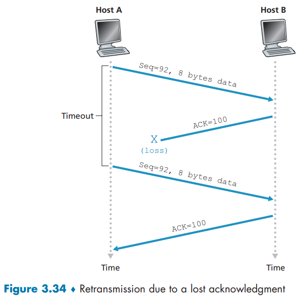

1.  **初始传输：** 主机A向主机B发送一个报文段 , 其序列号为92 , 包含8字节数据(覆盖字节92至99)。
2.  **接收与确认：** 主机B成功接收该报文段 , 并向主机A发送一个确认报文段 , 其确认号为100(表示期望下一个收到字节100 , 即字节92-99已接收)。
3.  **问题：** 该确认报文段在网络中丢失 , 未能到达主机A。
4.  **超时与重传：** 主机A的计时器超时 , 触发重传机制。主机A重新发送原来的报文段(序列号92 , 8字节数据)。
5.  **接收方处理重复数据：** 主机B再次收到该报文段 , 通过序列号判断出该数据(字节92-99)已经被接收。因此 , 主机B的TCP协议会**丢弃这些重复的字节** , 但可能会再次发送一个确认号为100的确认 , 以确保通信状态同步。

**核心：** 通过序列号机制 , 接收方可以识别并丢弃重复的数据。

---

##### 场景二：连续发送多个报文段 , 多个确认均丢失

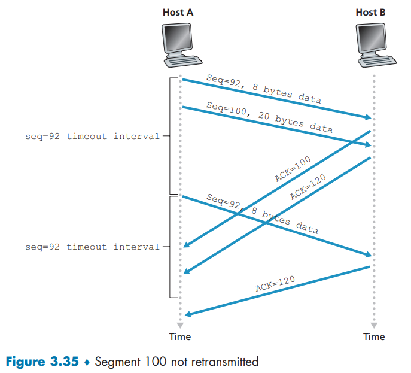

1.  **初始传输：** 主机A连续向主机B发送两个报文段：
    *   报文段1：序列号92 , 8字节数据(字节92-99)
    *   报文段2：序列号100 , 20字节数据(字节100-119)
2.  **接收与确认：** 主机B成功接收两个报文段 , 并分别发送确认：
    *   对报文段1的确认：确认号100
    *   对报文段2的确认：确认号120
3.  **问题：**假设在超时之前这两个报文段中没有一个确认报文到达主机 (即报文回复超时)
4.  **超时与重传：** 主机A在等待确认超时后 , 根据其重传策略(如TCP的Go-Back-N) , 会**重传第一个未被确认的报文段(即序列号为92的报文段)** , 并重启计时器。
5.  **选择性重传：** 如果在这次新的超时之前 , 主机A收到了确认号120的确认 , 那么主机A便知道字节100-119也已被主机B成功接收。因此 , **只有序列号为92的报文段被重传 , 序列号为100的报文段不会被重传**。

**核心：** TCP的确认是累积性的。收到一个确认号 , 意味着该序号之前的所有字节都已被接收。这有助于减少不必要的重传。

---

##### 场景三：后续的确认弥补了前序确认的丢失

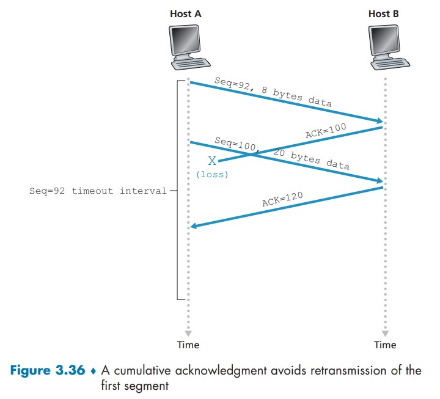

1.  **初始传输：** 与场景二相同 , 主机A发送了序列号为92和100的两个报文段。
2.  **接收与确认：** 主机B同样回复了确认号100和120的两个确认。
3.  **问题：** 第一个确认(确认号100)丢失 , 但第二个确认(确认号120)在主机A的超时计时器到期前成功到达。
4.  **结果分析：** 主机A收到确认号120。根据TCP语义 , 这表明主机B已经成功接收了字节119及之前的所有数据。这意味着**两个报文段(92和100)都已被主机B接收**。
5.  **结果：** 因此 , 主机A**不会重传这两个报文段中的任何一个** , 并继续发送新的数据。

**核心：** 后续的、更高确认号的确认报文段 , 可以充当之前所有确认的替代品 , 有效地通知发送方之前的所有数据均已成功送达 , 从而避免不必要的重传 , 提高传输效率。

#### Doubling the Timeout Interval

如果未收到ACK信号 则会把`Timeoutlnterval`加倍 这样这个数字就会成指数增长 而不是使用之前提到的估算方法 .

直到收到上层应用数据或者是收到ACK的时候 才会重新使用 估算方法 .

#### Fast Retransmit

超时周期太长可能会导致严重的后果 : 如果一个ACK丢失 , 会导致增加等待时间 , 造成重复发送分组等等 , 影响效率 .

发送者可以通过接收到的重复的**ACK(duplicate ACK)**来避免 因为发送方会快速发送大量报文 也就会对应生成大量重复的ACK 这样的话一个ACK丢失就会收到大量重复的ACK .

所以我们约定 如果连续接收到三个连续的重复ACK 就发起 **快速重传**

三个是一个有一定道理的数字 在作业中会有体现 .

```pseudocode
事件: 收到确认号(ACK)为 y 的确认报文
如果 (y > SendBase) {
    SendBase = y
    如果 (还有未被确认的报文段) {
        启动计时器
    }
} 否则 { // 收到重复ACK
    增加 y 对应的重复ACK计数
    如果 (y 的重复ACK计数 == 3) {
        // TCP快速重传
        重传序列号为 y 的报文段
    }
}
结束处理
```

#### Go-Back-N or Selective Repeat?

回退N步当然省了很多事 但是显然 很多情况下效率都很低 比如N个报文只有一个$n$号报文miss了 那么你不仅要从 $n$ 开始回传 还要重传$n+1 \rightarrow N$的报文 . 

前面也提到过 现代很多都是使用选择重传策略的 , 接收方会保存失序到达的报文 . 

对应的确认机制就是 **选择确认selective acknowledgment** .

### 3.5.5 Flow Control

本节主要介绍**TCP 的流量控制机制 flow-control service** , 它与发送方控制的 **拥塞控制 congestion control** 采取的动作十分相似 但是他们是针对完全不同的情况而采取的措施 . 需要加以区分 . **本节我们需要假设流量控制服务是通过接收方丢弃失序报文段实现的** . 

TCP 通过让发送方维护一个称为**接收窗口**的变量来提供流量控制。通俗来说 , **接收窗口用于让发送方了解接收端可用缓冲区空间的大小**。由于 TCP 是全双工的 , 连接两端的发送方各自维护一个独立的接收窗口。

我们通过一个文件传输场景来研究接收窗口：假设主机 A 正在通过 TCP 连接向主机 B 发送大文件。主机 B 为该连接分配了接收缓冲区 , 其大小记为 `RevBuffer(总大小)`。主机 B 的应用程序进程会不时从缓冲区读取数据。定义以下变量：

- `LastByteRead(最后读取字节)`：B 站应用程序进程从缓冲区读取的数据流中最后一个字节的编号
- `LastByteRcvd(最后接收字节)`：从网络到达并已放入 B 站接收缓冲区的数据流中最后一个字节的编号

由于 TCP 不允许已分配的缓存溢出 , 下式必须成立： 
$$
LastByteRcvd(最后接收字节) - LastByteRead(最后读取字节) \leq RevBuffer(总大小)
$$
接收窗口用 `rvnd` 表示 , 根据缓存可用空间的数量来设置 :
$$
rwnd(接收可用) = RevBuffer(总大小) - [ LastByteRcvd - LastByteRead ](尚未读取)
$$
 由于该空间是随着时间变化的 , 所以 `rwnd` 是动态 .

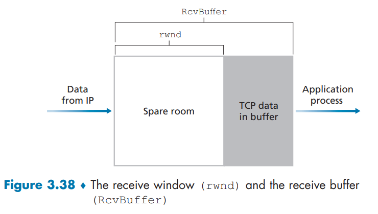

接收方会维护这个`rwnd` , 并把当前`rwnd`值放到发送给发送主机的报文中 , 这样发送者就知道还有多少可用空间 .

>   [!CAUTION]
>
>   ### 但是有问题 “死锁”风险
>
>   1.  **初始状态**：主机B的接收缓冲区已经被主机A发来的数据填满了。因此 , B通知A的接收窗口大小 `rwnd = 0`。意思是：“别发数据了 , 我这儿没地方放了。”
>2.  **关键假设**：主机B**没有**任何数据要发送给主机A。这意味着B没有理由主动发送任何TCP报文段给A。
>   3.  **转机出现**：主机B上的应用程序从缓冲区读取了一些数据 , 腾出了一部分空间。此时 , `rwnd` 的值从0变成了一个正数(比如100字节)。
>   4.  **问题产生**：谁去通知主机A这个好消息(`rwnd` 更新了)？
>       *   根据规则 , TCP只有在“有数据要发送”或“有确认需要回复”时 , 才会顺带在报文段的首部字段中更新这个 `rwnd` 值。
>       *   但现在 , B既没有数据要给A , 也没有新的数据需要确认(因为A已经停止发送了) , 所以B**不会主动**发送任何报文给A。
>   5.  **结果**：主机A永远不知道B的窗口已经打开了 , 它会一直傻等一个`rwnd > 0`的通知。而主机B则在等待A发送数据。**双方陷入了僵局或“死锁”**。
>   
>   ---
>
>   ### 第二部分：解决方案(“零窗口探测”)
>
>   为了防止这种死锁 , TCP规范提到 ：
>
>   1.  **主动探测**：当主机A发现接收窗口 `rwnd = 0` 时 , 它不会无限期地等待。它会启动一个**持续计时器**。
>2.  **发送探测报文**：计时器超时后 , 主机A会向B发送一个**非常小的数据段**(通常只有1个字节)。这个报文段被称为**零窗口探测包**。
>   3.  **触发响应**：
>       *   即使B的缓冲区还是满的 , 它也必须接收这个探测包(因为TCP需要保证可靠性)。
>       *   由于B收到了数据 , 它**现在就有义务**向A回复一个确认报文。
>   4.  **打破僵局**：在这个确认报文里 , B会**携带当前的窗口大小信息**。
>       *   **如果缓冲区还是满的**：B会在ACK中再次声明 `rwnd = 0`。A收到后 , 会重置持续计时器 , 稍后再次探测。
>       *   **如果缓冲区已经腾出空间**(这正是我们期望的)：B会在ACK中声明一个新的、非零的 `rwnd` 值(比如100)。
>   5.  **恢复通信**：主机A一收到这个非零的 `rwnd` , 死锁就被打破 , 它可以立即恢复发送数据了。
>   
>   ### 总结与类比
>
>   你可以把这个过程想象成一个**对话**：
>
>   *   **B**：“我满了！(rwnd=0)”
>*   **A**：(等待...)
>   *   **A**：(等了一会儿 , 发现没动静)“嘿 , 你好了吗？我这有个小东西(1字节)。”
>   *   **B**：(如果还没好)“还没好 , 还是满的！(`rwnd=0`)”
>   *   **A**：(继续等待 , 然后再问)
>   *   **B**：(如果好了)“好了好了 , 现在有100字节的空间了！(rwnd=100)”
>   *   **A**：“太好了！那我继续发了。”
>   
>   这个“小小的技术问题”和其“一个字节的探测”解决方案 , 完美体现了TCP协议设计的严谨性和鲁棒性 , 确保了即使在极端情况下 , 通信链路也能最终自我恢复。

>   [!NOTE]
>
>   顺便一提 :
>
>   *   UDP **不提供流量控制**。
>   *   如果发送速率超过接收方应用程序的读取速度 , 到达的UDP报文段会填满有限的套接字缓冲区 , 导致后续的报文段被丢弃。

### 3.5.6 TCP Connection Management

在本小节中 , 我们更为仔细地观察**如何建立和拆除一条 TCP 连接** . 显然 这点很重要 .

#### 如何建立

假设运行在一台主机(客户端)上的进程想要与另一台主机上的进程(服务器)建立连接。客户端应用进程首先告知其TCP模块 , 它希望与服务器中的某个进程建立连接。随后 , 客户端TCP会通过以下步骤与服务器端TCP建立连接：

1.   第一次传输的报文不包含任何应用层数据 但是将SYN位被置为1。这个特殊报文段被称为**SYN报文段**。
     此外 , 客户端会**随机选择一个初始序列号**(`client_isn`) , 并将该数值填入初始TCP SYN报文段的序列号字段。该报文段被封装在IP数据报中发送至服务器。(用于安全)

2.   当包含TCP SYN报文段的IP数据报到达服务器主机后(假设顺利到达) , 服务器会从数据报中提取TCP SYN报文段 , 为连接分配TCP缓冲区与变量 , 并向客户端TCP**发送一个连接准许报文段**。

     这个连接准许报文段同样不包含应用层数据 , 但其报文头中包含三个重要信息：

     -   首先 , SYN位被置为1；
     -   其次 , TCP报文头中的确认字段被设置为`client_isn+1`；
     -   最后 , 服务器选择自身的初始序列号`server_isn`并将其填入TCP报文头的序列号字段。

     这个连接准许报文段实质上表示：“我已收到你以初始序列号`client_isn`发起的连接请求SYN报文 , 同意建立该连接。我自身的初始序列号为`server_isn`。该连接准许报文段被称为**SYNACK报文段**。

3.   收到SYNACK报文段后 , 客户端同样会为连接分配缓冲区与变量。随后客户端主机会向服务器发送最后一个报文段：该报文段通过将`server_isn+1`填入TCP报文头的确认字段 , 来对服务器的连接准许报文段进行确认。此时连接已建立 , 因此**SYN位被置为0**。   

三路握手的第三阶段可以在报文段负载中携带客户端至服务器的数据。

完成这三个步骤后 , 客户端与服务器主机便能相互传输包含数据的报文段。在后续所有报文段中 , **SYN位都将置为0**。

>   [!NOTE]
>
>   有趣的是 , 攀岩者与保护员(位于攀岩者下方负责控制安全绳的人员)使用的三方确认通信协议 , 竟与TCP的三次握手完全一致 , 都是为了确保双方在攀登开始前准备就绪。

#### 如何拆除

连接终止时 , 主机中的"资源"(即缓冲区与变量)将被释放。以客户端主动关闭连接为例[图3.40] , 其流程如下：

1.   客户端应用进程发出关闭指令 , 促使客户端TCP向服务器进程发送一个特殊TCP报文段——该报文段首部的FIN标志位(见图3.29)被置为1。
2.   服务器收到此报文段后 , 会返回一个确认报文段 , 随后发送自身`FIN`位为1的终止报文段。
3.   最终客户端对服务器的终止段进行确认 , 此时双方主机的所有资源均完成释放。

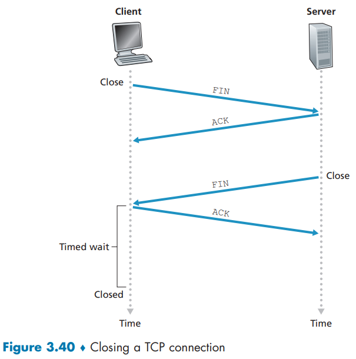

在TCP连接存续期间 , 每台主机的TCP协议会经历多种状态迁移。

[图3.41]展示了客户端TCP的典型状态流转：

-   初始处于`CLOSED`状态
-   当应用层发起新连接时 , 客户端TCP向服务器发送SYN报文段后进入`SYN_SENT`状态
-   在此状态下等待接收含`SYN`标志及对客户端序列号确认的服务器报文段 , 收到后跃迁至`ESTABLISHED`状态 , 至此方可收发包含应用数据的TCP报文段。
-   当客户端应用决定关闭连接时(服务器亦可主动关闭) , 客户端TCP会发送FIN位置1的报文段 , 随即进入`FIN_WAIT_1状`态 , 等待服务器确认报文段
-   收到确认后转入`FIN_WAIT_2`状态 , 继续等待服务器FIN报文段；待收到服务器`FIN`段后发送确认并进入`TIME_WAIT`状态。
    -   此状态旨在重传最终确认(防止ACK丢失) , 其持续时间依实现而异 , 典型值为30秒、1分钟或2分钟。等待结束后连接正式关闭 , 客户端所有资源(包括端口号)即被释放。

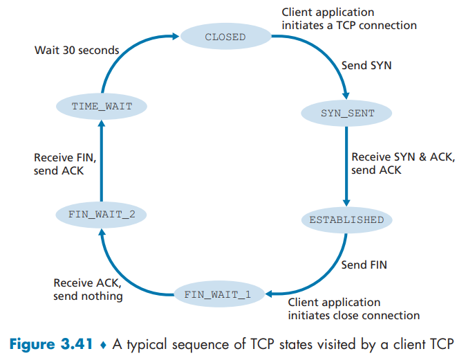


[图3.42]演示了当客户端发起连接拆除时 , 服务器端TCP的典型状态迁移轨迹。


>   [!CAUTION]
>
>   以上都是标准的情况 不考虑异常

**上述讨论均假设客户端与服务器处于就绪状态**——即服务器正在监听客户端发送SYN段的目标端口。

那么如果服务器端没有监听目标端口 , 服务器就回向发送主机回复一个`RST`表示为`1`的报文 , 告知对方不要再发送 , 没有监听 .

**值得注意的是 , 当主机收到目的端口与活跃UDP套接字不匹配的UDP数据报时 , 将发送特殊ICMP数据报**(chap5)

>   [!CAUTION]
>
>   ### Nmap
>
>   为了探索目标主机上的一个特定的TCP端口 , 如端口 `6789` , `nmap`将对那台主机的目的端口`6789`发送一个特殊的TCPSYN报文段。有3种可能的输出结果：
>
>   1.   源主机从目标主机接收到一个TCP SYNACK报文段。因为这意味着在目标主机上一个应用程序使用TCP端口`6789`运行 , `nmap`返回“打开”。  
>   2.   源主机从目标主机接收到一个TCP RST报文段。这意味着该SYN报文段到达了目标主机 , 但日标主机没有运行一个使用TCP端口`6789`的应用程序。但攻击者至少知道发向该主机端口`6789`的报文段没有被源和自标主机之间的任何防火墙(chap 8)所阻挡。
>   3.   源什么也没有收到。这很可能表明该SYN报文段被中间的防火墙所阻挡 , 无法到达自标主机。  
>
>   `nmap`可以侦察还能打开的TCP和UDP端口 , 侦察防火墙及其配置 , 甚至能侦察应用程序的版本和操作系统。

>   [!NOTE]
>
>   ## 泛洪攻击
>
>   ### SYN 泛洪攻击
>
>   这正好对应了你前面提到的TCP三次握手过程：
>
>   1.  **正常连接**：客户端发送SYN , 服务器回复SYN-ACK , 然后客户端回复ACK , 连接建立。
>   2.  **攻击过程**：
>       *   攻击者发送大量的**SYN**报文到服务器。
>       *   服务器收到后 , 为每一个请求分配资源(缓冲区和变量) , 并回复**SYN-ACK**。
>       *   **但是 , 攻击者永远不会发送最终的ACK确认。**
>   3.  **后果**：
>       *   服务器的连接资源被这些“半开连接”迅速占满。
>       *   当所有资源都被占用后 , 服务器无法再接受新的合法连接请求 , 导致**服务拒绝**。
>
>   这就好比一个恶作剧者用无数个假订单占满了餐厅的所有座位和接线员 , 导致真正的顾客永远打不进来电话 , 也找不到座位。
>
>   ---
>
>   ### 其他类型的泛洪攻击：
>
>   *   **UDP 泛洪**：向目标随机端口发送大量UDP数据包 , 导致目标不断回复“端口不可达”消息 , 耗尽资源。
>   *   **ICMP 泛洪(Ping 泛洪)**：向目标发送海量的ICMP回显请求(Ping) , 消耗其带宽和处理能力。
>   *   **HTTP 泛洪**：针对Web服务器 , 发送大量看似合法的HTTP请求(GET或POST) , 耗尽服务器的最大并发连接数。
>
>   ### 总结特点：
>
>   *   **目的**：使服务瘫痪 , 而非窃取数据。
>   *   **手段**：用远超目标处理能力的流量进行冲击。
>   *   **来源**：通常是僵尸网络(Botnet) , 由成千上万被控制的“肉鸡”电脑同时发起攻击。
>
>   ## (D)DoS
>
>   泛洪攻击只是DoS的一种 , 除了基于流量泛洪的攻击 , DoS攻击还有很多其他类型 , 它们利用不同的原理来耗尽目标的资源。
>
>   以下是一些常见的其他类型DoS攻击：
>
>   ### 1. 应用层DoS攻击(Layer 7攻击)
>
>   这种攻击不靠流量压垮网络 , 而是通过发送大量看似“合法”的请求 , 耗尽服务器应用层的核心资源(如CPU、内存、数据库连接)。
>
>   *   **特点**：攻击流量可能不大 , 但“成本”很高。服务器处理每个这样的请求都需要进行大量计算。
>   *   **例子**：
>       *   **HTTP洪水攻击**：对Web服务器频繁发送复杂的HTTP请求(例如 , 频繁搜索、提交动态页面请求)。这就像是让无数个“机器人”在超市里不停地要求店员去仓库最深处检查某件商品 , 导致店员没时间服务真正的顾客。
>       *   **CC攻击**：这是HTTP洪水的一种 , 主要针对消耗资源较大的网页(如含有大量数据库查询的页面)。
>
>   ### 2. 协议攻击(或称资源耗尽型攻击)
>
>   这种攻击利用网络协议本身的缺陷或握手过程来消耗目标系统的资源(如连接表、防火墙会话表)。
>
>   *   **特点**：目标是耗尽目标的“状态表”容量 , 而非带宽。
>   *   **例子**：
>       *   **SYN洪水**：你之前了解到的 , 就是最经典的协议攻击。
>       *   **Ping of Death**：一种较老的攻击 , 发送非法格式或超大的ICMP数据包 , 导致目标系统在重组数据包时缓冲区溢出而崩溃。
>       *   **Slowloris攻击**：非常“阴险”的攻击。它通过建立大量到Web服务器的HTTP连接 , 并以极慢的速度(比如几分钟一次)发送一个头部信息 , 来保持连接始终开放。这会耗尽服务器的最大并发连接数 , 导致服务器无法接受新连接。
>
>   ### 3. 放大/反射型攻击
>
>   这种攻击是一种非常高效的DDoS , 攻击者通过“伪装源IP”(即IP欺骗)向某些公共的第三方服务器发送一个小请求 , 而这个服务器会向攻击目标返回一个非常大的回复。
>
>   *   **特点**：用很小的代价(攻击者的带宽)制造出流向目标的巨大流量。
>   *   **例子**：
>       *   **DNS放大攻击**：攻击者伪装成目标IP , 向开放的DNS解析器发送一个小的查询请求(例如 , 请求查询一个很大的DNS记录) , DNS服务器会将这个巨大的回复发送给攻击目标。
>       *   **NTP放大攻击**：原理类似 , 利用网络时间协议中的`monlist`命令 , 让小请求触发大回复。
>
>   ---
>
>   ### 总结与对比
>
>   | 攻击类型                    | 攻击目标             | 好比...                                                      |
>   | :-------------------------- | :------------------- | :----------------------------------------------------------- |
>   | **流量泛洪** (如UDP泛洪)    | 网络带宽             | 用巨型垃圾车堵死高速公路的所有车道。                         |
>   | **协议攻击** (如SYN洪水)    | 连接表/状态资源      | 派很多人去餐厅占座但不点餐 , 让真正吃饭的客人没座位。        |
>   | **应用层攻击** (如HTTP洪水) | 服务器CPU/内存/应用  | 派很多人去银行柜台办理最复杂、最耗时的业务 , 让后面排队的人永远等不到。 |
>   | **放大攻击**                | 网络带宽(但效率极高) | 冒充别人打电话给披萨店 , 订1000个披萨送到仇人家 , 让仇人家被披萨淹没。 |
>
>   这些攻击类型经常被组合使用 , 形成复杂且破坏力极强的DDoS攻击。

## 3.6 Principles of Congestion Control

### 3.6.1 The Causes and the Costs of Congestion

#### 情况 1：两个发送方和一台具有无穷大缓存的路由器

-   **拓扑**：两台主机(A 和 B)的连接共享一台路由器的单跳输出链路 , 路由器缓存无穷大。
-   **过程**：主机 A、B 分别以速率$\lambda_{in}$发送初始数据 , 共享容量为R的输出链路。当发送速率在$0\sim R/2$之间时 , 每连接吞吐量等于发送速率；当发送速率超过$R/2$ , 每连接吞吐量上限为$R/2$。
-   **拥塞代价**：虽然总吞吐量接近链路容量R , 但分组到达速率接近链路容量时 , **平均时延会变得极大(甚至无穷大)**。
    -   这里的无穷大是因为我们假设缓存无穷大 而且要离散的看待缓存 总之还真能这样

#### 情况 2：两个发送方和一台拥有有限缓存的路由器

-   **拓扑**：两台主机(A 和 B)的连接共享一台**有限缓存**的路由器的单跳输出链路。
-   过程 : 当路由器缓存满时分组被丢弃 , 发送方会重传数据。不同重传方式会导致不同性能：
    -   若发送方精准只重传丢失分组(如能感知缓存空闲) , 吞吐量上限仍为$R/2$ , 但无多余重传；
    -   若发送方超时重传(更真实场景) , 会出现重传冗余 , 例如总供给载荷接近$R/2$时 , 吞吐量可能降至$R/3$ , 且存在不必要的重传数据；
    -   若分组被多次重传(如排队延迟导致的提前重传) , 吞吐量会进一步降低(如接近$R/4$)。
-   **拥塞代价**：**重传导致的冗余数据传输(浪费链路带宽)** , 以及分组因缓存溢出被丢弃后需重传的额外开销。

#### 情况 3：4 个发送方和具有有限缓存的多台路由器及多跳路径

-   **拓扑**：4 台主机通过**两台路由器(R1、R2)**和**多跳路径**传输(如 A-C、B-D 流在 R2 上竞争缓存)。
-   **过程**：当发送速率$\lambda_{in}$较大时 , 路由器 R2 的缓存会因多流竞争而溢出。例如 A-C 和 B-D 流在 R2 上竞争 , 若其中一流的供给载荷极大 , 会挤占另一流的缓存空间 , 导致其吞吐量趋近于 0。
-   **拥塞代价**：**多跳路径中路由器转发分组的 “无效工作”(如转发后分组因下游缓存溢出被丢弃 , 前序路由器的转发开销被浪费)** , 以及某条流因缓存被挤占而吞吐量骤降。

[这里不想贴图了]

### 3.6.2 Approaches to Congestion Control

#### 端到端拥塞控制

-   网络层无显式支持 , 端系统通过观察网络行为(如分组丢失、时延)推断拥塞。
-   以 TCP 为例 , 其通过 TCP 报文段丢失(如超时或 3 次冗余确认)感知拥塞 , 进而减小窗口长度。

#### 网络辅助的拥塞控制

-   路由器向发送方提供网络拥塞状态的显式反馈信息 , 可通过简单比特、拥塞分组(如 “我拥塞了”)或标记分组字段等方式实现。
-   历史上在 IBM SNA、`DEC DECnet`、ATM 等体系结构中被采用 , 例如 ATM 的 ABR 拥塞控制中 , 路由器会显式通知发送方其能支持的最大发送速率。


图中具体展示了两种拥塞信息的两种反馈路径 :

1.   直接网络反馈(如路由器发拥塞分组给发送方)(直接说 '我拥塞了')
2.   经由接收方的网络反馈(路由器标记分组 , 接收方收到后向发送方通知拥塞指示)这一种形式至少需要一个完整的传输过程

## 3.7 TCP Congestion Control

`TCP拥塞控制算法(Tahoe/Reno/Newreno)`

TCP 采用的方法是让每个发送方根据感知到的网络拥塞情况 , 限制其向连接中发送流量的速率。

如果 TCP 发送方感知到自身与目的地之间路径的拥塞程度很低 , 就会提高发送速率；如果发送方感知到路径存在拥塞 , 就会降低发送速率。

但这种方法引发了三个问题：

1.   TCP 发送方如何限制其向连接中发送流量的速率？

     -   在 3.5 节中我们看到 , TCP 连接的每一端都是由一个接收缓存、一个发送缓存和几个变量`LastByteRead`、`rwnd` 等)组成。

     -   运行在发送方的 TCP 拥塞控制机制跟踪一个额外的变量 , 即拥塞窗口`congestion window`。拥塞窗口表示为 `cwnd` , 它对一个 TCP 发送方能向网络中发送流量的速率进行了限制。

     -   形式上 , 在一个发送方中未被确认的数据量不会超过 `cwnd` 与 `rwnd` 中的最小值 , 即 
         $$
         \text{LastByteSent} - \text{LastByteAcked} \leq \min \{ \text{cwnd}, \text{rwnd} \}
         $$
         
     -    因为现在我们考察拥塞机制 所以在这里我们认为缓存空间足够大 不会成为主要的影响因素

     -    该发送方的发送速率大概是 
          $$
          \frac{cwnd}{RTT} byte/s
          $$
          通过调节 `cwnd` 的值 , 发送方因此能调整它向连接发送数据的速率。

2.   TCP 发送方如何感知自身与目的地之间路径的拥塞情况？

     -   **我们必须在保证不拥塞的同时 , 也使得发送速率更高** , 那么首先就要感知拥塞情况 , 下面的是拥塞的一些标准
         -   **超时或收到 4 个确认(1 个初始 ACK + 3 个冗余 ACK)**：推测网络 “重度拥塞” , 需**降低发送速率**(减小拥塞窗口)。
         -   **收到冗余 ACK 之外的确认(即新数据的 ACK 正常到达)**：推测网络 “不拥塞” , 可**增加发送速率**(增大拥塞窗口)。
         -   **带宽探测**：鉴于确认(ACK)表明源到目的地的路径无拥塞 , 而丢包事件表明路径拥塞 , TCP 调整其传输速率的策略是：**响应到达的 ACK 提高速率 , 直到发生丢包事件 , 此时降低传输速率**。

3.   发送方应采用何种算法 , 根据感知到的端到端拥塞情况来改变发送速率？

     -   `TCP congestion-control algorithm` 最早在 [Jacobson 1988] 中被描述 , 并在 [RFC 5681] 中被标准化

     -   该算法有三个主要组成部分：

         1.   慢启动

         2.   拥塞避免
         3.   快速恢复。

     -   **慢启动和拥塞避免是 TCP 的强制组成部分** , 二者的区别在于根据收到的 ACK 增大拥塞窗口`cwnd`大小的方式不同。

     -   但是**事实上** , 慢启动比拥塞避免更快速地增大 `cwnd` 的大小。

     -   快速恢复是对 TCP 发送方的推荐机制 , 但并非强制要求。

### 3.7.1 Classic TCP Congestion Control

#### Slow Start

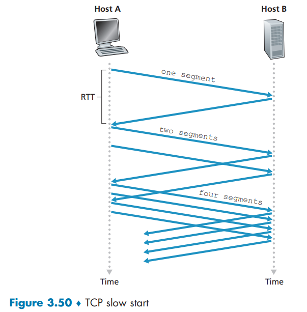

发送方初始设置一个较小的拥塞窗口 , 教材上认为是 1 个 , 实际操作中可能为1-10个MSS , 每收到一个ACK确认报文 , 窗口值就增加一个MSS , 从而实现指数级增长——第一轮发送1个报文 , 收到1个ACK后窗口变为2；第二轮发送2个报文 , 收到2个ACK后窗口变为4 , 依此类推。

当窗口达到慢启动阈值`ssthresh`或发生数据包丢失时 , 慢启动阶段结束 , 进入拥塞避免阶段 , 转为线性增长。整个过程通过“试探-确认”的循环快速提升传输效率 , 同时通过丢包反馈及时收敛 , 实现网络拥塞的动态平衡。

但是 ,  这种指数级增长何时结束？慢启动机制为这个问题提供了几种答案。

-   首先 ,  如果出现由超时指示的丢包事件  ( 即网络拥塞  )  ,  TCP发送方会将拥塞窗口值重置为1 ,  并重新开始慢启动过程。同时 ,  它会将第二个状态变量**慢启动阈值ssthresh**设置为检测到拥塞时的拥塞窗口值的一半。
-   慢启动结束的第二种方式直接与`ssthresh`的取值相关——由于`ssthresh`是上次检测到拥塞时窗口值的一半 ,  当拥塞窗口达到或超过该阈值时继续翻倍增长可能不够谨慎 ,  因此此时慢启动阶段终止 ,  TCP转入拥塞避免模式。
-   第三种结束方式是通过检测到三个重复ACK ,  此时TCP会执行快速重传并进入快速恢复状态。

#### Congestion Avoidance

进入拥塞避免状态时 ,  拥塞窗口的值约为上次遭遇拥塞时的一半——这意味着网络可能再次面临拥塞风险！

因此 ,  TCP不再每个RTT将窗口值翻倍 ,  而是采取更保守的策略 ,  每个RTT仅将窗口增加1个MSS。

这种机制可通过多种方式实现：常见做法是发送方每收到一个新确认报文 ,  就将窗口增加MSS字节的  (` MSS/cwnd ` ) 比例。

那么拥塞避免阶段的线性增长  ( 每个RTT增加1个MSS  ) 何时终止？

-   当发生超时事件时 ,  其处理方式与慢启动阶段一致：将拥塞窗口重置为1个MSS ,  同时将慢启动阈值更新为丢包发生时窗口值的一半
-   三组重复ACK同样会触发丢包事件——这种情况表明网络仍在持续传输部分数据段  ( 重复ACK的持续接收就是证明  ) 。

因此TCP对此类丢包事件的响应不应像超时事件那样剧烈：此时TCP会将窗口减半  ( 并额外增加3个MSS以补偿已接收的三个重复ACK  )  ,  同时记录慢启动阈值为收到三重重复ACK时窗口值的一半 ,  随后进入快速恢复状态。

#### Fast Recovery

-   在快速恢复阶段 ,  每当收到导致TCP进入此状态的丢失报文段的重复ACK时 ,  拥塞窗口值会增加1个MSS。
-   当最终收到丢失报文段的确认ACK后 ,  TCP会在缩减拥塞窗口后进入拥塞避免状态。
-   若发生超时事件 ,  快速恢复会执行与慢启动和拥塞避免阶段相同的操作：将拥塞窗口值设为1个MSS ,  同时将慢启动阈值设置为发生丢包事件时窗口值的一半 ,  然后转入慢启动状态。

快速恢复是TCP协议中建议但非强制的组件[RFC 5681]。值得注意的是 ,  早期版本的TCP Tahoe不论遇到超时还是三重重复ACK触发的丢包事件 ,  都会无条件将拥塞窗口降至1个MSS并重新进入慢启动阶段。而新版`TCP Reno`则引入了快速恢复机制。

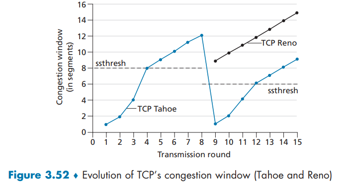

图3.52展示了Reno与Tahoe两种协议中TCP拥塞窗口的演化过程。该图中阈值初始设置为8个MSS。在前八个传输轮次中 ,  Tahoe和Reno行为完全一致：慢启动阶段拥塞窗口呈指数级增长 ,  在第四轮传输时达到阈值 ,  随后进入线性增长阶段 ,  直至第八轮传输后出现三重重复ACK事件。此时拥塞窗口为12个MSS ,  慢启动阈值相应调整为窗口值的一半  ( 6个MSS  ) 。在TCP Reno中 ,  拥塞窗口会被设为9个MSS后继续线性增长；而TCP Tahoe则会将窗口重置为1个MSS ,  经历指数增长直至达到阈值后方转为线性增长。

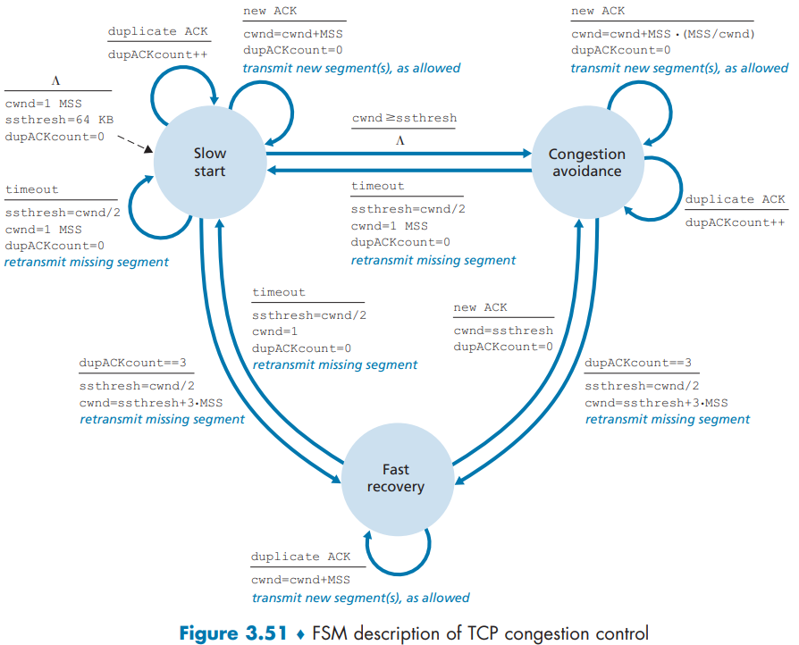

图3.51完整呈现了TCP拥塞控制算法的有限状态机描述 ,  涵盖慢启动、拥塞避免和快速恢复三个核心阶段 ,  同时标注了新报文段传输与重传的发生节点。

#### TCP Congestion Control: Retrospective

忽略第一阶段 TCP拥塞控制阶段常常被称为 加性增 , 乘性减 (AIMD) . 反应在图上就是 .

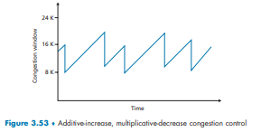


#### TCP Cubic

`TCP 三次曲线`

鉴于TCP Reno采用"加性增、乘性减"的拥塞控制策略 ,  人们自然会思考：这种探测恰好低于数据包丢失触发阈值的发送速率是否是最优方案？实际上 ,  将发送速率减半(甚至如早期TCP Tahoe版本那样将发送速率降至每个RTT仅发送一个数据包) ,  然后缓慢提升的方式可能过于保守。若发生数据包丢失的拥塞链路状态并未显著变化 ,  更佳策略或许是快速提升发送速率以接近丢失前的水平 ,  再谨慎探测带宽。这一核心思想正是`TCP CUBIC`协议的设计精髓。

`TCP CUBIC`与`TCP Reno`仅有细微差异：依然仅在收到ACK时增大拥塞窗口 ,  且慢启动与快速恢复阶段保持不变。CUBIC仅对拥塞避免阶段作出如下革新：

- 设`Wmax`为最近检测到丢包时的拥塞窗口值 ,  K为无丢包情况下CUBIC窗口大小再次达到`Wmax`的未来时间点。通过可调参数计算K值 ,  即控制协议恢复至`Wmax`的速度。
- CUBIC根据当前时间t与K点时间距离的立方函数来增加拥塞窗口。当t远离K时窗口增长迅猛 ,  接近K时则转为谨慎 ,  从而实现快速恢复至预丢失速率`Wmax`后转为精细探测。
- 当t超越K时 ,  立方函数确保初始阶段窗口缓步增长(适用于链路拥塞程度未大变的情形) ,  随后加速探索(适应链路状态显著变化后的新平衡点)。


图3.54展示了两种协议的理想化性能对比：在t₀结束慢启动后 ,  当t₁、t₂、t₃时刻发生拥塞丢包时 ,  CUBIC能更快逼近`Wmax`(从而获得比Reno更高的总体吞吐量)。图示清晰呈现CUBIC如何持续维持发送速率尽可能接近(发送方不可见的)拥塞阈值。值得注意的是 ,  在t₃时刻链路拥塞程度明显缓解 ,  使两种协议均能突破`Wmax`的限制。

TCP CUBIC近年已获广泛部署：2000年左右主流Web服务器几乎全部运行TCP Reno变体 ,  而近期对Top 5000网站的监测显示近半数已采用CUBIC版本 ,  它也成为Linux操作系统默认的TCP实现 .

#### Macroscopic Description of TCP Reno Throughput

我们来考虑一个长期的TCP的平均吞吐量 . 

在此分析中，我们将忽略超时事件后发生的慢启动阶段。 ( 这些阶段通常非常短，因为发送方会以指数速度快速脱离该阶段。 ) 

当窗口大小为 $w$ 字节且当前往返时间为 $RTT$ 秒时，TCP 的传输速率大约为 $w/RTT$。然后，TCP 通过每个 RTT 将 $w$ 增加 1 个 MSS ( 最大报文段长度 ) 来探测额外带宽，直到发生丢包事件。用 $W$ 表示发生丢包事件时的 $w$ 值。假设在整个连接期间 RTT 和 $W$ 大致保持不变，则 TCP 传输速率的范围为 $W/(2\cdot RTT)$ 到 $W/RTT$。

这些假设导出了一个高度简化的 TCP 稳态行为宏观模型。当速率增加到 $W/RTT$ 时，网络会从连接中丢弃一个数据包；然后速率减半，并在每个 RTT 中以 MSS/RTT 的速度增加，直到再次达到 $W/RTT$。这个过程会不断重复。由于 TCP 的吞吐量 ( 即速率 ) 在这两个极值之间线性增长，我们得到：
$$
\text{连接的平均吞吐量} = \frac{0.75 \cdot W}{RTT}。
$$


利用这个高度理想化的 TCP 稳态动态模型，我们还可以推导出一个有趣的表达式，将连接的丢包率与其可用带宽联系起来。该推导过程概述在课后习题中。一个更复杂的模型，经验证与实测数据吻合较好，可参见[Padhye2000]

---

$$
\text{Throughput} \leq \frac{\text{MSS}}{\text{RTT} \cdot \sqrt{\frac{2L}{3}}} \approx \frac{1.22 \times \text{MSS}}{\text{RTT} \cdot \sqrt{L}}
$$

在我们考虑丢包率的情况下 , 考虑重传等问题 可以得到上面的公式 , 其中 $L$ 表示丢包率 .

使用该公式，我们能够看到，为了取得10Gbps的吞吐量，今天的TCP拥塞控制算法仅能容忍$2 \times 10^{-10}$的报文段丢失概率 (  或等价地说，对每$5,000,000,000$个报文段仅能有一个丢包 ) ，这是一个非常低的值。

这种观察导致许多研究人员为这种高速环境特别设计新版TCP，对这些努力的讨论参见[Jin2004；Kelly2003；Ha2008；RFC7323]。

---

### 3.7.2 Network-Assisted Explicit Congestion Notification  and Delayed-based Congestion Control

`网络辅助的显式拥塞通知与基于延迟的拥塞控制`

自 20 世纪 80 年代末慢启动和拥塞避免首次标准化以来，TCP 一直采用我们在 3.7.1 节中学习过的端到端拥塞控制形式：TCP 发送方不从网络层接收任何显式的拥塞指示，而是通过观察到的丢包来推断拥塞。

最近，针对 IP 和 TCP 的扩展被提出、实现和部署，允许网络向 TCP 发送方和接收方显式地通知拥塞。此外，还提出了许多 TCP 拥塞控制协议的变体，它们利用测量到的数据包延迟来推断拥塞。我们将在本节中探讨网络辅助和基于延迟的拥塞控制。

#### Explicit Congestion Notification

显式拥塞通知是在互联网内部执行的一种网络辅助拥塞控制形式。如图 3.55 所示，TCP 和 IP 都参与其中。

在网络层，IP 数据报头部的服务类型字段 ( 我们将在 4.3 节讨论 ) 中的两个比特 (  总共有四种可能的值 ) 被用于 `ECN`。

ECN 比特的一种设置**被路由器用来表明它 (  该路由器 ) 正经历拥塞**。这个拥塞指示随后被携带在标记过的 IP 数据报中传递给目的主机，目的主机随后通知发送主机，如图 3.55 所示。

RFC 3168 并未提供路由器何时处于拥塞状态的定义；这个决定是由路由器供应商提供可能、并由网络运营商做出的配置选择。

然而，其直观思想是，可以在实际发生丢包之前，通过设置拥塞指示比特来向发送方发出拥塞开始的信号。ECN 比特的第二种设置被发送主机用来通知路由器：发送方和接收方具备 ECN 能力，因而能够采取行动来响应 ECN 指示的网络拥塞。

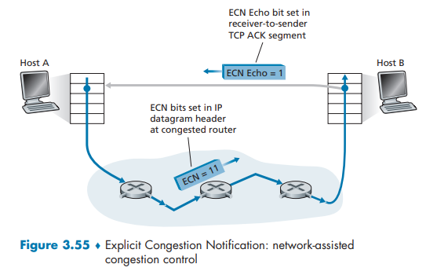

如图 3.55 所示，当接收主机中的 TCP 通过接收到的数据报收到一个 ECN 拥塞指示时，接收主机中的 TCP 通过在接收方到发送方的 TCP ACK 段中设置 ECE (  显式拥塞通知回应 ) 比特 (  见图 3.29 ) 来通知发送主机中的 TCP 该拥塞指示。TCP 发送方则通过将拥塞窗口减半来对带有拥塞指示的 ACK 做出反应，就像它使用快速重传对丢失的段做出反应一样，并在下一个发送的 TCP 发送方到接收方段的头部中设置 CWR (  拥塞窗口已减小 ) 比特。

除了 TCP 之外，其他传输层协议也可以利用网络层信号的 ECN。数据报拥塞控制协议 提供了一种利用 ECN 的低开销、拥塞控制的、类似 UDP 的不可靠服务。DCTCP，

---

专为数据中心网络设计的 DCQCN (  数据中心量化拥塞通知 ) 也利用了 ECN。近期的互联网测量显示，在流行服务器中以及通往这些服务器的路径上的路由器中，ECN 能力的部署正在不断增加。

#### Delay-based Congestion Control

第二种拥塞避免方法采用基于延迟的方法，同样在丢包发生之前主动检测拥塞的开始。

在 TCP Vegas 中，发送方测量所有被确认数据包的源到目的路径的 RTT。令 $RTT_{\min}$ 为发送方处这些测量值中的最小值；这出现在路径未拥塞且数据包经历最小排队延迟时。如果 TCP Vegas 的拥塞窗口大小是 `cwnd`，那么未拥塞的吞吐率将是$ \frac{cwnd}{RTT_{\min}}$。

-   TCP Vegas 背后的直观想法是，如果实际发送方测量的吞吐率接近该值，则可以增加 TCP 发送速率，因为 (  根据定义和测量 ) 路径尚未拥塞。然而，如果实际发送方测量的吞吐率显著小于未拥塞的吞吐率，则路径处于拥塞状态，Vegas TCP 发送方将降低其发送速率。
-   可以总结为 让通道满 但不至于再满

BBR 拥塞控制协议建立在 TCP Vegas 的思想基础上，并融合了允许其与 TCP 非 BBR 发送方公平竞争的机制。据报道，在 2016 年，谷歌开始在其互联数据中心的私有 B4 网络中的所有 TCP 流量上使用 BBR，取代了 CUBIC。它也被部署在谷歌和 YouTube 的 Web 服务器上。其他基于延迟的 TCP 拥塞控制协议包括用于数据中心网络的 TIMELY，以及用于高速和长距离网络的 Compound TCP 和 FAST。

### 3.7.3 Fairness

- **公平性的理想模型**：当多条TCP连接经过同一传输速率为$ R $ bps的瓶颈链路时，若每条连接得到相同份额的链路带宽（速率接近$ R/K $，$ K $为连接数），则认为拥塞控制机制公平。Chiu和Jain在1989年给出了两条TCP连接竞争瓶颈链路时流量平等分配的经典解释（如图3-54、3-55所示），理想情况下它们的吞吐量会趋于平等。

- **实际情况的偏差**：
  - **RTT差异的影响**：若多条TCP连接的往返时间（RTT）不同，即使共享瓶颈链路，RTT小的连接会更频繁地发送数据（因其窗口更新更快），导致吞吐量分配不平等。例如，一个RTT小的连接和一个RTT大的连接竞争时，RTT小的连接会获得更多带宽。
  - **UDP的干扰**：UDP不具备TCP的拥塞控制机制，在共享链路时会无节制地占用带宽，挤压TCP连接的资源，破坏TCP的公平性。

- **公平性的优化与研究方向**：
  - 针对TCP因RTT差异导致的不公平，有研究尝试开发网络辅助的拥塞控制机制（如显式拥塞通知ECN）来抑制不公平情况。
  - 对于UDP破坏公平性的问题，研究方向包括开发能限制UDP流量的机制，避免其过度占用带宽。

- **典型场景的不公平性**：以Web浏览（多个TCP连接共享链路）为例，若连接的RTT或应用特性不同，带宽分配会偏离“平等”，体现了TCP公平性在实际场景中的复杂挑战。


