因为网络层实在太复杂 书中用了两章的内容 分别讲网络层的 数据平面和控制平面 .

-   数据平面(chap4)——路由器是如何决策每一个到达的数据报转发到对应的链路 .
    -   传统IP转发(基于数据报的目的地址进行转发)
    -   广义转发(利用数据报头部多个字段的值实现转发及其他功能)
    -   深入解析IPv4与IPv6协议及其寻址体系 .

-   控制平面(chap5)——这部分关乎网络范围的全局决策 , 即如何为从源主机到目的主机的数据报文 , 在整个网络中选择一条端到端的传输路径 .
    -   我们将学习经典的路由算法 , 并详细介绍当今互联网中广泛使用的路由协议 , 如 **OSPF** 和 **BGP**
    -   传统上 , 控制平面的路由功能与数据平面的转发功能被紧密耦合 , 共同集成在路由器设备内部 .而 **软件定义网络(SDN)** 则革新了这一架构 , 它通过将控制平面功能剥离出来 , 通常作为一个独立的远程"控制器"服务 , 从而实现了数据平面与控制平面的**解耦与分离** .关于SDN控制器的详细内容 , 我们也将在第五章中一同探讨 .

# Network Layer : data plane

在网络中每一台主机和路由器都一个网络层部分 .

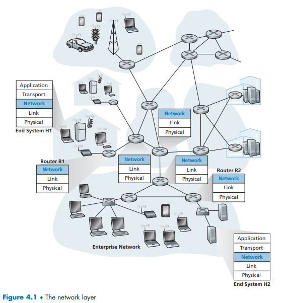

图中展示了 网络层的位置 .

## 4.1 Overview of Network Layer

[后面 `4.1.1` 和 `4.1.2` 都是鸡肋 浏览即可 结构安排没有很合理]

### 4.1.1 Forwarding and Routing: The Data and Control Planes

网络层的主要目标是**将分组从发送主机移动到接收主机** .其核心功能可划分为两个方面 :

1.   转发 : 指路由器**本地执行**的动作 , 当分组到达其**输入链路**时 , 路由器根据规则将其移动到合适的**输出链路** .
     -   在**数据平面**中实现 .
     -   是数据平面的**主要**且最常见的功能 .
     -   发生时间尺度极短(纳秒级) , 通常由**硬件**实现 .
     -   主要依据是路由器内部的**转发表** .
2.   路由选择 : 指为分组从源到目的地**规划端到端路径**的**网络范围**处理过程 .
     -   在**控制平面**中实现 .
     -   由**路由选择算法**计算路径 .
     -   发生时间尺度较长(秒级) , 通常由**软件**实现 .

|   特性   |      转发       |    路由选择    |
| :------: | :-------------: | :------------: |
| **范围** |   路由器本地    |    网络全局    |
| **功能** | 移动分组(入→出) | 决定端到端路径 |
| **实现** |    数据平面     |    控制平面    |
| **时间** |    短(硬件)     |    长(软件)    |

#### 数据平面

**转发表** : 是路由器的**关键元素** .路由器通过检查到达分组的头部字段值来**查询转发表** , 从而决定将分组从哪个**输出链路接口**转发出去 .

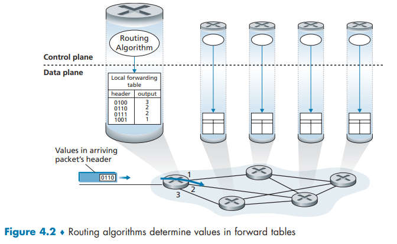

#### 控制平面

1.   传统方法
     -   **核心思想** :每台路由器**独立**运行路由选择算法 , 并与其他路由器通过**路由选择协议**交换信息 , 从而**自行计算**并填充其自身的转发表 .
     -   **特点** :
         -   转发和路由选择功能**紧密耦合**在同一台路由器中 .
         -   理论上 , 人类可以手动配置所有转发表 , 但这**容易出错**且对网络变化的**响应慢** .

2. SDN方法

    - **核心思想** :将控制平面功能从路由器中**分离**出来 , 交由一个**远程的、集中式的控制器**负责 .

    - **特点** :
        - 路由器**只负责转发**(数据平面功能不变) .
        - 远程控制器通过软件**计算转发表** , 并分发给各路由器 .
        - 控制器与路由器之间通过**交换报文**进行通信 .
        - 这种方法实现了**软件定义网络** 的本质 :**控制与转发分离** , 网络由软件灵活定义 .


---

### 4.1.2 Network Service Model

[所谓模型 只是一个说法 本质上就是想约定这一层网络应该有什么样的要求 完成什么任务]

- **确保交付** :分组保证能到达目的地 .
- **确保时延上界交付** :在规定的时延内(如100ms)确保交付 .
- **有序分组交付** :分组按发送顺序到达 .
- **确保最小带宽** :为数据流提供一条有特定保证带宽的"虚拟链路" .
- **安全性** :为数据传输提供机密性等服务 .

#### 因特网的现实 :尽力而为服务
- 因特网网络层提供的是**单一服务模型** :**尽力而为服务** .
- **该服务的特性** :
    - **不保证**分组按序到达 .
    - **不保证**最终一定交付 .
    - **不保证**端到端时延 .
    - **不保证**最小带宽 .
- **结论** :尽管看起来是"根本无服务" , 但通过与充足的带宽供给相结合 , 因特网的尽力而为服务模型已被证明**足够好** , 能够支持海量应用(如流媒体、实时视频会议等) .其他如ATM等网络架构提供了更强的服务保证 , 但并未取代因特网的基本模型 .

### 4.1.3 An Overview of Chapter 4

本节是网络层**数据平面**部分的**路线图** , 明确了后续小节将要讨论的核心组件和概念 , 并对关键术语进行了辨析 .

#### **1. 数据平面组件路线图**

后续章节将按以下顺序深入探讨数据平面的具体内容 :

*   **4.2节 :路由器内部结构**
    *   重点研究路由器的**硬件操作** .
    *   核心内容包括 :
        *   输入与输出的**分组处理** .
        *   路由器内部的**交换机制**(数据如何从输入端口转到输出端口) .
        *   **分组排队**与**调度**策略 .

*   **4.3节 :传统的IP转发**
    *   核心机制 :基于**目的IP地址**进行转发 .
    *   将学习的关键知识 :
        *   **IP寻址**方案 .
        *   **IPv4** 协议(及其相关概念) .
        *   **IPv6** 协议 .

*   **4.4节 :通用转发**
    *   一种更灵活、更强大的转发范式 .
    *   机制 :可以基于**分组首部中的多个字段**(而不仅仅是目的IP地址)进行转发决策 .
    *   支持更复杂的操作 :
        *   **阻塞**或**复制**分组 .
        *   **重写**首部字段 .
        *   所有这些操作都可在**软件控制**下完成 .
    *   这是**现代网络**(特别是**软件定义网络SDN**)中数据平面的关键组成部分 .

#### **2. 关键术语辨析**

为了澄清概念 , 本节对几个容易混淆的术语进行了界定 :

*   **转发 与 交换**
    *   在本书和许多文献中 , 这两个术语**可以互换使用** , 均指代分组转发的行为 .

*   **分组交换机**
    *   这是一个**通用术语** , 指所有根据分组首部字段值 , 将分组从输入链路转移到输出链路的设备 .

*   **链路层交换机 与 路由器**
    *   它们是**分组交换机**的两种具体类型 , 根据其工作的**协议层**进行区分 :
        *   **链路层交换机** :
            *   基于**链路层帧**的字段值(如MAC地址)进行转发 .
            *   属于**第2层**设备 .
        *   **路由器** :
            *   基于**网络层数据报**的字段值(如IP地址)进行转发 .
            *   属于**第3层**设备 .
    *   **本章重点** :由于本章聚焦**网络层** , 因此将主要使用术语 **"路由器"** .

## 4.2 What’s Inside a Router?

路由器的主要功能是实现 **转发** 即将分组从一台路由器的入链路传从到适当的出链路 .

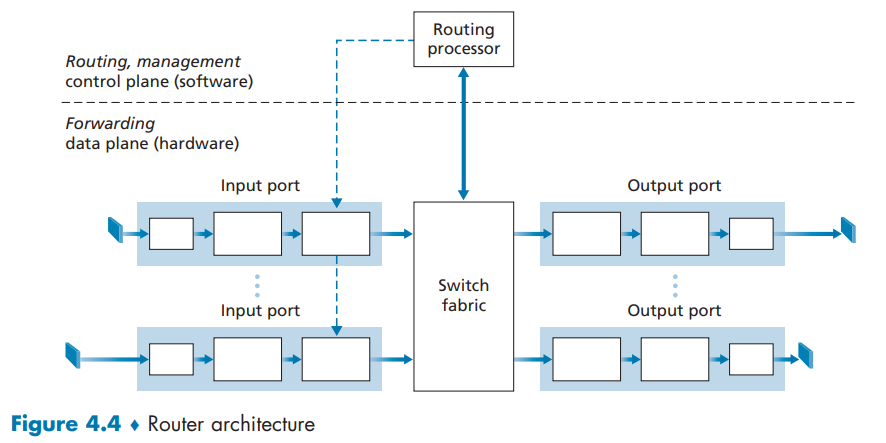

- 路由器输入端口的**关键功能**包括 :在物理层终结入链路 , 在数据链路层与链路交互 , 执行查找转发表以确定输出端口 , 并将控制分组转发给路由选择处理器 . 端口指物理接口 , 数量从企业级少量到ISP级数百个10Gbps不等 . 
- 交换结构负责连接输入与输出端口 , 完全内置于路由器 , 相当于路由器内部的网络 . 
- 输出端口负责存储从交换结构接收的分组 , 执行链路层和物理层处理 , 并在输出链路上发送数据 . 双向链路中 , 输出端口常与输入端口成对出现 . 

---

- 路由选择处理器执行控制平面功能 :在传统路由器中运行路由协议、维护路由表、计算转发表；在SDN路由器中与远程控制器通信、安装转发表项 , 并执行网络管理 . 

---

- **输入端口、输出端口和交换结构通常由硬件实现** , 以应对高速数据报处理(如10Gbps线路下仅51.2ns处理一个数据报) . 
- **控制平面功能则由路由选择处理器以软件实现** . 
- 分组转发可通过汽车进入环状交叉路类比 :基于目的地转发如按最终目的地选择出口；通用转发则考虑来源、车型等多种因素 . 环状交叉路对应交换结构 , 入口/出口对应路由器端口 . 
- 设计挑战包括处理高速数据时的处理速度、交换结构内部拥堵、出口竞争及优先级分配 , 这些问题与交通管理类似 . 

### 4.2.1 Input Port Processing and Destination-Based Forwarding

<a id="fig4.5"></a>

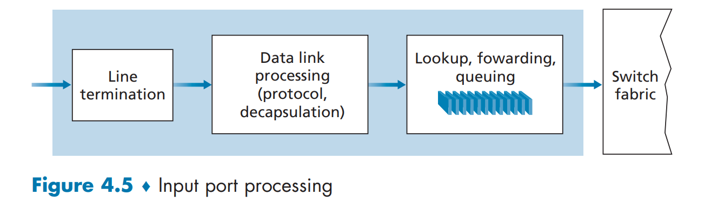

图4.5展示了输入处理的更详细视图 . 输入端口的线路端接(line-termination function)功能和链路层处理为单个输入链路实现了物理层和链路层 . 

---

输入端口执行的**查找操作是路由器运行的核心**——路由器在此处利用转发表来查询到达数据包将通过交换结构转发至的输出端口 . 

该**转发表既可由路由处理器计算并更新 , 也可从远程SDN控制器获取** . 

如图4.4中路由处理器至输入线卡的虚线所示 , 转发表通过独立总线(如PCI总线)从路由处理器复制到线卡 . 借助每个线卡上的这种影子副本 , 数据包转发决策可在各输入端口本地完成 , 无需为每个数据包调用集中式路由处理器 , 从而**避免了集中式处理瓶颈** . 

>   [!NOTE]
>
>   **原先** , 每个数据包到来时 , 输入端口都必须咨询**路由处理器**才能知道转发到哪 , 就像每个顾客结账都要打电话问经理 . 
>
>   **现在** , 由于线卡上已经有了转发表的副本 , 输入端口可以自行就地查表做出转发决策 , 不再需要为每个数据包去依赖路由处理器 . 
>
>   ---
>
>   ### 也就是说 线卡上的转发表 只是路由处理器的一个副本 ? 是的 !
>
>   1.  **来源单一** : 这个副本的唯一来源 , 就是中央路由处理器(或SDN控制器) . 线卡自身不参与路由计算 , 不决定数据包的最终去向 . 
>   2.  **内容同步** : 副本的内容(即转发表项)会随着主表的更新而同步更新 . 当网络拓扑变化导致路由改变时 , 路由处理器会计算出新路径 , 并立即将更新后的转发表下发到所有线卡 , 确保所有"影子副本"与"主副本"保持一致 . 
>   3.  **权限分离** : 线卡只有**使用**这个副本的权限(执行"查表"这个动作) , 而没有**修改**这个副本内容的权限 . 计算和决策的"大脑"依然是路由处理器 , 线卡是负责高速执行的"肌肉" . 
>
>   ---
>
>   ### 线卡上的副本可以保证找到所有的转发信息吗 会有说 显卡转发表无法处理 需要上报路由处理器的情况吗 ?
>
>   这是一个非常深入且关键的问题 . 答案是 : **在绝大多数情况下 , 线卡副本能保证找到转发信息并独立处理 . 但在极少数特定情况下 , 确实需要上报路由处理器 . **
>
>   这两种情况正好对应了路由器处理数据的两个层面 : **数据平面** 和 **控制平面** . 
>
>   ---
>
>   #### 1. 常态(99.9%的情况) : 数据平面处理 —— 副本足以应对
>
>   线卡上的转发表副本 , 包含了路由处理器计算出的、当前所有已知最佳路径的"精编指令集" . 对于所有**目的地址在转发表中有明确表项**的数据包 , 线卡都能独立完成查找和转发 . 
>
>   *   **就像什么？** 就像你问一个训练有素的客服代表一个常规问题 , 他根据手上的知识库(副本)就能立刻给你标准答案 , 完全不需要去请示部门经理 . 
>
>   ---
>
>   #### 2. 异常或控制流(那0.1%的情况) : 控制平面处理 —— 需要上报路由处理器
>
>   当数据包触发了"异常"或"控制"逻辑时 , 线卡就无法独自处理了 , 必须上报 . 主要有以下几种情况 : 
>
>   **a) 表项缺失**
>   *   **情况** : 一个数据包的目的IP地址 , 在转发表副本中**找不到任何匹配项**(即路由未知) . 
>   *   **处理** : 线卡不知道如何转发 , 它会将这个数据包通过特定通道上交给路由处理器 . 
>   *   **路由处理器的动作** : 处理器会查看自己的全局路由表 . 如果确实没有路由 , 它可能会生成一个 **"ICMP目的不可达"** 消息发回给源主机 , 或者如果它后来通过路由协议学到了这条路由 , 它会更新转发表并下发到所有线卡 . 
>
>   **b) 需要处理特殊控制报文**
>   *   **情况** : 数据包本身不是普通数据 , 而是**路由协议报文**(如OSPF、BGP报文)或 **ICMP Echo请求** 等网络控制和管理报文 . 
>   *   **处理** : 线卡识别出这些包不是要转发的普通数据 , 而是要给"路由器自己"的 . 它会将这些包直接上交给路由处理器 . 
>   *   **路由处理器的动作** : 处理器会"聆听"并处理这些报文(如与邻居路由器更新路由表、回复Ping请求等) . 这属于路由器的控制和管理功能 . 
>
>   **c) 触发安全或策略机制**
>   *   **情况** : 数据包匹配了需要中央处理器介入的**访问控制列表** 或**防火墙策略** . 例如 , 日志记录需要记录到中央系统 , 或者需要进行复杂的深度包检测 . 
>   *   **处理** : 简单的"允许/拒绝"策略线卡可能自己能执行(如果硬件支持) , 但复杂的、需要状态跟踪或记录的分析 , 则需要上报 . 
>
>   **d) 新流的第一包(在某些高级架构中)**
>   *   **情况** : 在一些早期或特定设计的SDN网络中 , 当一条数据流(例如某个视频通话的第一个包)首次到达时 , 线卡上可能没有对应的流表项 . 
>   *   **处理** : 线卡会将这"第一个包"上交给SDN控制器(相当于路由处理器) . 
>   *   **控制器的动作** : 控制器根据全局策略计算出一条转发路径 , 生成一条新的流表项 , 并"安装"到相关的线卡上 . 后续属于同一条流的所有数据包 , 线卡就能用自己的流表副本快速转发了 . 这就是"<u>首包上送 , 后续本地转发</u>"的机制 . 
>
>   #### 总结
>
>   您可以这样理解 : 
>
>   *   **线卡(副本)** : 负责**高速转发**的"肌肉和条件反射" . 它处理所有常规、已知的流量 . 
>   *   **路由处理器(主表)** : 负责**智能决策**的"大脑" . 它处理异常、学习路由、运行协议、响应管理请求 , 并确保所有"肌肉"的记忆(副本)都是最新和正确的 . 
>
>   这个"**绝大部分本地处理 + 极少数特殊情况上报**"的架构 , 完美地平衡了**高性能转发**和**灵活集中控制**这两个看似矛盾的需求 , 是现代路由器设计的精髓 . 

- **转发表** :

  - 直接存储所有IP地址(40亿+)不可行 . 

  - 这里采用 **最长前缀匹配规则** 就相当于保存了一个范围 : 转发表中的每个表项都是一个"网络前缀"加转发端口的映射
    
    - **最长前缀匹配规则** 规定 :  当存在多个匹配的表项时 , 选择其中**前缀长度最长**的那一个作为最终匹配项 , 并将其关联的端口作为转发出口
    
    - 当你收到一个 IP 数据包 , 需要根据转发表查找其输出端口时 , 将数据包目的 IP 地址与表中所有表项的前缀进行逐位比对
    
    -   此时可能出现三种情况 : 无匹配(上报控制层)、单一匹配或多个匹配(依据 最长前缀 原则)
    
        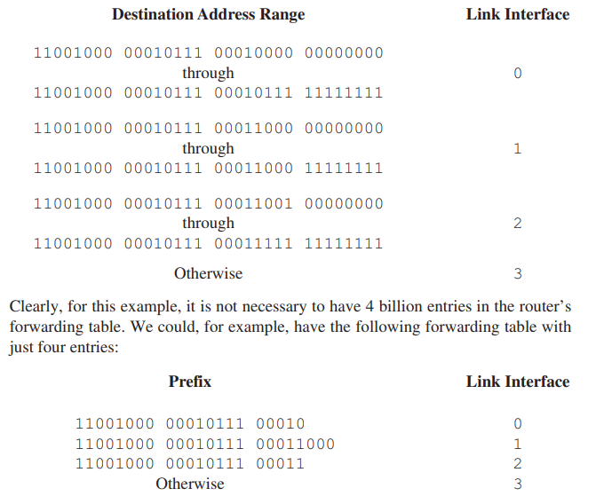
    
  
- **高速查找技术要求** :

  - 查找需在纳秒级完成(如10Gbps链路、64字节分组) . 
  - 使用硬件加速查找算法(如TCAM 十分强大 查找时间是常数级 ) . (为什么是硬件可以回想一下计算机组成原理中的cache命中那一块)
  - TCAM支持常数时间内返回匹配结果 , 适用于高速路由设备(如Cisco系列) . 

==**一旦通过查找确定了某分组的输出端口 该分组就能够进入交换结构 .**==

尽管查找是是输入端口中最重要的工作 但是还有其他的操作将会被执行 以及在交换结构中阻塞时 还需要排队并及时调度 .

>   [!NOTE]
>
>   - **输入端口其他处理动作** :
>       - 物理层与链路层处理 . 
>       - 检查与更新IP首部字段(版本号、检验和、寿命字段) . 
>       - 更新网络管理计数器 . 
>
>   - **"匹配加动作"模式** :
>       - 输入端口处理是"匹配(目的IP)＋动作(转发)"的具体实现 . 
>       - 同样应用于 :
>           - 链路层交换机(匹配MAC地址＋转发/过滤) . 
>           - 防火墙(匹配IP/端口＋阻止转发) . 
>           - NAT(匹配端口＋重写端口＋转发) . 
>       - 该抽象是网络设备通用转发的核心基础

### 4.2.2 Switching

交换结构位于路由器的核心 ,因为数据包正是通过这一结构从输入端口实际交换(即转发)至输出端口 . 

交换可通过多种方式实现 ,如图4.6所示 : 

<a id="fig4.6"></a>


-   **通过内存进行交换**  
    -   早期方式: 数据包先复制到中央路由处理器的内存 ,由CPU决定转发目标后 ,再复制到输出端口 .速度受限于内存带宽 ,且无法并行处理 . 就相当于一台计算机
    -   现代方式: 处理任务下放到输入线卡上的处理器 ,提高了并行性 . 
-   **通过总线进行交换**
    -   输入端口通过一条共享总线直接将数据包发送给输出端口 . 
    -   具体实现时 ,输入端口会在数据包前添加标识内部转发的标签(标头) ,指明目标输出端口 ,再将数据包发送至总线 . 
    -   总线是独占资源 ,同一时间只能传输一个数据包 ,其他数据包必须等待 . 交换速率受限于总线速度 . **就像环岛每次仅能容纳一辆车** . 不过对于小型局域网和企业网环境 ,总线交换通常已能满足需求 . 
    -   无需路由处理器

-   **通过互联网络进行交换** 
    -   使用**交叉开关** 等复杂结构 ,用多条并行路径连接输入和输出端口 . 
    -   **核心优势** : 只要输入和输出端口不同 ,多个数据包可以**同时转发** ,极大地提高了吞吐量 . 
    -   **唯一瓶颈** : 当两个数据包要发往**同一个**输出端口时 ,其中一个会被阻塞 . 

---

除了这三种 还有一种更现代的 multiple stages of switching elements , 这个甚至在中文互联网上都没有找到翻译 (原书翻译成 多级交换元素)(仅浅浅搜索一下)

### 4.2.3 Output Port Processing

输出端口处理(如图4.7所示)负责将存储在输出端口内存中的数据包通过输出链路发送出去 .

<a id="fig4.7"></a>

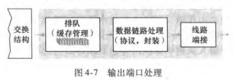

这一过程包括 : (通过调度机制)选择待传输的数据包、执行出队列操作 ,并完成必要的链路层与物理层传输功能 . 

### 4.2.4 Where Does Queuing Occur?

丢包就是发生在上文所讲的 输入端口队列 和 输出端口队列 中 . [见 [fig4.5](#fig4.5) [fig4.6](#fig4.6) [fig4.7](#fig4.7)]

#### 输入排队 (Input Queuing)

1. 现象的产生

    -   **前提假设：** 假设所有分组长度固定,同步到达输入端口 .输入链路速度与输出链路速度($R_{\text{line}}$)相同 .交换结构传送速率为 $R_{\text{switch}}$ .

    -   **无排队条件：** 如果 $R_{\text{switch}}$ 比 $R_{\text{line}}$ 快 $N$ 倍(其中 $N$ 为输入/输出端口数),则在输入端口仅会出现**微不足道的排队** .这是因为即使最坏情况下(所有 $N$ 条输入链路接收分组,且都转发到同一输出端口),每批 $N$ 个分组也能在下一时间批次前通过交换结构处理完毕 .

    -   **排队条件：** 如果交换结构速度不够快(相对于输入链路速度),无法做到所有分组无时延通过,则**到达的分组必须进入输入端口队列**,等待交换结构传输到输出端口 .

2. HOL 阻塞 (Head-Of-the-Line Blocking)(线头阻塞)

    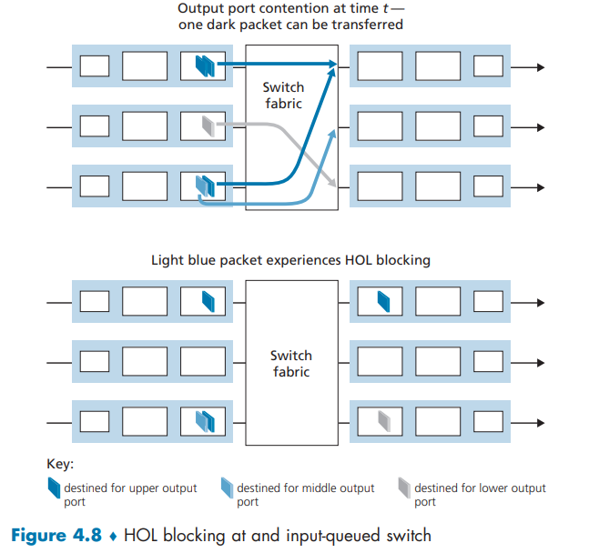

    -   **描述：** 当一个输入队列中的队首分组(Head-of-the-Line)等待交换结构发送时(比如等待目标输出端口空闲),它会**阻碍**该队列中在其后方、即使目标输出端口已空闲的分组的发送 .

    -   **示例 (图 4-8)：** 一个深色阴影分组(下方)想去右上角端口但左上角另一个分组也需要去右上角端口 , 需要等待交换结构,导致其左下后方的浅色阴影分组(想去右中侧端口,该端口可能空闲)也被迫等待 .

    -   **影响(结论)：** 经推导,由于 HOL 阻塞,**输入队列的吞吐量至多只能达到输入链路上分组到达率的 58%** [Karol 1988] .
        -   **非严格地说：** 如果假设输入队列长度无限增大,这等同于交换机出现了**丢包**的丑态[McKeown 1997b]

    -   **解决方案：** 文中提到 [McKeown 1997b] 讨论了多种解决 HOL 阻塞的方法 .

#### 输出排队 (Output Queuing)

1. 现象的产生

    -   **前提假设：** 假设 $R_{\text{switch}}$ 比 $R_{\text{line}}$ 快 $N$ 倍,且来自 $N$ 个输入端口的分组目标都是**相同的**输出端口 .

    -   **排队条件：** 在向输出链路发送一个分组的时间内,将有 $N$ 个新分组到达该输出端口(每个输入端口一个) .由于输出端口在一个单位时间内**仅能**传输一个分组,这 $N$ 个到达的分组必须**排队**等待经输出链路传输 .

    -   **结果：** 排队的分组数量会变得足够大,最终**耗尽输出端口的可用内存** .

        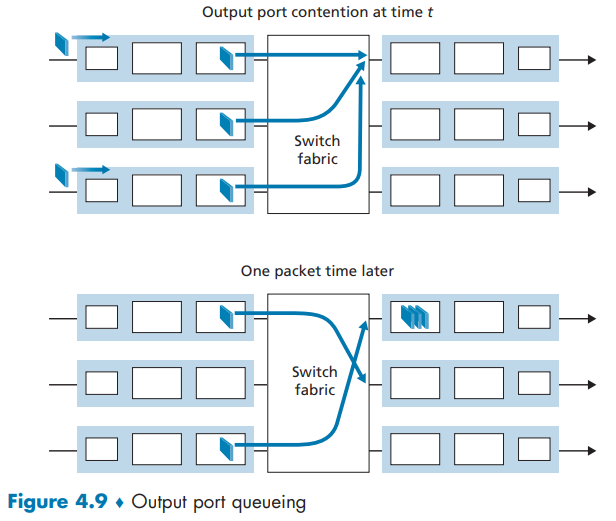

    -   **示例 (图 4-9)：** 在时刻 $t$,所有输入端口都到达一个发往最上侧输出端口的分组 .在一个分组时间后,3 个初始分组被传输到输出端口排队,其中一个被发送；同时又有 2 个新分组到达并要发往最上侧输出端口 .

    -   **待讨论主题：** 输出端口的分组调度(Packet Scheduler)是后续章节将要讨论的中心问题 .

2. 拥塞管理与丢包策略

    -   **内存不足时的决策：** 当没有足够的内存来缓存一个分组时,必须做出决定：
        -   **丢弃 (Drop-tail)：** 丢弃新到达的分组 .
        -   **删除排队分组：** 删除一个或多个已排队的分组为新分组腾出空间 .

    -   **主动队列管理** (AQM) 算法： 在缓存填满前就丢弃一个分组或加以标记,这有利于向发送方提供一个拥塞信号 .
        -   **最广泛研究和实现的 AQM 算法之一是随机早期检测 (RED - Random Early Detection)** (引自 [Christiansen 2001; Floyd 2016]) .

3. 缓存长度需求 (Buffer Size)

    -   传统经验 (结论)： 经推导(省略推导过程,引自 [RFC 3439; Villamizar 1994]),缓存数量 $B$ 应该等于平均往返时延 (RTT) 乘以链路容量 $(C)$,即：

        $$B = \text{RTT} \cdot C$$

        -   **例子：** 10Gbps 链路,250ms RTT,所需缓存量 $B = 2.5\text{Gb}$ .

    -   新的研究结论： 经推导(省略推导过程,引自 [Appenzeller 2004]),对于有大量流的 TCP,所需缓存量可以减少：

        $$B = \text{RTT} \cdot C / \sqrt{N}$$

        其中 $N$ 是流的数量 .

        -   **适用情况：** 对于有大量流流经的主干路由器链路, $N$ 的值可能非常大,所需缓存长度的减少相当明显 .

### 4.2.5 Packet Scheduling

所谓分组调度 就是说我有一个队列 我依据什么顺序对队列里面的申请提供服务 比如 "先到先来" FCFS(first come first service) , FIFO(first in first out) , 还是设置一定的优先级 ?

分组调度是路由器在多个待发送分组之间决定发送顺序的机制,影响网络性能、延迟、公平性等.

常见调度算法：

1.  **First-In-First-Out (FIFO)**：
    -   最简单的调度方式
    -   分组按到达顺序排队,先到先发
    -   无优先级或区分服务质量
    -   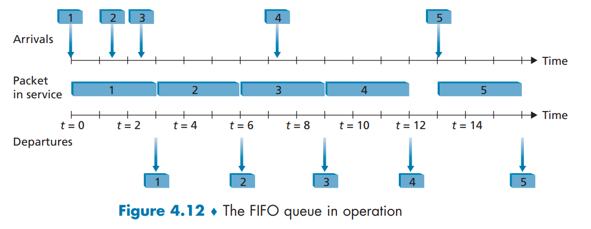
    
2.  **Priority Scheduling(优先级调度)**：
    -   分组按优先级分类,高优先级先发送
    -   注意 并不是使用优先队列这样的结构 一个例子是 简单的分为低优先级和高优先级 如下图[fig4.13]所示 ; 同时 , 当低优先级的开始传输以后 高优先级也不能打断传输 [fig4.14] 
    -   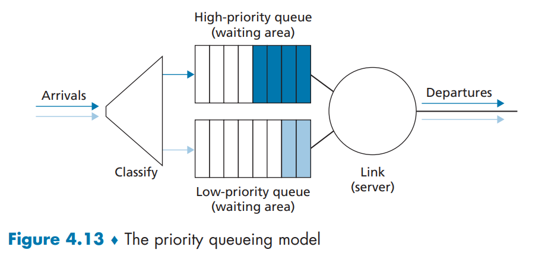
    -   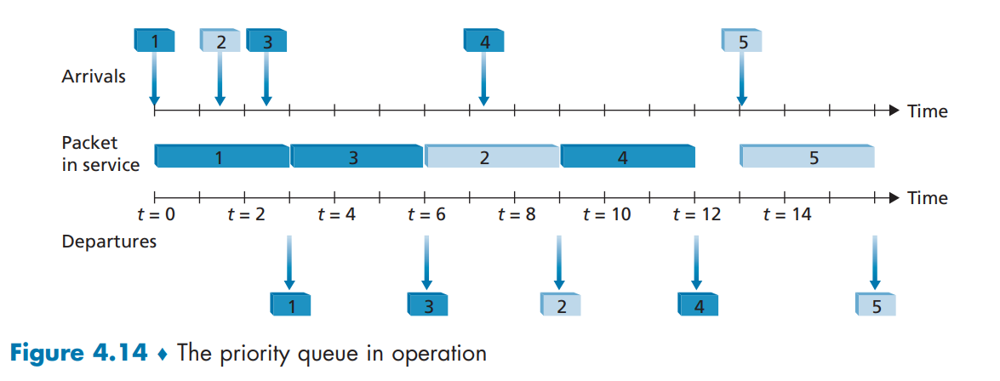
    -   可用于区分实时流(如语音)与普通流量
    -   可能导致低优先级流“饥饿”
    
3.  **Round Robin and Weighted Fair Queuing (WFQ)循环和加权公平排队**
    
    1.   循环对流的发送逻辑
    
         1.   **分组分类**:分组被预先划分到不同的类别(例如：类 1、类 2……类 N).
    
         2.   **轮流服务**调度器按顺序轮流为每个类提供服务.(例如：先传一个类 1 的分组,再传一个类 2 的分组,再传类 1,再传类 2……依此类推.)
    
         3.   **保持工作(Work-Conserving)原则**
    
              -   只要系统中还有任何类别的分组在排队,链路就不会空闲.
    
              -   如果轮到某个类,但该类没有分组可传,则**立即跳过**,检查下一个类.
    
         4.   **无绝对优先级**
    
              -   不像严格优先级排队那样,高优先级类会“霸占”链路；
              -   循环调度确保每个类都能**公平地获得服务机会**.
    
         5.   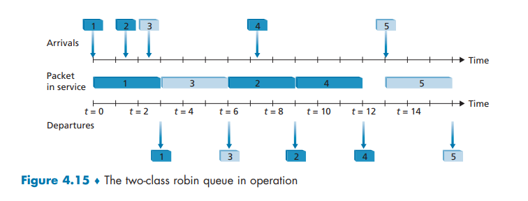
    
              图中就是传送一个`1(属于深色类)`再传送一个`3(属于浅色类)`

2.    weighted fair queuing (WFQ) discipline

     1.   对不同的队列进行加权显然更合理 所以有加权队列

          1.   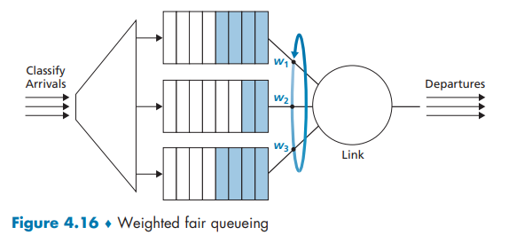

          2.   每一条线路的流量
               $$
               R \times \frac{\omega_i }{ \sum \omega_j} \quad R是链路总速率
               $$

## 4.3 The Internet Protocol (IP): IPv4, Addressing,  IPv6, and More

### 4.3.1 IPv4 Datagram Format

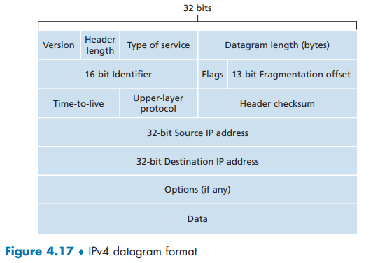

在无[Options]的情况下 一个TCP数据报总共会有40字节的首部 (TCP的20字节首部+IP的20字节首部)

IP数据报中的关键字段如下：

-   **版本(号)**.这4比特规定了数据报的IP协议版本.通过查看版本号,路由器能够确定如何解释IP数据报的剩余部分.不同的IP版本使用不同的数据报格式.IPv4的数据报格式如图4-16所示.新版本的IP(IPv6)的数据报格式将在4.3.5节中讨论.
-   **首部长度**.因为一个IPv4数据报可包含一些可变数量的选项(这些选项包括在IPv4数据报首部中),故需要用这4比特来确定IP数据报中载荷(例如在这个数据报中被封装的运输层报文段)实际开始的地方.大多数IP数据报不包含选项,所以一般的IP数据报具有20字节的首部.
-   **服务类型**.服务类型(TOS)比特包含在IPv4首部中,以使不同类型的IP数据报(例如,一些特别要求低时延、高吞吐量或可靠性的数据报)能相互区别开来.例如,将实时数据报(如用于IP电话应用)与非实时流量(如FTP)区分开也许是有用的.提供特定等级的服务是一个由网络管理员对路由器确定和配置的策略问题.我们在3.7.2节讨论明确拥塞通告所使用的两个TOS比特时也学习过.
-   **数据报长度**.这是IP数据报的总长度(首部加上数据),以字节计.因为该字段长为16比特,所以IP数据报的理论最大长度为65535字节.然而,数据报很少有超过1500字节的,该长度使得IP数据报能容纳最大长度以太网帧的载荷字段.
-   **标识、标志、片偏移**.这三个字段与所谓IP分片有关,这是一个我们将很快要考虑的主题.有趣的是,新版本的IP(即IPv6)不允许在路由器上对分组分片.
-   **寿命**.寿命(Time-To-Live,TTL)字段用来确保数据报不会永远(如由于长时间的路由选择环路)在网络中循环.每当一台路由器处理数据报时,该字段的值减1.若TTL字段减为0,则该数据报必须丢弃.
-   **上层协议**.指示是TCP还是UDP(上层运输层协议) . 该字段通常仅当一个IP数据报到达其最终目的地时才会有用.例如,值为6表明数据部分要交给TCP,而值为17表明数据要交给UDP.注意在IP数据报中的协议号所起的作用,类似于运输层报文段中端口号字段所起的作用.**协议号是将网络层与运输层绑定到一起的黏合剂**,**而端口号是将运输层和应用层绑定到一起的黏合剂**.我们将在第6章看到,链路层帧也有一个特殊字段用于将链路层与网络层绑定到一起.
-   **首部检验和**.首部检验和用于帮助路由器检测收到的IP数据报中的比特错误.首部检验和是这样计算的：将首部中的每2个字节当作一个数,用反码算术对这些数求和.如在3.3节讨论的那样,该和的反码(被称为因特网检验和)存放在检验和字段中.路由器要对每个收到的IP数据报计算其首部检验和,如果数据报首部中携带的检验和与计算得到的检验和不一致,则检测出是个差错.路由器一般会丢弃检测出错误的数据报.**注意到在每台路由器上必须重新计算检验和并再次存放到原处**,因为TTL字段以及可能的选项字段会改变.关于计算因特网检验和的快速算法的有趣讨论参见[RFC1071].此时,一个经常问的问题是：
    -   为什么TCP/IP在运输层与网络层都执行差错检测？
        1.   注意到在IP层只对IP首部计算了检验和,而TCP/UDP检验和是对整个TCP/UDP报文段进行的
        2.   TCP/UDP与IP不一定都必须属于同一个协议栈.原则上,TCP能够运行在一个不同的协议(如ATM)上[Black 1995],而IP能够携带不一定要传递给TCP/UDP的数据.
-   **源和目的IP地址**.当某源生成一个数据报时,它在源IP字段中插入它的IP地址,在目的IP地址字段中插入其最终目的地的地址.通常源主机通过DNS查找来决定目的地址,如在第2章中讨论的那样.我们将在4.3.3节中详细讨论IP编址.
-   **选项**.选项字段允许IP首部被扩展.首部选项意味着很少使用,因此决定对每个数据报首部不包括选项字段中的信息,这样能够节约开销.然而,少量选项的存在的确使问题复杂了,因为数据报首部长度可变,故不能预先确定数据字段从何处分界开始.而且还因为有些数据报要求处理选项,而有些数据报则不要求,故导致一台路由器处理一个IP数据报所需的时间变化可能很大.这些考虑对于高性能路由器和主机上的IP处理来说特别重要.由于这样或那样的原因,在IPv6首部中已去掉了IP选项,如4.3.5节中讨论的那样.
-   **数据(有效载荷)**.我们来看看最后也是最重要的字段,这是数据报存在的首要理由！在大多数情况下,IP数据报中的数据字段包含要交付给目的地的运输层报文段(TCP或UDP).然而,该数据字段也可承载其他类型的数据,如ICMP报文(在5.6节中讨论).

>   [!NOTE]
>
>   [IPv4分片 , IPv6禁止路由器分片 , 只能由发送主机分片] [主机直接分片是安全的 但是直接在路由器中分片就会有很多问题 ]
>
>   当IPv4数据报在某路由器上发现长度超过下一跳链路MTU(最大传输单元)且$\mathbf{DF=0}$,路由器便把原报文按MTU拆成若干片,每片复制原首部并重新计算总长度、MF标志(非末片置1,末片置0)和13位片偏移(以8字节为单位指出本片数据在原报文中的起始位置),随后各片独立封装帧转发
>
>   当$\mathbf{DF \neq 0}$时 , 则分组实在过大 直接丢弃 !
>
>   目的主机收到同ID, 同源目的地址的片后,按片偏移排序缓存,待MF=0的末片到达且连续无空缺时重组回完整报文,
>
>   若任一片丢失或重组超时则整体丢弃,这一机制使中间节点免予重组,但也导致任片失效即全报重传、防火墙难识别、易被攻击等问题.

### 4.3.2 IPv4 Addressing

#### 转发基础

首先我们要明确 : 一个IP地址不是分配给一台主机或路由器这类设备本身,而是分配给设备的一个接口.

个人电脑通常只有一个网络接口,因此它只有一个IP地址.

而路由器则通常有多个IP地址,是因为它设计了多个接口,每个接口连接一个不同的网络.

它的核心任务就是在这些不同的网络之间接收来自一个网络的数据,并通过另一个接口发送到目标网络,因此它必须为每个连接的网络都配备一个独立的接口和IP地址.

---

每个IPv4的地址长度为32比特 , 因此总共有$2^{32}$个可能的地址 , 使用 **点分十进制记法** , `0-255.0-255.0-255.0-255`.

我们先不考虑NAT , 每个接口都对应一个唯一的IP地址 , 这个地址应该由其连接的子网来决定 , 而不是随机分配的 .

---

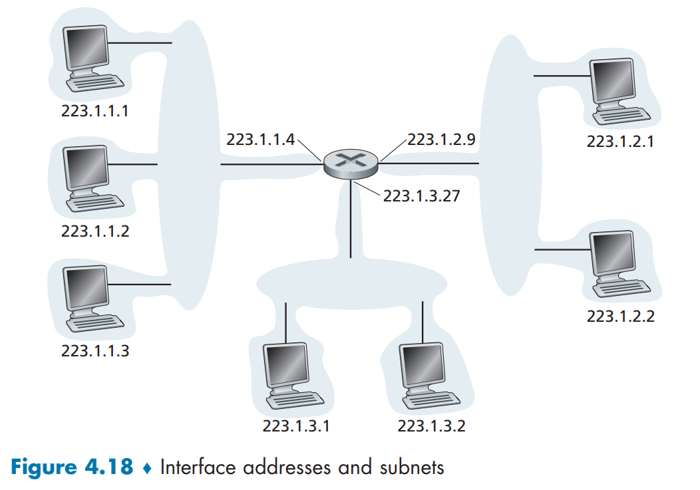

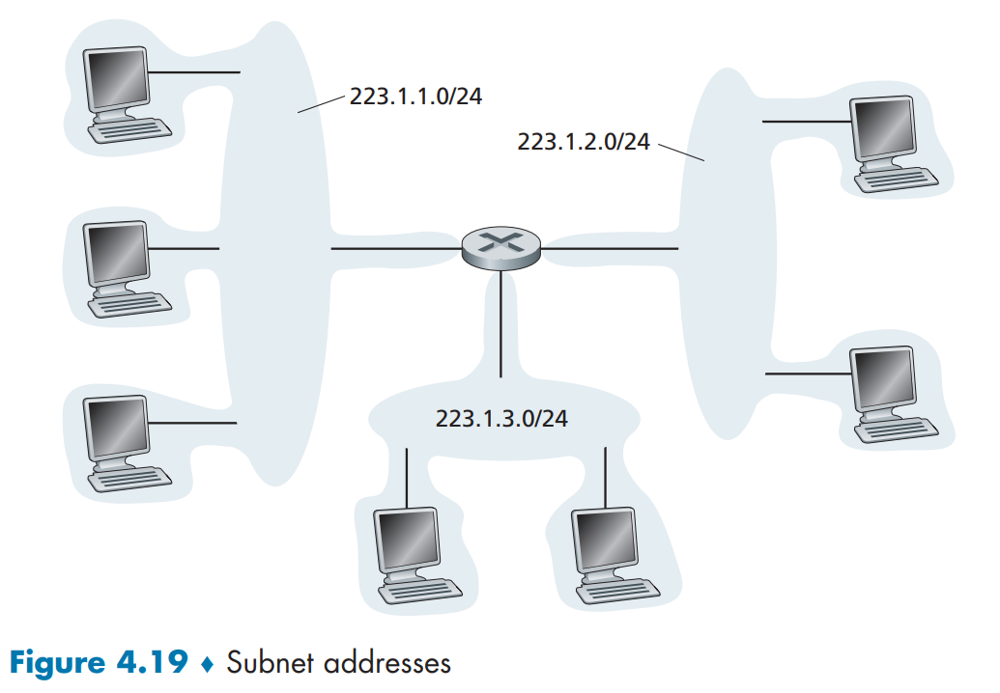

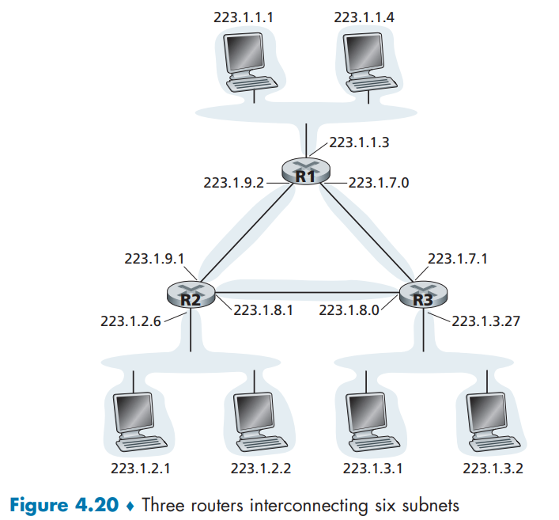


上面三张图展示了IP地址以及形成的子网 [Fig4.20] 中有六个子网 , 除了明显的三个以外 , 两两路由器的`output`之间也形成了子网 , 比如 `223.1.9.xxx/24` .

采用子网掩码后的转发就变成 :

1.   检查分组目的IP地址中的网络号：若网络号不是本网络, 则从路由表中找出相应的转发结点地址将其转发出去.
2.   检查子网号：当网络号是本网络时,路由器将检查子网号,向相应的子网转发此分组.

---

#### 如何编址

**无类别域间路由选择**  **CIDR**

>   [!NOTE]
>
>   好的,这是一个非常核心的网络技术概念.我们来详细解释一下“无类别域间路由选择”.
>
>   ### 核心摘要
>
>   **无类别域间路由选择**,简称 **CIDR**,是用于在互联网上更灵活地分配IP地址和进行路由选择的一种方法.它诞生于1993年,主要为了解决两个问题：
>   1.  **IPv4地址即将耗尽**.
>   2.  **互联网核心路由表规模急剧膨胀**.
>
>   要理解CIDR,我们首先要了解它出现之前的世界——**有类别路由**.
>
>   ---
>
>   ### 1. 历史背景：有类别路由
>
>   在CIDR之前,IP地址被严格划分为A、B、C、D、E五个固定类别：
>
>   | 类别 | 地址范围(二进制开头) | 默认子网掩码        | 网络数量    | 每个网络的主机数量 |
>   | :--- | :------------------- | :------------------ | :---------- | :----------------- |
>   | A    | 0...                 | 255.0.0.0 (/8)      | 126个       | 16,777,214         |
>   | B    | 10...                | 255.255.0.0 (/16)   | 16,384个    | 65,534             |
>   | C    | 110...               | 255.255.255.0 (/24) | 2,097,152个 | 254                |
>   | D    | 1110...              | 多点广播            |             |                    |
>   | E    | 11110...             | 保留                |             |                    |
>
>   **有类别路由的问题：**
>
>   *   **浪费严重**：一个需要300个IP地址的中型企业,只能申请一个B类地址(6万多个IP),但实际只用了很少一部分,造成巨大浪费.而一个C类地址(254个IP)又不够用.
>   *   **路由表爆炸**：每个网络(无论是A、B还是C类)都会在互联网核心路由器上产生一条路由条目.随着网络数量激增,路由表变得过于庞大,影响了路由效率.
>
>   ---
>
>   ### 2. CIDR 是什么？
>
>   CIDR 的核心思想是：**打破IP地址的固定类别界限**.
>
>   它引入了两个关键概念：
>
>   #### a) 可变长度子网掩码
>
>   子网掩码不再局限于 255.0.0.0、255.255.0.0 等固定值,而是可以是任意长度.这使得我们能够将一个大的IP地址块(如一个A类或B类网络)划分成多个更小的、大小不等的子网,或者将多个连续的小网络(如多个C类网络)聚合成一个更大的“超网”.
>
>   **表示方法：**
>   CIDR使用一种简洁的 **“斜线记法”** 来表示IP地址和其对应的子网掩码.
>   格式为：`IP地址 / 前缀长度`
>   *   **前缀长度**：子网掩码中连续‘1’的位数.
>
>   **例如：**
>   *   `192.168.1.0/24` 等同于 `192.168.1.0` 子网掩码 `255.255.255.0`
>   *   `192.168.1.0/26` 等同于 `192.168.1.0` 子网掩码 `255.255.255.192`(划分出了更小的子网)
>   *   `172.16.0.0/12` 等同于 `172.16.0.0` 子网掩码 `255.240.0.0`(这是一个“超网”)
>
>   #### b) 路由聚合
>
>   这是CIDR在互联网骨干网中最重要的应用.ISP可以从上级机构获得一个大的IP地址块,然后将其划分给多个下游客户.在向外广播路由信息时,ISP只需广播这个大的地址块,而无需广播其内部所有的小网络.
>
>   **举个例子：**
>   *   一个ISP拥有地址块 `200.100.80.0/20`.
>   *   它可以将这个块分配给8个公司,每个公司得到一个 `/23` 的网络(例如 `200.100.80.0/23`, `200.100.82.0/23` ... `200.100.94.0/23`).
>   *   当ISP与外部网络通信时,它不需要告诉全世界它内部有8条具体的路由.它只需要宣告一条聚合路由：**`200.100.80.0/20`**.
>   *   外部路由器只需要记住这一条路由条目,就可以将发往这8个公司中任意一个的数据包先发送到这个ISP.然后由ISP内部的路由器进行更精确的转发.
>
>   ---
>
>   ### 3. CIDR 的优势
>
>   1.  **极大地减少了IP地址浪费**：可以根据客户的实际需求分配大小合适的地址块,而不是僵化的A、B、C类.
>   2.  **有效控制了互联网路由表的规模**：通过路由聚合,将多条路由条目合并为一条,减轻了核心路由器的负担.
>   3.  **提高了路由效率**：更小的路由表意味着更快的查找速度和更低的硬件要求.
>
>   ---
>
>   ### 4. 实际应用示例
>
>   假设你是一个网络管理员,公司给你分配了一个IP地址段：`192.168.1.0/24`.
>
>   *   **默认情况**：你有 256 个地址(0-255),可用主机地址是 254 个(1-254).
>   *   **使用CIDR划分子网**：你需要为4个部门划分独立的子网,每个部门大约需要50台主机.
>       *   计算后,你可以使用 `/26` 的子网掩码(`255.255.255.192`).
>       *   这将 `192.168.1.0/24` 划分成了4个更小的子网：
>           *   `192.168.1.0/26`(主机：1-62)
>           *   `192.168.1.64/26`(主机：65-126)
>           *   `192.168.1.128/26`(主机：129-190)
>           *   `192.168.1.192/26`(主机：193-254)
>       *   每个子网有64个地址,其中62个可用给主机.完美满足了需求.
>
>   ---
>
>   ### 总结
>
>   | 特性         | 有类别路由           | 无类别域间路由         |
>   | :----------- | :------------------- | :--------------------- |
>   | **核心思想** | 固定类别(A, B, C)    | 无类别,灵活划分        |
>   | **子网掩码** | 固定的(/8, /16, /24) | 可变长度的(VLSM)       |
>   | **表示法**   | 点分十进制           | 斜线记法(CIDR记法)     |
>   | **地址分配** | 浪费严重             | 高效、按需分配         |
>   | **路由表**   | 条目多,规模大        | 通过聚合,条目少,规模小 |
>   | **时代**     | 互联网早期           | 现代互联网(IPv4和IPv6) |
>
>   简单来说,**CIDR是现代互联网能够持续运行至今的基石技术之一**.它通过“打破类别、灵活划分、聚合路由”的方式,极大地缓解了IPv4地址危机并优化了全球路由效率.今天,无论是IPv4还是IPv6,都完全基于CIDR的原理进行地址管理和路由.
>
>   ---
>
>   另外 , IP广播地址为`255.255.255.255`,如果一台主机给这个地址发送数据报,报文会发给一个网络中的所有主机,默认情况下路由器也会有选择地向邻居子网转发该报文(虽然通常不会这样做)

#### 如何获取一个地址 

1. 获取一块 IP 地址块

    - 网络管理员通常从 ISP 处获取 IP 地址块.

    - ISP 会从其已有的更大地址块中划分出一部分分配给组织.

        - 例如,若 ISP 拥有 `200.23.16.0/20`,可将其划分为 8 个 `/23` 子块,分配给 8 个组织.

        - ```text
            ISP的地址块 200.23.16.0/20	11001000 00010111 00010000 00000000
            =============================================================
            组织0      200.23.16.0/23  11001000 00010111 0001|000|0 00000000
            组织1		 200.23.18.0/23	 11001000 00010111 0001|001|0 00000000
            组织2		 200.23.20.0/23  11001000 00010111 0001|010|0 00000000
            ...
            组织7		 200.23.30.0/23  11001000 00010111 0001|111|0 00000000
            ```


    - 也可以通过 全球 IP 地址的管理机构**ICANN**获取IP,它们也负责分配 IP 地址、管理 DNS 根服务器及域名分配.
    
    - ICANN 通过区域性注册机构进行地址分配.


2. 为主机分配地址：动态主机配置协议(DHCP)

    - 获得地址块后,需为组织内的主机和路由器接口分配具体 IP 地址.

    - 路由器地址通常由管理员手动配置,而主机地址则常用 **DHCP** 自动分配.

    - DHCP 可分配固定或临时 IP 地址,并提供子网掩码、默认网关、DNS 服务器等信息.
        - DHCP 被称为 **即插即用协议**,适用于：住宅网络,企业网络,无线局域网,移动设备频繁切换网络的场景(**如学生携带笔记本电脑移动**)


    - DHCP 采用客户端-服务器模型：
      - 客户端为新接入的主机分配IP.
      - 每个子网可设一台 DHCP 服务器,若无,则通过 **DHCP 中继代理**(通常为路由器)转发请求


#### DHCP协议:自动分配 IP 的四个步骤

当一台新主机接入网络时(比如笔记本连上 Wi-Fi),它通常还没有 IP 地址.DHCP 协议的作用,就是**自动为这台主机分配一个可用的 IP 地址**,并告诉它网络相关的配置信息(如网关、DNS、子网掩码等).整个过程分为四个阶段：

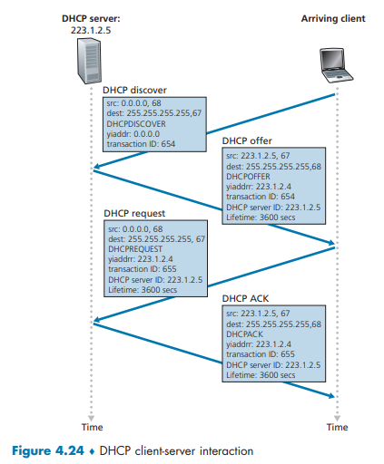

------

##### 1. DHCP Discover(发现阶段)

>   **主机寻找 DHCP 服务器**

-   新主机刚连上网络时,没有 IP 地址,因此无法直接向特定服务器发送消息.
-   它会向整个局域网广播一个 **DHCP Discover** 报文,表示“谁能给我一个 IP 地址？”
-   这个报文：
    -   **源 IP 地址**：`0.0.0.0`(表示自己还没有 IP)
    -   **目的 IP 地址**：`255.255.255.255`(广播给所有节点)
    -   **UDP 端口**：从客户端 **68** → 服务器 **67**
-   链路层会把这个 IP 数据报封装成一个**广播帧**发送给局域网上的所有节点.

------

##### 2. DHCP Offer(提供阶段)

>   **服务器提出可用的 IP 地址**

-   局域网中可能有多个 DHCP 服务器,它们都能收到 Discover 消息.
-   每个服务器都会向主机回复一个 **DHCP Offer** 报文,内容包括：
    -   **yiaddr**(your IP address)：为主机准备的可用 IP 地址
    -   **子网掩码**、**默认网关**、**DNS 服务器地址**
    -   **租约时间(Lease Time)**：这个 IP 可用多久(常为几小时或几天)
-   因为主机此时还没有 IP 地址,服务器的回应也必须使用 **广播**(目的地址为 `255.255.255.255`),这样主机才能收到.

------

##### 3. DHCP Request(请求阶段)

>   **主机选择其中一个服务器的 Offer**

-   主机可能收到多个服务器的 Offer(例如 192.168.1.10、192.168.1.11 等).
-   它会选择一个最合适的(通常是最先到达的)Offer,然后发送 **DHCP Request** 报文,告诉网络：
    -   “我选择了某个服务器提供的那个 IP 地址,请为我保留.”
-   这个报文同样是广播发送的,以便所有 DHCP 服务器都知道这台主机选择了谁,其他服务器就可以回收它们原先准备的地址.

------

##### 4. DHCP ACK(确认阶段)

>   **服务器确认并正式分配 IP 地址**

-   被选中的 DHCP 服务器收到 Request 后,发送 **DHCP ACK** 报文,表示：
    -   “你的 IP 地址(如 192.168.1.10)已经正式分配,租约时间为 X 小时.”
    -   并附带网络的其他配置信息.
-   主机收到 ACK 后,就可以正式使用该 IP 地址与网络通信了.

------

##### 额外说明：租约续期

-   当租约时间快到期时,主机会主动向 DHCP 服务器发送 **DHCP Request** 请求续租.
-   若服务器同意,会再发一个 **DHCP ACK**,延长租期；否则主机需要重新申请新 IP.

| 阶段 | 报文名称      | 方向          | 作用                   |
| ---- | ------------- | ------------- | ---------------------- |
| ①    | DHCP Discover | 主机 → 广播   | 寻找 DHCP 服务器       |
| ②    | DHCP Offer    | 服务器 → 广播 | 提供可用 IP 与配置     |
| ③    | DHCP Request  | 主机 → 广播   | 选择一个服务器的 Offer |
| ④    | DHCP ACK      | 服务器 → 广播 | 确认并正式分配 IP      |

### 4.3.3 Network Address Translation (NAT)

上面的方式有很多缺陷会随着网络越来越大而凸显,比如怎么应对网络的扩容(原先只要8个IP地址就可以满足,现在我想要256个...),所有设备(甚至包括TV和打印机)都需要一个IP,怎么分配呢?

幸运的是我们可以使用 网络地址转换(NAT) 技术,它可以解决IPv4地址短缺问题,并增强网络的安全性.其核心思想是允许在一个专用网络(如家庭或企业网络)内部使用私有IP地址,而在与公共互联网通信时,通过一个或多个公共IP地址进行数据传输.

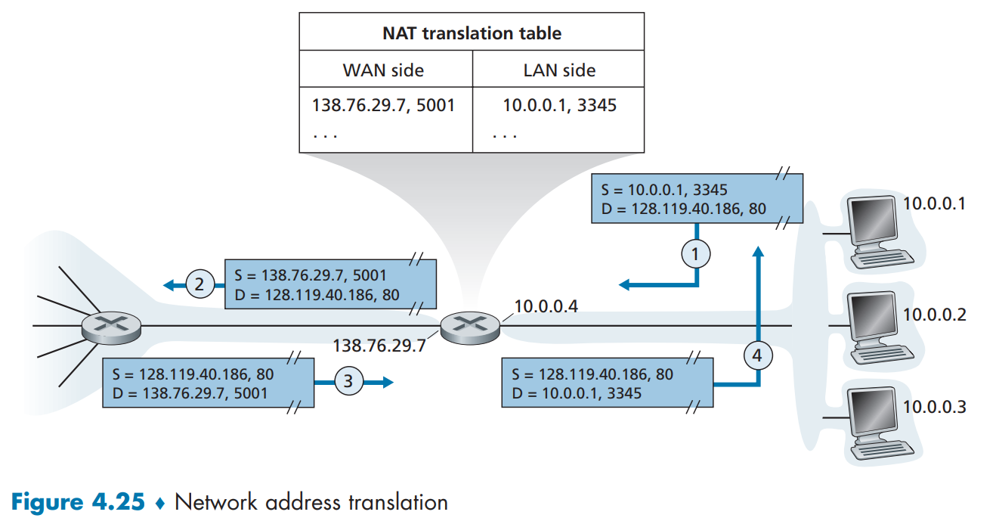

#### NAT 的基本原理与运行机制

1. **专用网络与公共地址的隔离**  
   - 专用网络(如家庭网络)内部使用私有IP地址(例如 `10.0.0.0/24`),这些地址在本地有效,但不能直接在全局互联网中使用.
   - NAT路由器作为专用网络与公共互联网之间的网关,将内部私有地址转换为一个公共IP地址(例如 `138.76.29.7`),使得所有对外通信看起来都来自同一个地址.

2. **NAT转换表与端口映射**  
   - NAT路由器通过维护一张 **NAT转换表** 来跟踪内部主机与外部服务器的通信.表中记录以下信息：
     - 内部主机的私有IP地址和端口号
     - 转换后的公共IP地址和端口号
   - **示例流程**：
     1. 内部主机 `10.0.0.1:3345` 请求外部服务器 `128.119.40.186:80`.
     2. NAT路由器将源地址和端口替换为 `138.76.29.7:5001`,并记录映射关系.
     3. 服务器响应发送到 `138.76.29.7:5001`,NAT路由器根据转换表将数据包转发回 `10.0.0.1:3345`.

3. **支持大量并发连接**  
   - 由于端口号是16位,NAT理论上可支持超过6万个并发连接,使得多个设备能共享单一公共IP地址.

---

#### NAT 的优势与广泛应用

- **地址节约**：缓解了IPv4地址枯竭问题.
- **安全性**：隐藏内部网络结构,提供一定程度的防火墙保护.
- **即插即用**：结合DHCP协议,NAT路由器可自动为内部设备分配私有地址,简化网络配置.

---

#### NAT 的争议与局限性

1. **违反协议分层原则**  
   - 传统网络层(IP)设备不应修改传输层(如端口号)信息.NAT打破了这一原则,被视为对互联网端到端通信模型的破坏.

2. **对服务器和P2P应用的阻碍**  
   - 内部主机若作为服务器(如Web服务器或P2P节点),需要外部主动发起连接,但NAT会阻挡未经请求的入站流量.
   - **解决方案**：  
     - **NAT穿越技术**(如STUN、TURN、ICE)  
     - **通用即插即用(UPnP)**：允许内部主机动态配置NAT映射规则.

3. **中间盒的兴起**  
   - NAT是“中间盒”的典型代表,这类设备不仅转发数据包,还执行深度包检测、负载均衡、防火墙等功能,推动了网络架构向更通用的转发模式演进.

---

#### 总结

NAT通过地址与端口转换,实现了私有网络与公共互联网的无缝连接,成为现代互联网不可或缺的组件.尽管存在协议设计和应用兼容性的争议,但其在地址扩展和网络管理方面的价值使其持续发挥重要作用.随着IPv6的普及,NAT的需求可能逐渐减少,但在过渡期内,它仍是网络架构中的关键技术和研究焦点.

### 4.3.4 IPv6

在20世纪90年代早期,由于互联网的迅猛发展导致32位IPv4地址面临枯竭的危机,IETF开始研发替代协议IPv6.尽管当时对IPv4地址耗尽时间的预测存在争议(从2008年到2018年不等),但为预留足够的技术部署时间,IPv6的研发工作正式启动.值得注意的是,IPv5原指ST-2协议,但最终被放弃.2011年2月,IANA分配完了最后的IPv4地址池,标志着IPv4地址资源的实质性耗尽,进一步凸显了向`IPv6`过渡的紧迫性.

#### IPv6 Datagram Format

- 扩展的地址能力. IPv6 将 IP 地址的大小从 32 位增加到 128 位.这确保了世界不会耗尽 IP 地址.现在,地球上的每一粒沙子都可以拥有 IP 地址.
- 除了单播和多播地址之外,IPv6 还引入了一种新型地址,称为**任播地址**,它允许数据报交付给一组主机中的任意一个.此功能可用于向包含特定文档的多个镜像站点中最近的一个发送 HTTP GET 请求

-   简化的 40 字节头部. 正如下文所讨论的,许多 IPv4 字段已被删除或变为可选项.由此产生的 40 字节固定长度头部允许路由器更快地处理 IP 数据报.新的选项编码允许更灵活的选项处理.

- [流标签]. IPv6 对**流**有一个难以明确界定但有所暗示的定义.例如,音频和视频传输很可能被视为一个流.另一方面,更传统的应用,如文件传输和电子邮件,可能不会被当作流.高优先级用户(例如,为其流量支付了更好服务费用的人)所承载的流量也可能被视为一个流.然而,清楚的是,IPv6 的设计者预见到了最终需要能够区分不同流的需求,即使流的精确定义尚待确定.

将图 4.26 与图 4.17 进行比较,可以看出 IPv6 数据报更简单、更精简的结构.IPv6 中定义了以下字段：

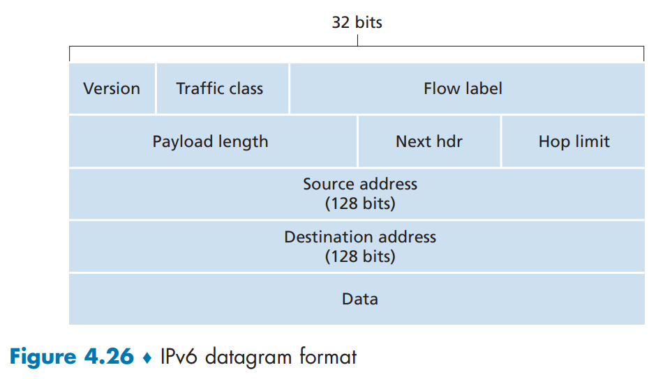

*   ***版本***.这个 4 位字段标识 IP 版本号.毫不奇怪,IPv6 在此字段中的值为 6.请注意,在此字段中填入 4 并不会创建一个有效的 IPv4 数据报.(如果会的话,事情就会简单得多——参见下面关于从 IPv4 过渡到 IPv6 的讨论.)
*   ***流量类***.这个 8 位流量类字段,类似于 IPv4 中的 TOS 字段,可用于赋予一个流内的某些数据报以优先级,或者可用于将来自某些应用(例如,语音)的数据报优先于来自其他应用(例如,SMTP 电子邮件)的数据报.
*   ***流标签***.如上所述,这个 20 位字段用于标识一个数据报流.
*   ***有效载荷长度***.这个 16 位值被视为一个无符号整数,给出了 IPv6 数据报中在固定长度的 40 字节数据报头部之后的字节数.
*   ***下一个头部***.该字段标识此数据报的内容(数据字段)将交付给的协议(例如,TCP 或 UDP).该字段使用的值与 IPv4 头部的协议字段相同.
*   ***跳数限制***.该字段的内容由每个转发该数据报的路由器减一.如果跳数限制计数达到零,路由器必须丢弃该数据报.
*   ***源地址和目的地址***.IPv6 128 位地址的各种格式在 RFC 4291 中描述.
*   ***数据***.这是 IPv6 数据报的有效载荷部分.当数据报到达其目的地时,有效载荷将从 IP 数据报中移除,并传递给下一个头部字段中指定的协议.

上面的讨论指出了 IPv6 数据报中所包含字段的用途.将图 4.26 中的 IPv6 数据报格式与我们在图 4.17 中看到的 IPv4 数据报格式进行比较,我们注意到 IPv4 数据报中出现的几个字段在 IPv6 数据报中不再存在：

- 分片/重组. **IPv6 不允许在中间路由器进行分片和重组**；这些操作只能由源和目的地执行.如果路由器接收到的 IPv6 数据报太大而无法通过出站链路转发,该路由器会直接丢弃该数据报,并向发送方返回一个"数据包过大"的 ICMP 错误消息(参见 5.6 节).然后发送方可以使用更小的 IP 数据报大小重新发送数据.分片和重组是一项耗时的操作；将此功能从路由器中移除并将其完全置于端系统中,可显著提高网络内的 IP 转发速度.

- 头部校验和. 由于互联网分层结构中的传输层(例如,TCP 和 UDP)和链路层(例如,以太网)协议执行校验和,IP 的设计者可能觉得该功能在网络层是足够冗余的,可以移除.
    - 再次强调,IP 数据包的快速处理是一个核心关切点.回顾我们在 4.3.1 节对 IPv4 的讨论,由于 IPv4 头部包含一个 TTL 字段(类似于 IPv6 中的跳数限制字段),IPv4 头部校验和需要在每个路由器重新计算.与分片和重组一样,这在 IPv4 中也是一项成本高昂的操作.

- 选项. 选项字段不再是标准 IP 头部的一部分.但是,它并没有消失.相反,选项字段是由 IPv6 头部指向的可能的下一个头部之一.也就是说,就像 TCP 或 UDP 协议头部可以是 IP 数据包内的下一个头部一样,选项字段也可以.选项字段的移除产生了一个固定长度的 40 字节 IP 头部.

*   量类.这个 8 位流量类字段,类似于 IPv4 中的 TOS 字段,可用于赋予一个流内的某些数据报以优先级,或者可用于将来自某些应用(例如,IP 语音)的数据报优先于来自其他应用(例如,SMTP 电子邮件)的数据报.
*   流标签.如上所述,这个 20 位字段用于标识一个数据报流.
*   有效载荷长度.这个 16 位值被视为一个无符号整数,给出了 IPv6 数据报中在固定长度的 40 字节数据报头部之后的字节数.
*   下一个头部.该字段标识此数据报的内容(数据字段)将交付给的协议(例如,TCP 或 UDP).该字段使用的值与 IPv4 头部的协议字段相同.
*   跳数限制.该字段的内容由每个转发该数据报的路由器减一.如果跳数限制计数达到零,路由器必须丢弃该数据报.
*   源地址和目的地址.IPv6 128 位地址的各种格式在 RFC 4291 中描述.
*   数据.这是 IPv6 数据报的有效载荷部分.当数据报到达其目的地时,有效载荷将从 IP 数据报中移除,并传递给下一个头部字段中指定的协议.

#### Transitioning from IPv4 to IPv6

好的，这是对图中描述的两种 IPv4 向 IPv6 迁移方法的说明。

1.   标志日法

     这种方法要求在某个预先设定的日期和时间，**整个互联网上的所有机器都关机，并从 IPv4 全面升级到 IPv6**。尽管在约35年前因特网规模还很小时曾有过类似的技术迁移，但对于如今拥有数十亿设备的全球网络而言，这种需要全球同步、一步到位的方法被公认为是**完全不可行的**。其协调难度和中断风险极高，因此仅停留在理论层面。

2.    隧道技术

      这是一种在实践中被广泛采用的渐进式迁移方法。其核心思想是：**当两个IPv6“岛屿”需要通信，但它们之间隔着纯IPv4网络时，可以将整个IPv6数据报作为载荷，封装在一个IPv4数据包中**。这个“包裹”着IPv6数据的IPv4数据包，就像在IPv4网络中打通了一条“隧道”，它能够被中间只理解IPv4的路由器正常转发。当这个数据包到达隧道另一端的IPv6路由器时，该路由器会“拆开”IPv4包头，取出里面原始的IPv6数据报并进行后续路由。这种方法使得IPv6网络可以在不升级现有IPv4核心设施的情况下先行部署和互联。

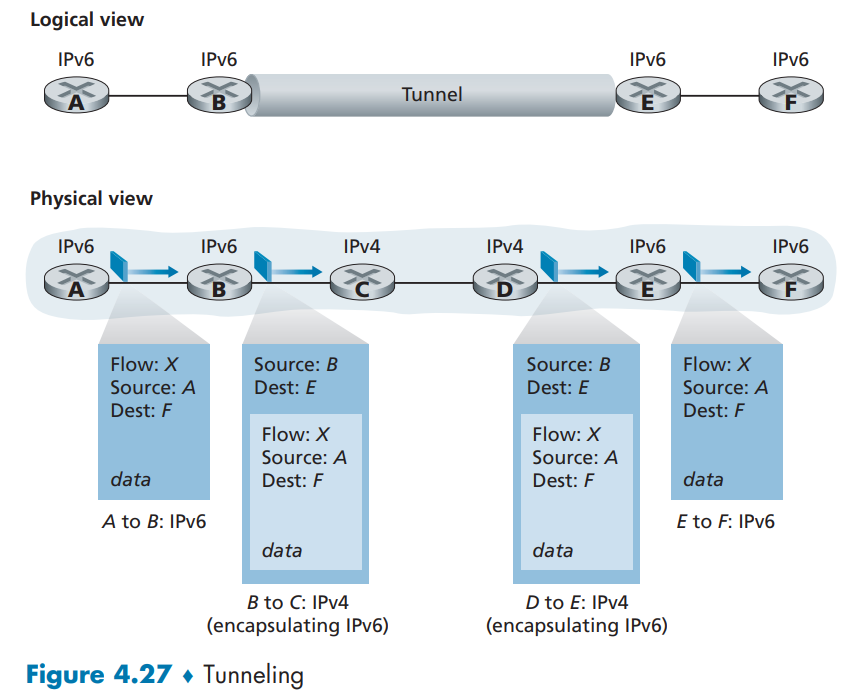

---

**1. IPv6的采用现状：势头已起，正在加速**

**2. 核心启示：改变网络层协议极其困难**

*   从IPv6的经验中得到的最大教训是，**在网络层引入和部署新协议异常艰难**。这被比喻为更换一栋房子的“基石”，几乎不可能在不造成巨大破坏的情况下完成。
*   相比之下，**应用层协议的创新和部署则迅速得多**（如Web、即时通讯、社交媒体）。这被比喻为给房子“重新刷漆”，相对容易且容易被模仿和普及。
*   结论：虽然未来互联网的网络层必定还会演变，但其**变化速度将远慢于应用层**。

>   [!NOTE]
>
>   ICMP 是 TCP/IP 协议族中的一个核心协议，主要用于在 IP 网络设备（如路由器、主机）之间传递**控制消息**和**错误报告**。它本身不传输应用数据，而是为网络连通性和故障诊断提供至关重要的支持。
>
>   [chap5中有更详细的介绍]
>
>   ---
>
>   ### 核心目的与作用
>
>   你可以把 IP 协议想象成一个“只负责送货”的邮差，它尽力把数据包（信件）送到目的地，但如果路上遇到问题（如地址找不到、路不通），它自己并不会通知寄件人。而 **ICMP 就是这个“反馈机制”**，它负责向寄件人报告这些情况。
>
>   ICMP 的主要作用包括：
>
>   1.  **错误报告**：当数据包在传输过程中遇到问题无法到达目的地时，向源发送端报告错误。
>       *   **例如**：目标网络不可达、目标主机不可达、端口不可达、通信被管理员禁止等。
>   2.  **网络诊断**：提供用于查询和诊断的网络工具。
>       *   **例如**：`ping` 和 `traceroute`（在 Windows 中是 `tracert`）这两个最常用的网络工具就是基于 ICMP 实现的。
>   3.  **流量控制**：在网络拥堵时，通知发送方降低发送速率（源点抑制消息，现已很少使用）。
>
>   ---
>
>   ### 工作原理与报文结构
>
>   ICMP 报文是封装在 **IP 数据包** 内部进行传输的。这意味着 ICMP 报文需要借助 IP 协议来发送，但它本身是 IP 协议的上层协议。
>
>   **封装关系：**
>   `[ IP 头部 | ICMP 报文 ]`
>
>   **ICMP 报文主要字段：**
>
>   *   **类型**：指定 ICMP 消息的类型（例如，8 表示回显请求，0 表示回显应答）。
>   *   **代码**：对类型的进一步细分，提供更具体的错误信息。
>   *   **校验和**：用于检验 ICMP 报文在传输过程中是否出错。
>   *   **数据**：携带与消息相关的具体信息，例如在 `ping` 请求中，这里包含标识符、序号和可选数据。
>
>   ---
>
>   ### 常见的 ICMP 消息类型
>
>   | 类型 | 代码 | 描述                     |
>   | ---- | ---- | ------------------------ |
>   | 0    | 0    | 回声回答（对Ping的回答） |
>   | 3    | 1    | 目的主机不可达           |
>   | 3    | 2    | 目的协议不可达           |
>   | 3    | 3    | 目的端口不可达           |
>   | 3    | 6    | 目的网络未知             |
>   | 3    | 7    | 目的主机未知             |
>   | 4    | 0    | 源抑制（拥塞控制，未用） |
>   | 8    | 0    | 回声请求 (ping)          |
>   | 9    | 0    | 路由器通告               |
>   | 10   | 0    | 路由器发现               |
>   | 11   | 0    | TTL 过期                 |
>   | 12   | 0    | IP 首部错误              |
>   ---
>
>   ### 关键应用实例
>
>   #### 1. Ping（Packet Internet Groper）
>
>   *   **工作原理**：
>       1.  源主机向目标主机发送一个 **ICMP 回显请求** 报文。
>       2.  如果目标主机在线且可达，它会回复一个 **ICMP 回显应答** 报文。
>       3.  源主机根据收到应答的时间和成功率，计算出网络延迟和丢包率。
>   *   **作用**：最基础的网络连通性测试工具。
>
>   #### 2. Traceroute / Tracert
>
>   *   **工作原理**：
>       1.  源主机向目标主机发送一系列数据包，并将这些数据包的 **IP 生存时间（TTL）** 字段依次设置为 1, 2, 3, ...
>       2.  当 TTL=1 的数据包到达第一个路由器时，TTL 减为 0，数据包被丢弃。该路由器会向源主机发回一个 **ICMP 超时** 报文，源主机由此知道第一个路由器的地址。
>       3.  当 TTL=2 的数据包到达第二个路由器时，同样返回超时报文，如此反复。
>       4.  直到数据包最终到达目标主机，目标主机可能会返回一个 **端口不可达** 消息（因为 traceroute 故意使用一个不可能的高端口号）或回显应答，从而完成整个路径的追踪。
>   *   **作用**：追踪数据包从源到目标所经过的路径，用于定位网络故障点。
>
>   ---
>
>   ### ICMP 与网络安全
>
>   ICMP 虽然是一个有用的网络管理工具，但也可能被恶意利用：
>
>   *   **ICMP 洪水攻击**：一种拒绝服务攻击，攻击者向目标发送海量的 ICMP 请求，耗尽目标的网络带宽或系统资源，使其无法响应正常请求。
>   *   **ICMP 重定向攻击**：攻击者伪造 ICMP 重定向报文，试图改变受害主机的路由表，将流量引导到恶意路由器上进行窃听或篡改（“中间人攻击”）。
>   *   **侦察与探测**：攻击者使用 `ping` 扫描来发现网络中存活的主机，或使用 `traceroute` 来探测网络拓扑结构。
>
>   因此，在许多网络防火墙策略中，会严格过滤甚至完全屏蔽外部的 ICMP 报文，以增强网络安全性。
>
>   ---
>
>   ### 总结
>
>   *   **定位**：网络层的“辅助”协议，是 IP 协议的“错误报告员”和“信使”。
>   *   **功能**：核心功能是**错误报告**和**网络诊断**。
>   *   **载体**：报文封装在 IP 数据包中。
>   *   **工具**：是 `ping` 和 `traceroute` 等必备网络工具的基石。
>   *   **双刃剑**：既是网络管理员的得力助手，也可能成为攻击者的工具，需在安全策略中谨慎对待。
>

## 4.4 Generalized Forwarding and SDN

[这一节的内容老师没有按照书上讲 这里为节省时间和篇幅也不详细称述 但是作为CS的同学看一下书仍然是好的 本节内容并不多] [但我不希望这份笔记变得臃肿 尽可能地减少字数是我的目标之一]

# 拾遗

这一部分介绍的内容是书中未提及(或老师打乱教学顺序较大)的部分 参考`ppt_cug_lqz/chap4.pdf`以及`AI`的解释 老师的`chap4.pdf`中还包括不少原书中`chap5`的内容 我讲写到下一篇笔记中

## 虚电路和数据报网络(4.2)

网络层连接服务可分为两大类：**虚电路（VC）网络** 和 **数据报网络**。这两者代表了网络层提供的两种根本不同的服务模型，尽管当今互联网是数据报网络，但理解虚电路有助于对比控制平面与数据平面的差异。

### 虚电路网络

- **核心思想**：在源主机与目的主机通信前，先建立一条**端到端虚电路**（类似于电话系统的“拨号连接”）。数据沿这条预定路径传输。
- **三个阶段**：
  1. **VC建立**：源主机向网络发送VC建立请求，网络为该VC分配资源（如带宽、缓存），并在沿途路由器中创建VC表项（包含入/出接口、VC编号）。
  2. **数据传输**：每个分组携带**VC编号**（而非目的地址），路由器根据本地VC表直接转发（无需查目的地址）。
  3. **VC拆除**：通信结束，释放资源。
- **关键特性**：
  - 分组按序到达。
  - 路由器为每个VC维护状态（**面向连接**）。
  - 常用于ATM、帧中继、MPLS网络。
- **数据平面行为**：转发基于**VC编号**，快速且确定性强。

### 数据报网络（如互联网）

- **核心思想**：每个分组独立路由，**无连接建立**，分组携带完整目的地址。
- **转发过程**：
  - 路由器根据**目的IP地址**查转发表（最长前缀匹配）。
  - 分组可能走不同路径、乱序到达、甚至丢失。
- **关键特性**：
  - 无状态（路由器不记住“会话”）。
  - 灵活、鲁棒（绕过故障），但需上层（如TCP）处理序、丢包。
- **数据平面行为**：转发基于**目的地址**，动态路径选择。

| 特性       | 虚电路网络     | 数据报网络（互联网） |
| ---------- | -------------- | -------------------- |
| 连接建立   | 必须（三阶段） | 无                   |
| 分组头部   | VC编号         | 完整目的地址         |
| 路由器状态 | 每个VC维护状态 | 无会话状态           |
| 分组顺序   | 保证           | 不保证               |
| 典型应用   | ATM、MPLS      | IP网络               |

> **注**：虽然互联网是数据报网络，但SDN可通过流表实现类似VC的精细控制。

---

## 4.5 选路算法到最后

> 注：本书将**路由选择（控制平面）**放在第5章，但数据平面依赖控制平面生成的转发表。因此本节补充**选路算法**，为理解转发表来源提供背景。

### 选路算法目标

为源-目的节点对计算**最优路径**，填充转发表。算法分类：

| 类型      | 特点                     | 代表算法           |
| --------- | ------------------------ | ------------------ |
| 集中式    | 全局拓扑知识             | 不实用（单点故障） |
| 分布式    | 各路由器协作计算         | LS、DV             |
| 静态/动态 | 手动配置 vs 自动适应变化 | -                  |

---

### 链路状态选路算法（Link-State, LS）

- **代表izer**：Dijkstra算法
- **原理**：
  1. 每台路由器通过**洪泛**广播其直接链路状态（链路代价）。
  2. 所有路由器构建**完整拓扑图**。
  3. 运行Dijkstra计算到所有节点的最短路径。
- **复杂度**：\(O(N^2)\)
- **特点**：
  - 收敛快。
  - 所有路由器视图一致。
  - OSPF协议基于LS。
- **转发表生成**：Dijkstra输出下一跳 → 填入转发表。

---

### 距离向量选路算法（Distance-Vector, DV）

- **原理**：Bellman-Ford（迭代、异步、分布式）
- **机制**：
  - 每台路由器维护**距离向量**（到所有目的地的最小代价）。
  - 周期性向邻居交换向量。
  - 更新公式：\(d_x(y) = \min_v \{ c(x,v) + d_v(y) \}\)
- **问题**：
  - **计数到无穷**：链路故障导致慢收敛。
  - **毒性反转**（Poison Reverse）部分缓解。
- **代表**：RIP协议。
- **转发表生成**：向量更新后提取下一跳。

---

### 层次选路（Hierarchical Routing）

- **动机**：大规模网络中，路由表爆炸、计算开销大。
- **方法**：
  - 将路由器聚合为**自治系统（AS）**。
  - **AS内部**：用OSPF（LS）。
  - **AS之间**：用BGP（路径向量）。
- **转发表**：
  - AS内：精细路由。
  - AS间：默认路由或聚合路由。

---

### 选路算法与数据平面的关系

| 算法 | 转发表内容 | 更新频率 | 数据平面影响 |
| ---- | ---------- | -------- | ------------ |
| LS   | 下一跳接口 | 拓扑变化 | 快速切换     |
| DV   | 下一跳接口 | 周期性   | 可能震荡     |
| BGP  | AS路径     | 策略变化 | 影响广域路由 |

> **结论**：控制平面（选路算法）计算路径 → 生成转发表 → 数据平面使用转发表高速转发。两者解耦是SDN核心。

---

## 其他拾遗（简要）

### 中继与网桥（对比路由器）

| 设备   | 工作层 | 转发依据 | 是否隔离冲突域 |
| ------ | ------ | -------- | -------------- |
| 中继器 | 物理层 | 比特再生 | 否             |
| 网桥   | 链路层 | MAC地址  | 是             |
| 路由器 | 网络层 | IP地址   | 是             |

### 广播与多播

- **广播**：`255.255.255.255` → 子网内所有主机。
- **多播**：组地址（如`224.0.0.0 - 239.255.255.255`），IGMP管理组成员。

### ICMP重定向

- 主机发送分组到“次优”路由器 → 路由器转发并回送**ICMP重定向**，告知主机更优网关。

---

**拾遗结束**。后续章节（如第5章控制平面、SDN）将深入OSPF、BGP、控制器等内容。


## 
