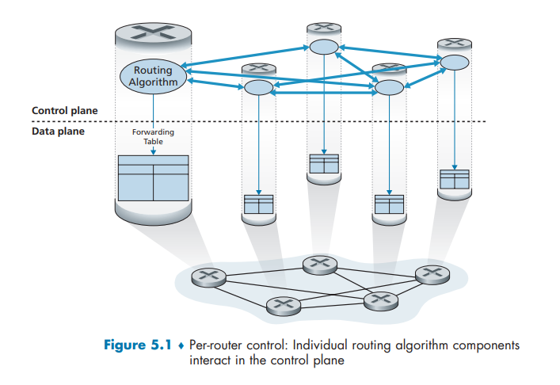
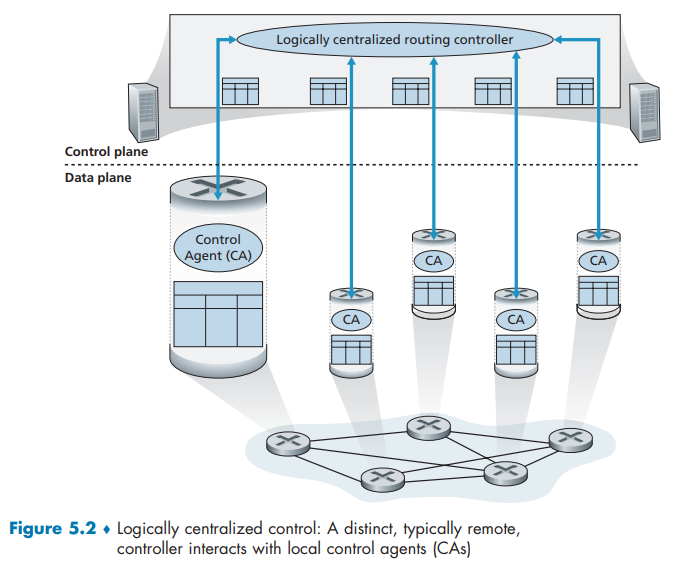
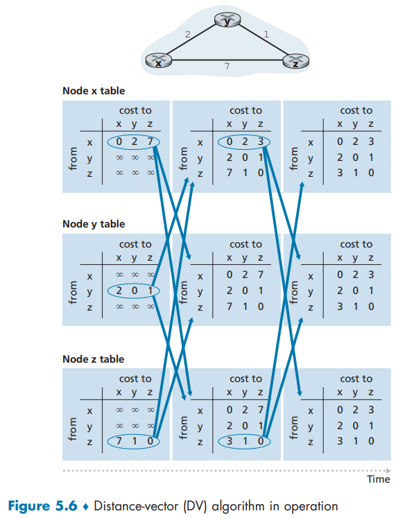
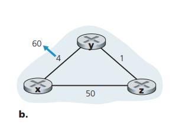
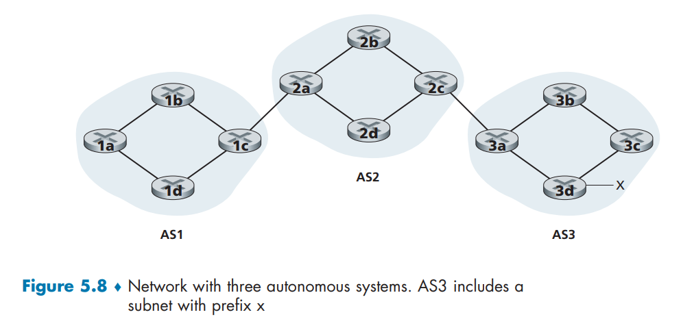
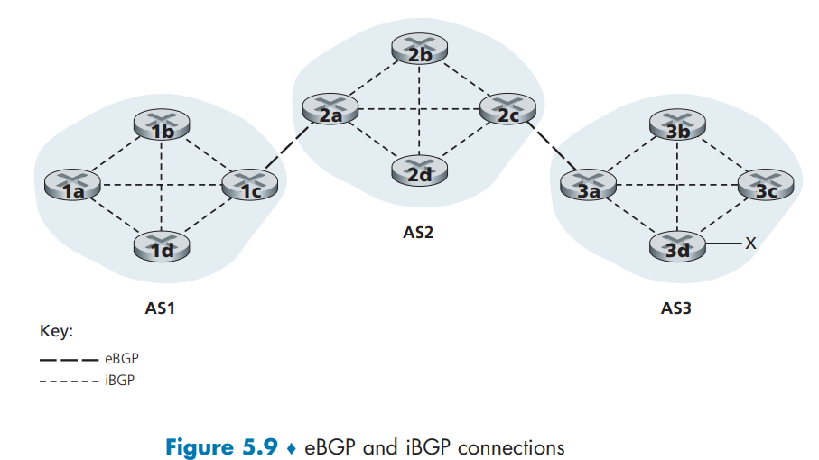
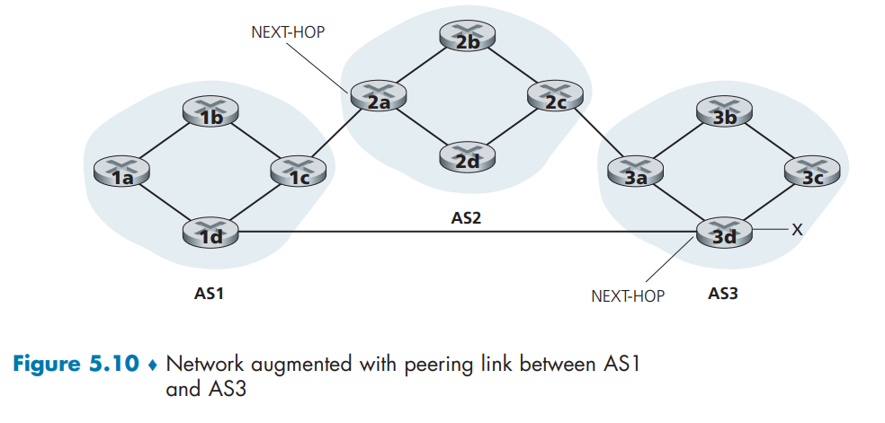

# The Network Layer : Control Plane

控制平面是网络范围内的逻辑控制核心:

-   负责管理数据报从源主机到目的主机路径上路由器的转发行为
-   承担着网络层组件与服务的配置与管理任务

---

*   **5.2 节 路由选择算法**
    *   讨论用于计算网络中最低开销路径的传统算法.这些算法是OSPF和BGP协议的理论基础.

*   **5.3 节 OSPF 协议**
    *   介绍开放最短路径优先(OSPF)协议.这是一种在一个单一ISP或自治系统内部广泛使用的路由选择协议.

*   **5.4 节 BGP 协议**
    *   介绍边界网关协议(BGP).这是在因特网中连接不同自治系统的关键协议,被称为因特网的"黏合剂".

*   **5.5 节 SDN 控制平面**
    *   讨论软件定义网络(SDN)的控制平面.重点在于其控制功能如何从网络设备中分离出来,并由一个独立的集中式控制器实现.

*   **5.6 节 ICMP 协议**
    *   介绍互联网控制报文协议(ICMP).这是一个用于在IP网络中传递控制和管理信息的协议,例如错误报告.

*   **5.7 节 SNMP 协议**
    *   介绍简单网络管理协议(SNMP).这是一个用于管理和监控IP网络设备的协议.

## 5.1 Introduction

这一节的核心主干是介绍控制平面实现转发表的两种基本方法：

1.  **路由器控制**
    *   **方式**：在每个路由器上独立运行路由选择算法组件,通过路由器间的交互,各自计算生成转发表.
    *   **特点**：控制功能分散在每个路由器中.
    *   **实例**：传统的OSPF和BGP协议采用此方式.

2.  **逻辑集中式控制**
    *   **方式**：一个独立的、集中式的控制器负责计算转发表,然后下发给各路由器.路由器上的控制代理只负责与控制器通信并执行其命令.
    *   **特点**：控制功能与转发功能分离；控制器在逻辑上是集中的(物理上可由多台服务器实现).通用的"匹配+动作"的抽象允许执行转发IP,共享负载,防火墙,NAT等其他功能.
    *   **关键区别**：路由器之间不直接交互来计算转发表.
    *   **实例**：SDN采用此方式,并已在谷歌、微软、中国电信等公司的网络中得到实际部署.





## 5.2 Routing Algorithms

[路由选择算法]

这里就是利用图模型 将计算机网络抽象成有权无向图 找到一条 **最短路径** 目前我们先不关心这个权重是如何确定的 重点在于如何根据这个图找到一条或多条 **最低开销路径(等价于最短路径)** [这里书中没有给出很好的数学定义 所幸比较直观]

[路由选择算法的分类方法]

1.   **集中式与分散式**

     * 集中式路由选择算法(如链路状态, Link State, LS 算法)要求算法拥有完整的、全局的网络知识,即所有节点间的连通性及所有链路的开销.这种算法的计算可以集中在一个控制器上完成.

     * 分散式路由选择算法(如距离向量, Distance-Vector, DV 算法)则不需要拥有全局的完整信息.每个节点仅需要知道与其直接相连链路的开销.路径的计算是通过节点之间迭代地交换信息逐步完成的.


2.   **静态与动态**

     * 静态路由选择算法的路径随时间变化非常缓慢,通常需要人工干预进行调整.

     * 动态路由选择算法则能够根据网络流量或拓扑结构的变化快速响应并调整路径开销.这种动态性赋予了算法更好的网络适应性,但也更容易导致路由循环或振荡等问题.


3.   **负载敏感与负载迟钝**

     * 负载敏感算法会使链路开销动态地变化以反映其当前拥塞水平,这意味着在拥塞发生时,算法倾向于避开拥塞的链路.早期的 阿帕网, Advanced Research Projects Agency Network, ARPANet 路由算法就属于此类.

     * 负载迟钝算法(如现今常用的 路由信息协议, Routing Information Protocol, RIP、开放最短路径优先, Open Shortest Path First, OSPF 和 边界网关协议, Border Gateway Protocol, BGP)在确定开销时不考虑当前的拥塞水平.因此,链路开销相对稳定,与实时流量情况关联不大.


### 5.2.1 The Link-State (LS) Routing Algorithm

使用链路状态算法 我们需要获取整个网络的状态 这经常使用 **链路状态广播算法**来完成 最后可以得到该网络完整统一的视图 

接下来 通常使用的算法就是`迪杰斯特拉算法(Dijkstra)`.迪杰斯特拉算法我们很熟悉 , 就是不断更新已知节点的所有已知有权边 , 确保得到当前能到达的节点都是最短的距离 , 直到找到我们的目标节点 , **此处算法应该自己实现** 我的实现参考了`www.geeksforgeeks.org`.

复杂度上 如果使用了堆的数据结构:$\Theta (nlogn)$ 若不使用则是$\Theta (n^2)$ 最差 ; 写到此处时已经有点忘了 建议回到代码中`cheak`一下 , 有关数据结构的代码会尽力整理到`data-structure`项目中 不过最好的方法还是你自己验证一下(写这一段的时候已经查到了一些不同的说法)(此处不再多说 追求严谨请查看代码)

---

实际使用中`dijkstra`也有严重的问题 :

1.   该算法基于快照计算,一旦链路代价改变,无法局部修正,则必须从头运行
2.   在大型网络中,每次计算都会涉及到全网节点,CPU和内存开销很大
3.   引发路由振荡
     -   某条链路代价持续波动(不断反复加减`e`)
     -   每个路由器不断重算,路由表剧烈抖动,网络计算资源消耗,数据包转发路径不稳定
4.   收敛速度慢 每次都要等待全网络同步更新链路状态 在极端情况下可能永远无法达到稳定状态

---

如何才能防止这样的振荡?大概有两种解决办法!

1.   强制链路费用不依赖于所承载的流量 但这是显然不可接受的 这样无法避免高时延 拥塞等情况
2.   要求所有路由器对齐时钟以后,在不同的周期时间点执行算法,但是研究发现即使如此,所有路由器也会开始自对齐,也就是他们最终还是会在同时发布链路状态通告以及计算迪杰斯特拉算法,这会给网络带来极大的压力,所以我们还需要增加时间随机化,即在发布链路状态通告之前,额外随机等待一个时长(0-50ms)

OSPF协议正是采用这种**LSA发包抖动(Jitter)**机制,避免全网LSA同步泛滥.

>   [!NOTE]
>
>   OSPF(Open Shortest Path First,开放最短路径优先)是**使用最广泛的内部网关协议(IGP)** 之一,基于**链路状态(Link-State)**算法,核心理念是"让每台路由器都拥有全网的地图"
>
>   - **协议类型**：链路状态路由协议
>   - **算法基础**：Dijkstra最短路径算法
>   - **应用场景**：企业核心网、数据中心、运营商骨干网
>
>   ---
>
>   ### **工作三部曲**
>
>   #### **1. 邻居发现：Hello协议**
>   - 路由器周期组播**Hello包**(默认10秒)到`224.0.0.5`
>   - 发现邻居并建立**邻接关系(Adjacency)**,交换链路状态信息
>   - **死亡时间(Dead Interval)**：40秒未收到Hello即判定邻居Down
>
>   #### **2. 信息同步：LSA洪泛**
>   - 每条链路状态变化都生成**LSA(Link-State Advertisement)**
>   - **可靠泛洪**：LSA被**全网广播**,每个路由器都存储到**LSDB(链路状态数据库)**
>   - **确认机制**：确保LSA不丢失、不重复
>
>   #### **3. 独立计算：SPF算法**
>   - 每台路由器基于**相同的LSDB**,独立运行Dijkstra算法
>   - 生成**以自己为根**的最短路径树(SPT)
>   - 最终产出**路由表**(RIB)
>
>   ---
>
>   ### **OSPF的灵魂：分层设计**
>
>   为了应对大型网络,OSPF引入**区域(Area)**概念：
>
>   ```
>           Area 0(骨干区域)
>             /   |   \
>      Area 1   Area 2   Area 3
>   ```
>
>   - **Area 0**：必须存在的**骨干区域**,所有非骨干区域必须直连它
>   - **区域边界路由器(ABR)**：连接骨干与非骨干,负责**路由汇总**
>   - **自治系统边界路由器(ASBR)**：引入外部路由(如静态、BGP)
>
>   **核心优势**：
>   - **隔离故障**：LSA泛洪被限制在区域内
>   - **缩减LSDB**：路由器只需维护本区域拓扑
>   - **降低计算量**：SPF计算范围缩小
>
>   ---
>
>   ### **关键特性**
>
>   | 特性              | 说明                                  |
>   | ----------------- | ------------------------------------- |
>   | **快速收敛**      | 链路变化触发立即泛洪+SPF重算,秒级收敛 |
>   | **无路由环路**    | SPF算法数学保证(基于图论)             |
>   | **支持VLSM/CIDR** | 支持子网划分和路由聚合                |
>   | **等价负载均衡**  | 支持多达16条等代价路径(EIGRP仅4-6条)  |
>   | **认证安全**      | 支持明文、MD5、SHA认证                |
>   | **路由策略丰富**  | 可精细控制路由引入、过滤、开销        |
>
>   ---
>
>   ### **优化机制**
>
>   - **DR/BDR选举**：在广播网络(如以太网)中选举**指定路由器**,减少邻接关系和LSA泛洪量
>   - **LSA发包抖动**：发送前加随机延迟,**避免自同步风暴**(即你之前提到的方案)
>   - **SPF延迟计时器**：收到变化后不立即计算,等待一段时间以防频繁震荡
>
>   ---
>
>   ### **OSPFv3升级**
>
>   - **IPv6原生支持**：取消IP地址依赖,使用Router-ID标识
>   - **安全性增强**：集成IPsec认证
>   - **多地址族支持**：可同时承载IPv4和IPv6
>
>   ---
>
>   ### **优缺点速览**
>
>   **✅ 优点**
>   - 收敛速度快,适合中大型网络
>   - 分层设计优雅,可扩展性强
>   - 标准化协议,厂商兼容性好(华为/思科/H3C互通)
>
>   **❌ 缺点**
>   - 配置相对复杂(相比RIP/EIGRP)
>   - 内存/CPU消耗大(维护LSDB、运行SPF)
>   - 区域设计不当会导致次优路径
>

### 5.2.2 The Distance-Vector (DV) Routing Algorithm

距离向量路由选择算法是一种迭代的,异步的,分布式的算法.而LS算法则是一种集中式的,虽然每个路由器自行维护自己的转发表,但是它仍然依赖全局信息,而DV算法则只依赖邻居的信息,同时把自己的计算结果分享给邻居.

-   说它是**分布式**的,是因为每个节点都要从一个或多个直接相连邻居接收某些信息,执行计算,然后将其计算结果分发给邻居.

-   说它是**迭代的**,是因为此过程一直要持续到邻居之间无更多信息要交换为止.(有趣的是,此算法是**自我终止**的,即没有计算应该停止的信号,它就停止了.)

-   说它是**异步**的,是因为它不要求所有节点相互之间步伐一致地操作.

我们将看到一个异步的、迭代的、自我终止的、分布式的算法比一个集中式的算法要有趣得多！

---

令$d_x(y)$是从节点x到节点y的最低开销路径的开销,则该最低开销与著名的Bellman-Ford方程相关,即

$$
d_x(y) = \min_v \{c(x,v) + d_v(y)\} \tag{5-1}
$$

其中$v$表示$x$的所有邻居 遍历完成后 该路径最低开销将是$c(x,v) + d_v(y)$

`bellman-ford`方程还有特别的现实意义,因为我们记$v^{*}$为向任意一个终点转发的路径上起始点$x$的直接后继,那么这个$v^{*}$就是这个转发表的数学模型

Bellman-Ford方程的另一个重要贡献是,它提出了将在DV算法中发生的`邻居到邻居通信的形式`

---

DV算法中,每个节点维护一张距离矢量表,记录到所有目的地的最短距离及下一跳.初始时,节点仅知道到直连邻居的链路代价,到其余目的地距离设为无穷大.随后,节点周期性地向所有邻居发送自己的距离矢量.每当收到邻居发来的距离矢量,节点便利用Bellman-Ford方程更新自身表项：对每一个目的地,计算经由该邻居的路径代价(到邻居的链路代价加上邻居宣称到目的地的距离),若该值小于当前记录的最优值,则更新最优距离和下一跳.通过持续交换与计算,网络最终收敛至一致的最优路由状态；当链路状态变化时,触发更新加速收敛,直至所有节点的距离矢量不再变化.

在该分布式、异步算法中,每个节点不时地向它的每个邻居发送它的距离向量副本.当节点x从它的任何一个邻居v接收到一个新距离向量,它保存v的距离向量,然后使用Bellman-Ford方程更新它自己的距离向量如下：

$$
D_x(y) \leftarrow \min_v \{c(x,v) + D_v(y)\} \quad \text{对N中的每个节点y}
$$

如果节点$x$的距离向量因这个更新步骤而改变,节点$x$接下来将向它的每个邻居发送其更新后的距离向量,这继而让所有邻居更新它们自己的距离向量.

令人惊奇的是,只要所有的节点继续以异步方式交换它们的距离向量,每个开销估计$D_x(y)$收敛到$d_x(y)$,$d_x(y)$为从节点x到节点y的实际最低开销路径的开销[Bersekas1991]

>   [!NOTE]
>
>   感觉就像是异步的 只靠考虑一步的 `dijkstra` 
>
>   DV算法本质上是**分布式的Bellman-Ford松弛过程**：每个节点只掌握邻居的"一步信息"(距离矢量),独立完成更新；没有全局拓扑,也不需同步,各节点按自己的时间收到更新、触发计算
>
>   但DV的局部最优选择可能因信息滞后导致**环路**和**计数到无穷**问题,这是"只看邻居一步"的视野局限所致——它像是一群各自为政的Dijkstra,缺乏全局协调,反而需要额外机制(如毒性逆转)来弥补
>
>   ---
>
>   DV类算法在实践中被广泛应用于多种路由协议,包括互联网的RIP和BGP、ISO IDRP、Novell IPX以及最初的ARPAnet.



图5-6举例说明了DV算法的运行,应用场合是该图顶部有三个节点的简单网络.学习完这个例子后,你应当确信该算法以异步方式也能正确运行,异步方式中可在任意时刻出现节点计算与更新的产生/接收

收敛之后就停止了变化 直到出现新的变动 下面我们就讨论这些情况

---

#### Distance-Vector Algorithm: Link-Cost Changes and Link Failure



由于DV方法严重依赖邻居的信息,在好消息(某一条链路成本变低)时,这个好消息会很快传递出去,所有节点都会更新.

但是当坏消息(某一条链路成本变高)时,会遇到 **路由选择环路**的情况,当这个节点直接断连或者代价极大时,后果会很严重,因此该问题有事也被称为 **无穷计数问题**.

通过对[fig5.7_b]的模拟我们能直观感受到这一点

1.   在$t_0$时刻,$y$检测到链路开销从4变为60.$y$计算它到$x$的新的最低开销路径的开销,其值为

$$
D_y(x) = \min\{c(y,x) + D_x(x),\, c(y,z) + D_z(x)\} = \min\{60+0,\, 1+5\} = 6
$$

2.   这个值显然是错误的,因为$y$依赖了$z$的判断,而$z$还没有更新这个坏消息.此时,$y$得到的路径实际上是$[y \rightarrow (z \rightarrow y \rightarrow x)]$

3.   到了$t_1$时刻,我们遇到路由**选择环路routing loop**,即为到达$x$,$y$通过$z$路由,$z$又通过$y$路由.路由选择环路就像一个黑洞,信息将在这两个节点之间不停地(或直到转发表发生改变为止)来回反复.

4.   在$t_1$后某个时间,$z$收到$y$的新距离向量,它指示了$y$到$x$的最低开销是$6$.$z$知道它能以开销$1$到达$y$,因此计算出到$x$的新最低开销

$$
D_z(x) = \min\{c(z,x) + D_x(x),\, c(z,y) + D_y(x)\} = \min\{5+0,\, 1+6\} = 7
$$

因为$z$到$x$的最低开销已增加了,于是它便在$t_2$时刻通知$y$其新开销.

5.   此后会一直循环到第$46$次,发现它以为最近的那条路线开销其实要大于$50$,这样才会更新路线.

关于链路开销增加的坏消息的确传播得很慢！如果链路开销$c(y,x)$从$4$变为$1000$0且开销$c(z,x)$为$9999$时将发生什么样的现象呢？这便体现了`count-to-infinity`的特点

#### Distance-Vector Algorithm: Adding Poisoned Reverse

那么怎么解决这个问题呢？刚才描述的那种特定循环场景,其实可以通过一种叫做**毒性逆转(poisoned reverse)** 的技术来避免.

它的思路其实很简单：如果 $z$ 是通过 $y$ 才路由到 $x$ 的,那么 $z$ 就会"骗" $y$ 说："我到 $x$ 的距离是无穷大！"——也就是向 $y$ 通告 $D_z(x) = \infty $,哪怕 $z$ 实际上知道  $D_z(x) = 5 $.只要 $z$ 还是通过 $y$ 去路由到 $x$,它就会一直对 $y$ 撒这个善意的谎.这样一来,$y$ 就相信 $z$ 根本到不了 $x$,于是 $y$ 也就不会尝试通过 $z$ 去路由到 $x$

---

我们来看毒性逆转是怎么解决[fig5-7b]里那个环路问题的.

1. 在毒性逆转的作用下,$y$ 的路由表中会记录$D_y(x)= \infty$发给$z$ (谁经过自己 就告诉谁自己到目的地是无穷大 相当于提前留出余量)
2. 当$(x,y)$ 链路的开销在 $t_0$ 时刻从 4 变成 60 之后,$y$ 更新自己的路由表,虽然开销高达 60,它还是选择直接路由到 $x$,并且把新的开销 $D_y(x)=60$ 告诉 $z$
3. $z$ 在$t_1$ 时刻收到这个更新后,马上就把去 $x$ 的路由切换到那条开销为 50 的直接$(z,,y)$链路上.因为这是一条新的、开销最低的路径,而且它不再经过 $y$
4. 所以 $z$ 就在 $t_2$ 时刻通知 $y$ 说："我现在到 $x$ 的开销是 50 啦！"
5. $y$ 收到 $z$ 的更新后,就更新自己的路由表,算出$D_y(x)=51$.
6. 但注意,因为现在 $z$ 在 $y$ 到 $x$ 的最低开销路径上,所以 $y$ 就在 $t_3$ 时刻向 $z$ "毒化"这条路径,告诉 $z$"我到 $x$ 的开销是无穷大！"——哪怕 $y$ 其实知道 $D_y(x)=51$

毒性逆转并不能彻底解决无穷计数问题 . 如果环路涉及三个或更多节点,毒性逆转就检测不到了.

### A Comparison of LS and DV Routing Algorithms

`LS`与`DV`路由选择算法的思路几乎可以说是互补的 我们来详细比较一下 . 记$N$是路由器节点的集合 , $E$是链路边的集合

1.   核心思想差异
     - LS算法：各节点通过广播向所有其他节点通告其**直连链路的开销**,基于全局信息独立计算路由.
     - DV算法：节点**仅与邻居通信**,但向邻居提供到其已知所有目的地的最低开销估计.

2. 报文复杂性

    - LS：需发送$\Theta (|N||E|)$量级的报文；任意链路开销变化必须广播至全网.

    - DV：仅邻居间交换报文；只有当链路开销变化影响本地最低开销路径时,才会向邻居传播.


3. 收敛速度

    - LS：收敛快,复杂度为$\Theta(|N|^2)$.
- DV：收敛较慢,易产生**路由环路**,并面临**无穷计数**问题.


4. 健壮性(如果 台路由器发生故障、行为错乱或受到蓄意破坏时情况会怎样呢?)

    - LS：各节点独立计算转发表,故障节点只能扭曲自身直连链路信息,错误影响相对隔离,健壮性较好.

    - DV：错误计算会逐跳扩散至全网,故障节点可向任意目的地通告错误路径(如1997年因特网中断事件),健壮性较差.

两种算法各有优劣,没有绝对赢家,均在实际互联网中得到应用.

## 5.3 Intra-AS Routing in the Internet: OSPF

随着规模的逐渐增大,我们之前所设计(讨论)的网络会出现越来越多的问题 可能需要更多的内存来管理 也需要更长的时间来收敛 同时还有管理上的需求 比如有一些电脑集群希望对外部隐藏自己的内部组织面貌 . 要解决这些问题就需要用到自治系统 .

-   一个自治系统(AS)是指**由一个单一技术管理机构(例如一个ISP、一所大学、一家大公司)所控制的一组路由器网络**
-   每个AS在互联网上都有一个全球唯一的编号,称为AS号 ASN , 由ICANN管理
-   在一个AS中的所有路由器都运行相同的路由选择算法 并且 拥有彼此的信息
-   中国电信是一个AS , 中国联通是另一个AS , 谷歌、腾讯也各自拥有自己的AS
-   **在一个自治系统内运行的路由选择算法 称为 自治系统内部路由选择协议 intra-autonomous system routing protocol**

#### Open Shortest Path First (OSPF)

OSPF(Open Shortest Path First)是一种内部网关协议(IGP),用于在自治系统(AS)内部进行路由选择.它是基于链路状态的协议,使用Dijkstra算法计算最短路径树,从而确定最佳路由.IS-IS协议与它密切相关 两者都被广泛地用于AS内部路由选择 . 所谓`open`开放 是指这个协议规范是公众可用的 .

---

1.   向本自治系统中所有路由器发送信息,使用的方法是洪泛法(这是ppt上的说法 但是似乎与课本不符 课本内容见下一个block)
2.   发送的信息就是与本路由器相邻的所有路由器的链路状态
3.   只有当链路状态发生变化时,路由器才用洪 泛法向所有路由器发送此信息

---

OSPF允许管理员按照自己的要求配置寻路策略 比如设置所有权重为1 得到最少跳路径 ; 设置成与容量成反比 从而鼓励流量走大道

在 OSPF 中,路由器会将路由信息广播给整个自治系统中的所有其他路由器,而不仅仅是它的邻居路由器.

每当某条链路的状态发生变化(例如链路成本变化或链路上下状态变化),路由器就会广播链路状态信息.即使链路状态没有发生变化,路由器也会定期广播链路状态(至少每 30 分钟一次).

OSPF 的通告包含在 OSPF 消息中,这些消息由 IP 直接承载,其上层协议号为 89.因此,OSPF 协议本身必须实现诸如可靠消息传输和链路状态广播等功能.OSPF 协议还会检查链路是否正常工作(通过向连接的邻居发送 HELLO 消息),并允许 OSPF 路由器获取邻居路由器的网络范围链路状态数据库.

---

OSPF的优点包括下列几方面:

-   **安全**.能够鉴别OSPF路由器之间的交换(如链路状态更新).使用鉴别,仅有受信任的路由器能参与一个AS内的OSPF协议,因此可防止恶意入侵者将不正确的信息注入路由器表内.为了确保路由信息的安全性,OSPF 提供了三种主要的认证方式：

    -   **明文认证(Simple Authentication)**认证字段以明文形式传输,安全性较低.
    -   **MD5认证(Message Digest 5 Authentication)**使用 MD5 哈希算法对认证字段加密,安全性高于明文方式.仍被广泛支持,尤其在传统设备或兼容性要求高的场景中.
    -   **SHA-HMAC认证(基于哈希的消息认证码)**更现代、更安全的认证方式,逐渐成为主流.在一些厂商设备(如华为、思科)中已支持配置

-   **多条相同开销的路径**.当到达某目的地的多条路径具有相同的开销时,OSPF允许使用多条路径,这样可以分散流量

-   **对单播与多播路由选择的综合支持**.多播OSPF(MOSPF)提供对OSPF的简单扩展,以便提供多播路由选择.MOSPF使用现有的OSPF链路数据库,并为现有的OSPF链路状态广播机制增加了一种新型的链路状态通告

    -   >   [!NOTE]
        >
        >   这句话有点难以理解
        >
        >   ------
        >
        >   ### 🧠 第一句："MOSPF使用现有的OSPF链路数据库"
        >
        >   -   **OSPF(Open Shortest Path First)** 是一种常见的内部网关协议,用于在自治系统内部进行路由选择.
        >   -   OSPF的核心是维护一个 **链路状态数据库(Link State Database, LSB)**,它记录了整个网络的拓扑结构.
        >   -   **MOSPF(Multicast OSPF)** 是OSPF的一个扩展版本,用于支持 **多播路由**(Multicast Routing).
        >   -   所以这句话的意思是：MOSPF并没有重新设计一套新的数据库,而是 **直接复用了OSPF已有的链路状态数据库**,这使得它可以与OSPF无缝集成.
        >
        >   ------
        >
        >   ### 🔄 第二句："并为现有的OSPF链路状态广播机制增加了一种新型的链路状态通告"
        >
        >   -   OSPF通过一种叫做 **链路状态广播(LSA, Link State Advertisement)** 的机制来传播网络拓扑信息.
        >   -   MOSPF在这个机制上做了扩展,**新增了一种新的LSA类型**,叫做 **Group-Membership LSA**.
        >   -   这种新的LSA用于通告哪些路由器连接了哪些多播组成员(即哪些主机订阅了哪些多播地址).
        >   -   这样,MOSPF就可以在已有的OSPF框架上,**额外传播多播组信息**,从而实现多播路由功能.
        >
        >   ------
        >
        >   ### ✅ 总结一下这句话的意思：
        >
        >   MOSPF是在OSPF的基础上扩展出来的协议.它没有重新设计网络拓扑数据库,而是直接使用OSPF的链路状态数据库.同时,它通过增加一种新的链路状态通告(Group-Membership LSA),使得原本只支持单播的OSPF也能支持多播通信.

-   **支持在单个AS中的层次结构**.一个 OSPF 自治系统可以分层配置多个区域,每个区域运行自己的链路状态路由算法,路由器之间广播链路状态信息.区域边界路由器负责处理跨区域的路由.整个系统中有一个主干区域,连接所有区域边界路由器,负责区域间的流量转发.跨区域通信需先到本区域边界路由器,再经主干到目标区域,最终到达目的地.

## 5.4 Routing Among the ISPs: BGP

为了协调多个AS 所有的AS都要运行相同的AS间路由选择协议 也就是 **边界网关协议 BGP Border Gateway Protocol** .

>   [!CAUTION]
>
>   之前有一点没有提到 :
>
>   RIP 和 OSPF 协议都属于**内部网关协议 IGP Interior Gateway Protocol** , 目前这类路由选择协议使用得最多

根据原文内容,BGP 的职责和工作逻辑顺序可以整理为如下说明：

---

### 5.4.1 The Role of BGP

1. **背景与问题引入**  
   - 每个自治系统(AS)中的路由器使用转发表来决定分组转发路径.  
   - 对于同一 AS 内部的目的地,路由信息由 AS 内部路由协议决定.  
   - 对于 AS 外部的目的地,需要使用 BGP(边界网关协议)进行路由.
2. **BGP 路由的基本单位**  
   - BGP 不是基于单个 IP 地址路由,而是基于 CIDR 化的前缀(如 `138.16.68/22`).  
   - 路由器转发表中对应外部目的地的表项格式为 `(前缀, 出接口)`.
3. **BGP 的两大核心任务**  
   - **任务一：获取前缀的可达性信息** 
     - BGP 使每个子网能够向整个互联网通告自身存在.  
     - 如果没有 BGP,子网将成为无法被外部访问的"孤岛".  
   - **任务二：选择最佳路由**
     - 当路由器获知多条通往同一前缀的路由时,BGP 会运行路由选择过程.  
     - 最佳路由的选择依据包括策略信息和前缀可达性信息.

### 5.4.2 Advertising BGP Route Information



图中展示了一个简单的网络 它有三个自治系统 . 对于每个自治系统中的路由器 它要么是一台**网关路由器gateway router** 要么是一台**内部路由器internal router** 此外我们知道 AS3具有一个前缀`x`

BGP连接还分为内部BGP(iBGP)和外部BGP(eBGP) , 在同一个AS中连接的是内部BGP 跨越两个AS的则是外部BGP 注意 内部BGP不一定与物理链路相对应 如下图所示



为了传播可达性信息,使用`iBGP`和`eBGP`会话.再次考虑向 AS1 和 AS2 中的所有路由器通告前缀 $ x $ 的可达性信息.在这个过程中,网关路由器 3a 先向网关路由器 2c 发送一个 eBGP 报文 <u>"AS3 $ x $"</u>.网关路由器 2c 然后向 AS2 中的所有其他路由器(包括网关路由器 2a)发送 iBGP 报文 <u>"AS3 $ x $"</u>.网关路由器 2a 接下来向网关路由器 1c 发送一个 eBGP 报文 <u>"AS2 AS3 $ x $"</u>.最后,网关路由器 1c 使用 iBGP 向 AS1 中的所有路由器发送报文 <u>"AS2 AS3 $ x $"</u>.在这个过程完成后,在 AS1 和 AS2 中的每个路由器都知道了 $ x $ 的存在并且也都知道了通往 $ x $ 的 AS 路径.

当然,在真实的网络中,从某个给定的路由器到某个给定的目的地可能有多条不同的路径,每条通过了不同的 AS 序列.届时会通过一定的策略来选择一条,也有一些产品可以使用多路径的策略.

### 5.4.3 Determining the Best Routes

-   当路由器通告一个前缀时,它随着前缀包含一些BGP属性 **前缀 +属性 = "路由"**
-   2个重要的属性:
    -   `AS-PATH`: 该属性包含了前缀的通告已经通过的那些AS的路径 比如之前的`AS2 AS3`和`AS3` 可以使用这些信息来检测和防止通告环路
    -   `NEXT-HOP`:表示到达某个前缀的下一跳 IP 地址.告诉本地路由器,如果要到达某个目标网络,应将数据包发送给哪个邻居路由器.
-   当一台网关路由器接收到一个路由器通告时,它使用输入策略决定是否接收或过滤该路由

有了这些基础知识 我们正式介绍当**一台路由器知道到一条前缀的多条路由时,路由器如何在可能的路由中选择** 一般来说会依照下面的规则:

1.   路由被指派一个本地偏好(local preference)值作为其属性之一(除了 AS-PATH 和 NEXT-HOP 以外).本地偏好属性的值是一种策略决定,它完全取决于该 AS 的网络管理员.具有最高本地偏好值的路由将被选择.
2.   从余下的路由中(所有都具有相同的最高本地偏好值),将选择具有最短 AS-PATH 的路由.如果该规则是路由选择的唯一规则,则 BGP 将使用距离向量算法决定路径,其中距离测度使用 AS 跳的跳数而不是路由器跳的跳数.
3.   从余下的路由中(所有都具有相同的最高本地偏好值和相同的 AS-PATH 长度)使用热土豆路由选择,即选择具有最靠近 NEXT-HOP 路由器的路由.
4.   如果仍留下多条路由,该路由器使用 BGP 标识符来选择路由,参见 [Stewart 1999].

>   [!NOTE]
>
>   
>
>   所谓热土豆路由 就是说这个报文是烫手山芋 不希望在自己的AS中过多停留 就近选择一个AS转发
>
>   所谓就近 对于`1c`来说 `NEXT-HOP`就是`2a`所在的`AS2`而不会再调用`iBGP`发送到`1d`再给`AS3`
>
>   单纯的热土豆路由是一种自私的算法 因为它的主要目的就是减少自己AS的压力

目前的方法就不再是一个自私的算法了 . 它也希望尽量减少端到端时延

### 5.4.4 IP-Anycast

**IP任播** 是一种网络寻址和路由技术,它允许将**同一个IP地址**分配给分布在多个不同地理位置的多个服务器或网络节点.在路由过程中,发往该任播地址的数据包不会被发送到所有拥有该地址的服务器,而是会根据路由协议(主要是BGP)的决策,被路由到**对于发送者来说“最近”或“成本最低”** 的那一个服务器.

#### 1. 核心概念与工作原理

-   **一对多映射**：一个IP地址对应多个物理服务器.
-   **BGP路由公告**：所有提供相同服务的服务器都使用相同的任播IP地址,并向互联网通过BGP协议宣告这个IP前缀.从全球路由表的视角来看,这个IP地址出现在许多不同的地方.
-   **“最近”的路由**：当用户尝试连接这个任播IP时,互联网上的路由器会根据BGP的路由策略(通常基于AS-PATH长度等度量标准),将连接请求引导到**拓扑距离最近**的那个服务器实例.这个“最近”指的是网络跳数或延迟最低,而非物理距离.

**简单比喻**：
想象一家在全球每个城市都有分店的银行,所有分店都使用同一个电话号码(888-123-4567).当你拨打这个号码时,电话系统会自动将你的呼叫连接到离你当前位置最近的那家分店.

------

#### 2. 主要优点

1.  **高可用性与容错性**：
    -   如果某个任播节点发生故障或下线,BGP路由会将其宣告的路由撤销.互联网路由器会自动停止将流量发往该故障节点,并将流量重新导向其他仍在正常工作的任播节点.这个过程对用户几乎是透明的,实现了快速的故障转移.
2.  **低延迟与高性能**：
    -   用户总是被连接到网络距离最近的服务器,这最大限度地减少了网络延迟和抖动,提升了用户体验.这对于实时性要求高的服务(如DNS、在线游戏、视频流)至关重要.
3.  **负载均衡**：
    -   流量被自然地分散到全球各地的多个数据中心.因为用户会连接到不同的“最近”节点,从而在全局层面实现了负载的均衡,无需一个中心的负载均衡器.
4.  **抵御DDoS攻击**：
    -   攻击流量会被分散到全球各地的任播节点.任何一个节点都只承受总攻击流量的一部分,从而提高了整个服务抵御大规模分布式拒绝服务攻击的能力.同时,攻击者难以瞄准并打垮一个特定的物理服务器.

------

#### 3. 主要挑战与缺点

1.  **连接状态问题**：
    -   这是任播技术最大的挑战.由于TCP连接需要维持状态,如果在一个会话中间,路由发生变化(例如,因为网络波动或节点故障),用户的后续数据包可能被路由到另一个不持有其连接状态的任播节点,导致连接中断.因此,原生任播更适用于无状态的UDP协议(如DNS)或可以被设计为无状态/共享状态的服务.
2.  **路由不最优**：
    -   BGP的“最近”路由不一定是性能最好的路由.它可能基于AS路径长度,但实际带宽或延迟可能并非最优.
3.  **调试复杂性**：
    -   当出现问题时,很难定位到具体的服务器,因为一个IP地址对应着多台机器.网络管理员需要额外的工具和日志来追踪流量到底去了哪个具体的数据中心.

------

#### 4. 典型应用场景

1.  **DNS根服务器和顶级域服务器**：这是IP任播最经典和成功的应用.全球13组DNS根服务器的字母实际上每个都由遍布全球的数百个任播节点共同承载,确保了DNS系统的稳定性和高性能.
2.  **内容分发网络**：许多CDN使用任播来将用户的请求引导到最近的边缘缓存节点.
3.  **网络时间协议**：像 `time.google.com` 这样的NTP服务器使用任播,为用户提供准确的时间同步.
4.  **DDoS缓解服务**：安全服务提供商利用任播将攻击流量“吸收”并稀释到其全球清洗中心.

------

#### 总结

IP任播是一种强大的网络技术,它通过利用BGP的路由逻辑,将一个逻辑服务地址映射到多个物理位置,从而在全局范围内实现了**低延迟、高可用、负载均衡和增强的抗攻击能力**.尽管它在处理有状态连接时存在挑战,但对于DNS、CDN等关键互联网基础设施来说,它已成为不可或缺的核心技术.

>   [!NOTE]
>
>   课件上介绍了一下IP组播 我安排在这里
>
>   **IP组播** 是一种网络通信技术,它允许一台主机(称为**源**)向一组特定的、感兴趣的主机(称为**组**)**同时**发送单个数据包.网络基础设施(主要是路由器)负责将该数据包**高效地复制**并分发到所有加入该组的主机.
>
>   这与单播(一对一)和广播(一对所有,限于本地网络)形成了鲜明对比.
>
>   ---
>
>   #### 1. 核心概念与工作原理
>
>   *   **组播组**：一个逻辑上的接收者集合,由单个**IP组播地址**来标识.
>   *   **组播地址**：IPv4中,地址范围是 `224.0.0.0` 到 `239.255.255.255`(D类地址).例如,`224.0.0.1` 代表同一网段内的所有主机.[表面可以使用组播地址来标识需要这些信息的主机]
>   *   **组成员关系**：主机使用 **IGMP** 协议向本地路由器宣告它想加入或离开某个组播组.
>   *   **组播路由**：路由器之间使用 **PIM** 等组播路由协议,来构建一个从源到所有组成员的**分发树**,确保数据包沿最优路径无环地传输,并只在必要时进行复制.
>   *   **中间会经历信息的复制**
>
>   **简单比喻**：
>   就像一个电视广播频道.电视台(源)只发射一个信号流.任何将电视调到该频道(加入组)的人都能收到节目.电视台不关心谁在收看,电缆网络(网络基础设施)负责将信号传送到千家万户.
>
>   ---
>
>   #### 2. 主要优点
>
>   1.  **极高的网络效率**：
>       *   **核心优势**.源服务器只需发送**一份**数据包,无论有多少个接收者.路由器在路径分岔点自行复制数据包.这极大地节省了源主机和网络核心链路的带宽与处理能力.
>
>   2.  **可扩展性**：
>       *   接收者数量的增加对源和核心网络的影响非常小.这使得它非常适合大规模应用,如直播、视频会议等.
>
>   3.  **减少网络拥塞**：
>       *   避免了单播中同一数据流在相同链路上重复传输的情况,从而减轻了网络拥堵.
>
>   ---
>
>   #### 3. 主要挑战与缺点
>
>   1.  **网络基础设施支持要求高**：
>       *   组播的部署严重依赖于路由器的支持.不仅需要路由器支持IGMP和PIM等协议,还需要网络管理员进行复杂的配置和管理.在公共互联网上端到端地部署组播非常困难,因此它主要应用于可控的网络环境,如企业网、运营商网络、数据中心或互联网的某些特定部分(如MBONE).
>
>   2.  **无状态和不可靠性**：
>       *   组播基于UDP,本质上是无连接、不保证可靠交付的.它不提供拥塞控制机制.如果应用需要可靠性(如文件分发),必须在应用层自行实现纠错、重传和流量控制,这非常复杂.
>
>   3.  **安全性挑战**：
>       *   任何知道组播地址的主机都可以向组播组发送数据(可能造成干扰)或加入组播组接收数据(可能造成信息泄露).需要加密和认证机制来保证安全.
>
>   4.  **故障排查复杂**：
>       *   由于状态分布在多个路由器上,组播网络的调试和故障排除比单播要复杂得多.
>
>   ---
>
>   #### 4. 典型应用场景
>
>   1.  **音视频直播**：IPTV、网络视频直播、网络电台.
>   2.  **视频会议与在线教学**：将主讲人的音视频流分发给所有参会者.
>   3.  **金融信息分发**：向大量交易员实时推送股价信息.
>   4.  **软件分发**：在公司内部同时向成千上万台电脑推送操作系统更新或软件补丁.
>   5.  **路由协议**：许多路由协议(如OSPF)使用组播在本地网段内发现邻居和交换路由信息.
>
>   ---
>
>   #### 总结
>
>   IP组播是一种为**一对多**和**多对多**通信设计的、以**网络为中心**的高效数据传输模型.它的巨大优势在于其无与伦比的**带宽效率**和**可扩展性**.然而,其广泛应用受限于对网络基础设施的**高要求**、**部署的复杂性**以及**缺乏内置的可靠性与拥塞控制**.因此,它通常在特定的、受控的网络环境中用于解决大规模的数据分发问题.

---

[课件后面的内容没有涉及或者不太重要 是例子 可以用上面的原理解释]

[后面书上的内容也没有讲]

### 5.4.5 Routing Policy

**主要讲述了 BGP 中的路由策略机制,即自治系统(AS)如何根据自身的商业关系和管理需求,选择性地通告或接收路由信息.**

---

1.  **BGP 并不总是通告所有可达前缀**
    -   与 IGP 不同,BGP 允许运营商根据策略决定是否通告某些前缀.
    -   例如,一个 AS 可能不希望将其客户的前缀通告给另一个客户或提供商.
2.  **策略基于商业关系**
    -   **客户 → 提供商**：AS 会将客户的前缀通告给其提供商.
    -   **提供商 → 客户**：AS 通常不会将其他提供商或对等体的前缀通告给客户.
    -   **对等体之间**：AS 只通告自己客户的前缀,不通告来自其他对等体或提供商的前缀.
3.  **策略影响路径选择**
    -   即使存在更短的 AS_PATH,AS 也可能因为策略原因而不选择该路径.
    -   例如,AS 可能更倾向于使用客户路径(因为能赚钱),而非对等体或提供商路径.
4.  **实现方式**
    -   使用 **路由过滤器(route filters)** 和 **策略语言(如 Cisco 的 route-map)** 来控制路由通告和接收.
    -   可以基于前缀、AS_PATH、NEXT-HOP、MED 等属性制定规则.
5.  **策略的结果**
    -   BGP 网络形成的路径并非最短路径,而是“策略驱动的路径”.
    -   这使得 BGP 网络的路径选择更复杂,但也更灵活,能反映经济和管理意图.

### 5.4.6 Putting the Pieces Together: Obtaining  Internet Presence

本节介绍如何将一个公司网络接入互联网并使其服务(如网站和电子邮件)能够被全球访问,这个过程综合运用了IP地址分配、DNS系统和BGP协议.

---

首先,公司需要与本地ISP建立物理连接,并从一个ISP处获得一个IP地址块(如一个/24地址范围).公司需要在这个地址块内为网关路由器、Web服务器、邮件服务器和DNS服务器等设备分配具体的IP地址.

其次,公司必须向域名注册机构注册一个域名(如`xanadu.com`),并将其DNS服务器的IP地址告知注册机构.注册机构会在顶级域服务器中设置相应记录,使全球用户能够通过域名找到公司的DNS服务器.随后,公司还需要在自己的DNS服务器中创建记录,将具体服务的主机名(如`www.xanadu.com`)映射到对应服务器的IP地址.

然而,仅完成以上步骤,外部用户仍无法访问公司服务.最关键的一步是让全球互联网路由器知道如何将数据包路由到公司的IP地址块.这是通过BGP协议实现的：公司的本地ISP会使用BGP向其上游ISP通告公司的IP前缀,这些信息会通过BGP在自治系统之间层层传播.最终,全球互联网上的路由器通过学习到的这条路由信息,才能将发送给公司服务器的数据包正确地转发过来.

## 5.5 The SDN Control Plane

这是一节关于软件定义网络（SDN）控制平面的深度讲解，核心内容可总结为以下六个部分：

---

### **1. SDN控制平面的定义与基础**
本节深入探讨SDN控制平面——负责全网逻辑控制、配置与管理的"大脑"。它建立在之前学习的SDN转发概念（4.4节）之上，将传统路由器/交换机称为"分组交换机"，强调其转发决策可基于传输层、网络层或链路层任意首部字段，而非传统路由仅基于目的IP地址。

---

### **2. SDN体系结构的四大特征**
- **基于流的转发**：通过流表精确控制交换机行为，可匹配多个首部字段值（如OpenFlow 1.0支持11个字段）
- **数据平面与控制平面分离**：数据平面是执行"匹配+动作"的简单高速交换机；控制平面是独立的服务器软件
- **网络控制功能外置**：控制软件运行在独立服务器上，与交换机物理分离
- **网络可编程**：控制应用通过API灵活定义转发逻辑，无需改动底层硬件

---

### **3. SDN控制平面的两大组件**
- **SDN控制器**：逻辑上集中、物理上分布的服务器集群，维护网络全局视图，提供高可用性和可扩展性
- **网络控制应用程序**：如路由选择、接入控制、负载均衡等具体功能模块，通过控制器API实现网络策略

---

### **4. SDN控制器的三层架构（自底向上）**
① **通信层（南向接口）**：通过OpenFlow等协议与交换机通信，接收设备事件（链路启停、设备上线）并下发指令
② **网络范围状态管理层**：维护全网状态的"单一真相源"，包括拓扑信息、链路状态、主机信息、流表副本及统计数据
③ **北向API接口**：为上层应用提供编程接口（如REST API），允许应用读写网络状态、注册事件通知

---

### **5. OpenFlow协议核心报文**
运行在使用TCP 6653端口的控制器与交换机之间：
- **控制器→交换机**：配置查询、修改流表项、读取统计、发送指定报文
- **交换机→控制器**：流表项删除通知、端口状态变化、未匹配报文上传（Packet-In）

---

### **6. 控制平面交互实例：链路故障处理**
当交换机s1与s2间的链路断开时：
1. s1通过OpenFlow端口状态报文上报故障
2. 控制器更新链路状态数据库
3. 注册过的路由应用（运行Dijkstra算法）被通告
4. 应用计算新最短路径
5. 流表管理器生成更新策略
6. 控制器通过OpenFlow修改s1、s3、s4的流表，重新建立s1→s2经s4的转发路径

该示例凸显核心优势：**路由算法集中运行，无需每台交换机参与；网络策略只需修改控制器软件即可全局生效**，彻底摆脱传统每路由器控制的厂商锁定和升级复杂性。

---

### **7. 历史演进与未来方向**
- **技术根源**：2004年提出分离理念 → 1998年ATM多控制器框架 → 2007年Ethane项目（300台交换机规模）→ OpenFlow诞生
- **未来趋势**：网络功能虚拟化（NFV）用通用服务器替代专用中间盒；将SDN从自治系统（AS）内部扩展至AS之间

---

**本质价值**：SDN通过软硬件解耦、逻辑集中控制、开放可编程接口，构建了类似PC生态的创新环境，使网络从垂直整合的"黑盒"转向开放协作的"白盒"体系。

[建议找几个小视频看看即可]

## 5.6 ICMP: The Internet Control Message Protocol

[这一段其实在前面的课件和笔记中提到过]

**ICMP（Internet Control Message Protocol，因特网控制报文协议）**是 IP 协议族中的一个重要组成部分，用于在网络层传递控制信息，帮助诊断网络问题和报告错误。[它通常被认为是IP的一部分 但单纯重体系结构上来讲它在IP之上]

#### 1. **ICMP 的作用**

-   用于在主机和路由器之间传递错误报告和诊断信息。
-   不用于传输用户数据，而是辅助 IP 层工作。

#### 2. **常见的 ICMP 报文类型**

-   **Destination Unreachable（目的地不可达）**：当路由器无法将数据包送达目的地时发送。
-   **Time Exceeded（时间超限）**：当数据包在网络中停留时间过长（TTL为0）时发送。
-   **Echo Request / Echo Reply（回显请求/应答）**：用于 `ping` 命令，测试主机是否可达。
-   **Redirect（重定向）**：告知主机应使用更优的下一跳路由器。

#### 3. **ICMP 报文结构**

-   包括类型字段、代码字段、校验和、以及报文内容。
-   报文格式依赖于具体类型，例如 Echo 报文包含标识符和序列号。

#### 4. **ICMP 与 IP 的关系**

-   ICMP 报文封装在 IP 数据报中传输。
-   ICMP 是 IP 层的“伴侣协议”，帮助 IP 层处理异常情况。

#### 5. **安全注意事项**

-   ICMP 可被用于网络扫描和攻击（如 ping flood）。
-   防火墙常对 ICMP 报文进行过滤或限制。

| ICMP 类型 | 编码 | 描述                       |
| --------- | ---- | -------------------------- |
| 0         | 0    | 回显回答（对 ping 的回答） |
| 3         | 0    | 目的网络不可达             |
| 3         | 1    | 目的主机不可达             |
| 3         | 2    | 目的协议不可达             |
| 3         | 3    | 目的端口不可达             |
| 3         | 6    | 目的网络未知               |
| 3         | 7    | 目的主机未知               |
| 4         | 0    | 源抑制（拥塞控制）         |
| 8         | 0    | 回显请求                   |
| 9         | 0    | 路由器通告                 |
| 10        | 0    | 路由器发现                 |
| 11        | 0    | TTL 过期                   |
| 12        | 0    | IP 首部损坏                |


