# The Link Layer and LANs

## 6.1 Introduction to the Link Layer

我们把通信路径相连接的通信信道称为链路(link) 

在这些信道中传输数据时 传输节点将数据报封装在链路层中

### 6.1.1 The Services Provided by the Link Layer

链路层协议可能提供的服务:

1.   **成帧 framing** 几乎所有的链路层协议都会将数据封装成帧 尽管方式可能会有所不同
2.   **链路接入** 使用媒体控制访问 Medium Access Control MAC  规定了帧在链路上的传输规则,点对点的传输时MAC协议比较简单甚至不存在 但是面对多个节点共享单个广播链路时 会遇到多播问题,这时MAC协议就会用于协调多个节点的帧传输 .
3.   **可靠交付** 一般会通过一些纠偏技术 但是像光纤/双绞铜线/同轴电缆这样不容易出现错误(低比特差错)的链路 使用纠偏技术不太必要 它们通常就不会提供可靠交付服务 .
4.   **差错检测和纠正** 链路层的差错检测比"校验和"复杂一些 往往通过硬件实现 而且可以定位到精确的位置并且纠正

### 6.1.2 Where Is the Link Layer Implemented?

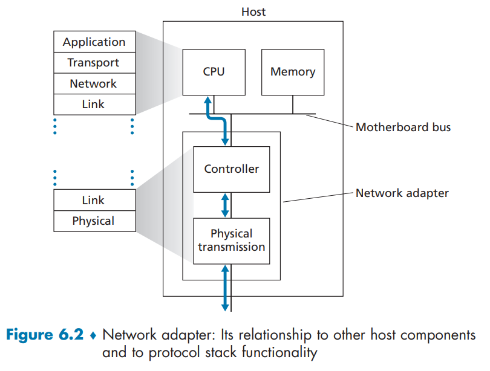

图6.2展示了一个典型的主机架构.以太网功能<u>要么集成在主板芯片组</u>中,要么**通过低成本专用以太网芯片实现**.数据链路层主要通过称为网络适配器(有时也称作网络接口控制器/NIC)的芯片实现.该适配器承载了包括组帧、链路接入、差错检测在内的多项链路层服务,因此链路层控制器的大部分功能均通过硬件实现.

-   在发送端,控制器获取协议栈高层生成并存储于主机内存中的数据报,将其封装为链路层帧(填充帧中的各个字段),随后遵循链路接入协议将帧发送至通信链路.
-   在接收端,控制器接收完整帧数据,并提取出网络层数据报.
-   若链路层执行差错检测,则由发送控制器设置帧头部的检错码,接收控制器执行差错检测操作.

链路层是硬件与软件的结合体——它正是协议栈中软件与硬件交汇的枢纽.

[注意到在一台主机上 网卡还与主机的PCI总线相连 就像一台IO设备]

## 6.2 Error-Detection and -Correction Techniques

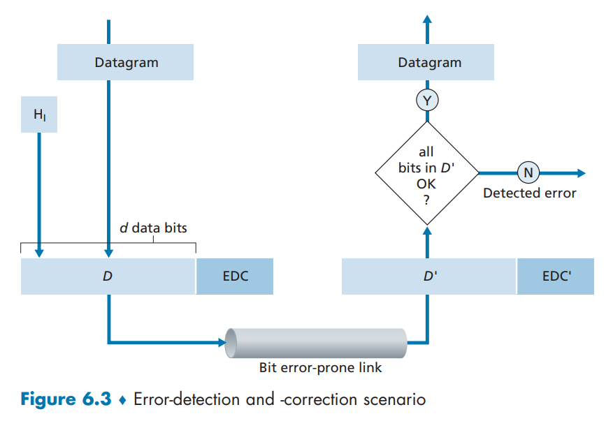

首先我们应该明确我们的讨论环境 在发送节点 我们使用**差错检测和纠正比特 error-detection and -correction bits EDC**来增强数据D . 要保护的数据不仅有网络层传下来的数据报 还包括链路帧首部中的链路级寻址信息等 传输过程中可能会遇到传输差错(原文用的词是 `in-transit bit flips`)

还需要声明一点 没有检测到差错不意味着没有差错 差错检测仍然有一定的概率找不到确实存在的错误 然后把这个误以为正确的数据包交付给网络层 这也有可能是因为攻击者采用了某种伪装技术 .

当然 对应的也有很多更加 复杂 精确 但是高开销的差错检测和纠正技术 .

本节主要研究的三种差错检测技术是 <u>奇偶校验 parity checks</u> & <u>检验和(sum)方法 check-summing methods</u> & <u>循环冗余检测 cyclic  redundancy checks</u>

### 6.2.1 Parity Checks

偶/奇 校验方案中 发送方只需要包含一个附加比特 使得 数据总数是 $d+1$ 个 并使总共有 偶/奇 数个`1`

虽然一个分组中出现比特差错的概率很小 但是往往是以突发的方式集中出现在某处 此时原本的方案就不够用了

于是**二维奇偶校验**

此时一共有 $i+j +1$个检验位是对所有数据的检验 也就是原始数据加上 $i+j +1$个检验位.

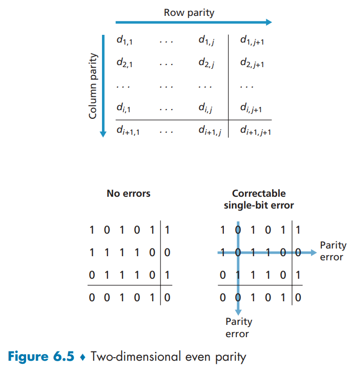

这种方法最多可以纠错1个比特差错 最多可以发现两个比特差错 并且奇偶位本身的差错也可以被发现

接收端兼具检测和纠正错误的能力被称为前向纠错(FEC).该技术普遍应用于音频存储和播放设备(如音频CD).在网络环境中,FEC技术既可独立使用,也可与我们在第3章研究的链路层ARQ技术结合使用.它减少了重传的次数 .

### 6.2.2 Checksumming Methods

这个应该很熟悉了 就和之前讲过的是一样的 重点在于进位要加回到某位上

在TCP和UDP协议中,因特网校验和计算范围覆盖所有字段(包括首部和数据字段).在IP中,校验和则仅针对IP首部进行计算(因为UDP或TCP报文段已有其自身的校验和).在其他协议中,可能会有所不同 .

校验和方法所需的数据包开销相对较小.例如,TCP和UDP中的校验和仅使用16比特.然而,与下文讨论的、常用于链路层的循环冗余校验(CRC)相比,它们提供的差错保护相对较弱.

此时一个很自然的问题是:为什么在传输层使用校验和,而在链路层使用循环冗余校验？主要还是因为效率 链路层中可以用专门的硬件来实现CRC 但是在主机中(网络层常常会在这里实现)我们需要更高的效率 .

### 6.2.3 Cyclic Redundancy Check (CRC)

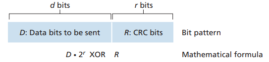

在当今计算机网络中广泛使用的一种差错检测技术是基于**循环冗余校验(CRC)码**.CRC码也被称为**多项式码**,因为可以将要发送的比特串视为一个多项式,其系数即为比特串中的0和1值,而对比特串的操作则可解释为多项式算术运算.

CRC码的工作原理 : 假设发送节点想要发送给接收节点的数据段 $ D $ 长度为 $ d $ 比特.发送方和接收方必须首先商定一个 $ r + 1 $ 比特的模式串,称为**生成多项式**,我们将其记为 $ G $.我们要求 $ G $ 的最高有效位(最左边的比特)为 1.CRC码的核心思想如图所示.对于给定的数据段 $ D $,发送方将选择 $ r $ 个附加比特 $ R $,并将它们附加到 $ D $ 之后,使得得到的 $ d + r $ 比特模式串 . 在使用模2算术运算时能够被 $ G $ **精确整除**(即余数为零).因此,使用CRC进行差错检查的过程很简单:接收方将接收到的 $ d + r $ 比特除以 $ G $.如果余数**非零**,则接收方知道发生了差错；否则,数据被视为正确而被接受.

>   [!NOTE]
>
>   为什么是r+1个的比特模式串 后来不是只用到r个吗
>
>   ---
>
>   -   当你用一个 `r+1` 位的数去除另一个数时,得到的余数的位数**最多**是 `r` 位.
>   -   CRC算法就是利用这一点,它计算出一个**恰好是 `r` 位**的余数 `R`,然后把它附加到数据后面.
>   -   也就是说 对于我们需要的`r`位数字 使用"1+r(string)"正好能表示 加上1有很多数学上的优良性质 .

## 6.3 Multiple Access Links and Protocols

本节主要研究的内容是 : 如何协调多个发送和接收节点对一个共享广播信道的访问 . 另外,广播信道通信也常用于局域网中,我们也会研究多路访问信道是如何在局域网中使用 .

这个问题可以类比为 如何在一个大房间中为所有人提供向所有人说话的机会 .

---

由于所有节点均能发送帧,当多个节点同时发送时,所有接收节点会同时收到多组帧——这些传输的帧会在所有接收端产生**碰撞 collide**.通常情况下,碰撞会导致接收节点无法解析任何一帧:从某种意义上说,碰撞帧的信号会相互纠缠形成乱序.因此所有涉及碰撞的帧都会丢失,广播信道在碰撞期间将被浪费.显然,若众多节点频繁发送帧,大量传输将引发碰撞,导致广播信道带宽被大量损耗.

由于这个问题 我们需要以某种方式协调活跃节点的传输,多路访问协议就是用来协调这种工作的 .

三类主要的多路访问协议类型是 (具体由几十种 但是大致可以归为这三类) :

1.   channel partitioning protocols 信道划分协议
2.   random access protocols 随机接入协议
3.   and taking-turns protocols 轮流协议

在结束概述之前,我们给出下列条件.在理想情况下,对于速率为 $ R  \text{bps} $ 的广播信道,多路访问协议应该具有以下所希望的特性:

1.  当仅有一个节点发送数据时,该节点具有 $ R  \text{bps} $ 的吞吐量；
2.  当有 $ M $ 个节点发送数据时,每个节点吞吐量为 $ R/M  \text{bps} $.这不必要求 $ M $ 个节点中的每一个节点总是有 $ R/M $ 的瞬间速率,而是每个节点在一些适当定义的时间间隔内应该有 $ R/M $ 的平均传输速率.
3.  协议是分散的；这就是说不会因某主节点故障而使整个系统崩溃.
4.  协议是简单的,使实现不昂贵.

### 6.3.1 Channel Partitioning Protocols

- **时分多路复用(TDM)**:将时间划分为时间帧,每个时间帧再分为多个时隙,每个时隙分配给一个节点传输分组比特.优点是消除碰撞且公平,每个节点平均速率为$R/N$ bps；缺点是节点即使有分组要发也只能在分配的时隙传输,若时隙空闲也不能被其他节点使用,类似TDM规则的鸡尾酒会中每人固定时间段发言,一旦都发言后再循环.
- **频分多路复用(FDM)**:将$R$ bps的信道划分为$N$个不同频段(每个频段带宽$R/N$),每个频段分配给一个节点.优点是避免碰撞且公平分配带宽；缺点是节点即使是唯一有分组要发的,也只能使用$R/N$的带宽.
- **码分多址(CDMA)**:每个节点用唯一的编码对发送数据编码,只要编码精心选择,网络具有抗干扰的特性,不同节点能同时传输,且各自的接收方仍能正确接收.CDMA在军用系统和民用的蜂窝电话中应用广泛,其编码类似于TDM的时隙和FDM的频率,用于分配多路访问信道的用户.(详细内容间第七章)

### 6.3.2 Random Access Protocols

第二大类多路访问协议是随机接入协议.在随机接入协议中,传输节点始终以信道的全速率(即 $R \,bps$)发送数据.当发生碰撞时,每个涉及碰撞的节点会重复重传其帧(即数据包),直至该帧成功传输且未发生碰撞.但节点遭遇碰撞时,不一定会立即重传帧,而是随机等待一段时间后再进行重传.所有涉及碰撞的节点会独立选择随机延迟.由于这些随机延迟是独立选取的,可能存在某个节点选择的延迟时间远小于其他碰撞节点的延迟,从而能够避开碰撞成功发送其帧.

文献中记载的随机接入协议数量众多,即便没有上百种,也有数十种.在本节中,我们将介绍几种最常用的随机接入协议——**ALOHA协议**和**CSMA载波侦听多路访问协议**.

以太网就是一种广泛应用且部署广泛的CSMA协议.

#### Slotted ALOHA (时隙ALOHA)

**核心逻辑**:对纯ALOHA的优化,将时间划分为等长的“时隙",节点仅能在时隙起始时刻发送数据.

- 工作流程:系统同步时钟,划分固定时长的时隙(如1ms/时隙)；节点需等待下一个时隙开始时再发送数据；发送后等待ACK,未收到则随机重传.
- 碰撞优化:碰撞仅发生在同一时隙内的多节点发送,避免了纯ALOHA中“部分重叠"导致的碰撞,碰撞概率大幅降低.
- 性能:最大信道利用率提升至约37%(理论值),同步要求增加了系统复杂度,但实用性远高于纯ALOHA.

1.   $37\%$如何计算得到 ? 我们建立的数学模型是 每一个时间分块抛掷一个硬币 有$p$的概率翻到可以重传的概率 那么总速率就是$N \times p^* \times (1 - p*)^{N-1}$ 极大值在N趋近于无穷的时候取到 大致为$\frac{1}{e} = 0.37$
2.   这意味着总速率为R的网络服务 有效传输速率仅为$0.37 \times R (bps)$ 另外研究表面还有$37\%$的时间是空闲的 $26\%$的时间会发生碰撞

---

#### ALOHA

**核心逻辑**:最基础的随机访问协议,节点有数据就立即发送,无需任何预处理.

- 工作流程:节点检测到待发数据后,直接向信道发送；发送后等待接收方的确认(ACK),未收到确认则判定为碰撞,等待随机时间后重传.
- 碰撞判定:若两个及以上节点在任意重叠时间段发送数据,即发生碰撞.
- 性能:最大信道利用率仅约18%(理论值),碰撞概率高,仅适用于节点少、数据量小的场景.
    - $N \times p^* \times (1 - p^*)^{2 \times (N-1)}$ 取极限后得到 $\frac{1}{2e}$

| 协议          | 核心优化点              | 碰撞概率 | 信道利用率 | 复杂度 |
| ------------- | ----------------------- | -------- | ---------- | ------ |
| ALOHA         | 无预处理,立即发送       | 最高     | ~18%       | 最低   |
| Slotted ALOHA | 时隙同步,仅时隙起始发送 | 中等     | ~37%       | 中等   |
| CSMA          | 发送前载波侦听          | 最低     | 最高(~90%) | 中等   |

---

#### CSMA(载波侦听多路访问协议)
**核心逻辑**:在发送数据前先“侦听"信道状态,避免在信道忙时发送,进一步减少碰撞.
- 核心机制:“载波侦听"——发送前检测信道是否有其他节点的传输信号(载波),若信道空闲则发送,若忙则等待.
    - **先听后说**:若检测到其他信号正在传输,则保持静默直至信道空闲.在网络术语中,这被称为**载波侦听**——节点在发送前先监听信道状态.当监听到其他节点正在传输数据帧时,会持续等待直至监测到信道持续空闲达特定时长,方才启动传输.
    - **同时发声即止**:若与他人同时开始传输,立即中止当前操作.这对应网络中的**碰撞检测**机制——发送方在传输过程中持续监听信道.一旦发现其他节点正在传输冲突帧,会立即终止自身传输,随机等待一段时间后,重新执行"空闲时再传输"的循环流程.

- 分类与细节:
  - 非坚持CSMA:侦听到信道忙时,随机等待一段时间后再次侦听,避免持续占用侦听资源.
  - 1-坚持CSMA:侦听到信道忙时,持续侦听,一旦信道空闲立即发送,优点是响应快,缺点是可能多个节点同时检测到空闲并发送,引发碰撞.
  - p-坚持CSMA:侦听到信道空闲时,以概率p直接发送,以概率(1-p)等待下一个时隙再尝试,平衡响应速度与碰撞概率.
- 性能:最大信道利用率可达90%以上(理想条件),碰撞概率远低于ALOHA系列,是以太网等网络的基础协议之一.

>   [!NOTE]
>
>   这段文字主要在解释**CSMA协议中即使节点进行载波侦听,仍会发生碰撞的原因**,并通过一个包含4个节点(A、B、C、D)的总线型网络时空图案例来具体说明:
>
>   - 首先指出,CSMA(载波侦听多路访问)和CSMA/CD(带碰撞检测的载波侦听多路访问)协议族包含了相关规则,且存在多种变种,这里聚焦其核心特性.
>   - 接着提出疑问:既然所有节点都做载波侦听(信道忙时就停止传输),为何还会碰撞？
>   - 然后通过案例分析:在时刻$ t_0 $,节点B侦听信道空闲后开始传输；在时刻$ t_1 $($ t_1 > t_0 $),节点D有帧要发,由于B的传输比特还未传播到D,D侦听到信道空闲便开始传输；短暂时间后,B的传输信号到达D,干扰了D的传输,引发碰撞.
>   - 最后总结:**信道传播时延(信号从一个节点传到另一个节点的时间)是关键因素**——传播时延越长,一个节点侦听不到另一个节点已开始传输的概率就越大,碰撞的可能性也就越高.

#### Carrier Sense Multiple Access with Collision Detection (CSMA/CD)

##### CSMA/CD的工作流程(节点适配器的行为)
1. **数据准备**:从网络层获取数据报,封装成链路层帧,存入适配器缓存.
2. **载波侦听**:若信道空闲(无信号能量),则开始传输；若信道忙,持续等待直到空闲.
3. **碰撞检测**:传输过程中,持续监视信道信号.若检测到其他节点的信号能量(即碰撞),**立即停止传输**.
4. **重传机制**:停止传输后,等待**随机时间**(通过“二进制指数退避算法"确定),然后返回步骤2重新尝试发送.

##### “二进制指数退避算法"(碰撞后的随机延迟策略)
为避免重复碰撞,节点通过该算法确定重传前的等待时间,规则如下:
- 设某帧经历了$ n $次碰撞,节点从集合$ \{0,1,2,\dots,2^n - 1\} $中**等概率选择一个数$ K $**,实际等待时间为$ K \times 512 $比特时间(即传输512比特所需的时间,如10Mbps以太网中为51.2μs).
- $ n $的最大值为10,若碰撞次数超过16次则丢弃帧.
- 示例:
  - 第1次碰撞后,$ n=1 $,集合为$ \{0,1\} $,以0.5概率选$ K=0 $(立即重传)或$ K=1 $(等待512比特时间).
  - 第2次碰撞后,$ n=2 $,集合为$ \{0,1,2,3\} $,依此类推,集合大小随$ n $指数增长,平衡了“信道空闲时快速重传"和“减少重复碰撞"的需求.

综上,CSMA/CD通过“先听后发、边发边听、碰撞停发、随机延迟重发"的机制,解决了共享信道的碰撞问题,同时通过二进制指数退避算法优化重传效率,是早期以太网实现多节点共享通信的核心协议.

>   [!NOTE]
>
>   这段文字主要解释了**CSMA/CD协议的效率定义及影响因素**,可从以下几点理解:
>
>   ### 一、效率的定义
>   CSMA/CD效率是指:当存在大量活跃节点且每个节点有大量帧要发送时,**帧在信道中无碰撞传输的时间占长期运行时间的比例**.
>
>   ### 二、效率的公式与参数
>   其近似公式为:
>   $$
>   \text{效率} = \frac{1}{1 + 5d_{\text{prop}}/d_{\text{trans}}}
>   $$
>   
>
>   - $ d_{\text{prop}} $:信号在任意两个适配器之间传播的**最大时间**(传播时延).
>   - $ d_{\text{trans}} $:传输一个最大长度以太网帧的时间(传输时延,如10Mbps以太网中约为1.2毫秒).
>
>   ### 三、参数对效率的影响
>   - 当$ d_{\text{prop}} $接近0时,效率接近1.
>     直观解释:传播时延为0时,碰撞节点会立即停止传输,不会浪费信道资源,信道几乎能全速率传输.
>   - 当$ d_{\text{trans}} $很大时,效率也接近1.
>     直观解释:帧的传输时间很长,一旦某帧占用信道,会在较长时间内有效传输,信道大部分时间都在“有用工作",碰撞的影响被稀释.
>
>   简言之,CSMA/CD的效率由**传播时延与传输时延的比值**决定,传播时延越小、传输时延越大,协议效率越高.

### 6.3.3 Taking-Turns Protocols

我们之前提到,一个理想的多路访问协议应具备两个特性:(1)当仅有一个节点活跃时,该节点的吞吐量可达 R bps；(2)当有 M 个活跃节点时,每个节点的吞吐量接近 R/M bps.ALOHA 和 CSMA 协议满足第一个特性,但不具备第二个.这促使研究者们开发了另一类协议——轮询协议.与随机接入协议类似,轮询协议也有数十种之多,且每种都存在多种变体.这里我们将讨论其中两种较为重要的协议.

-   第一种是**轮询协议**.该协议要求指定某个节点为主节点.主节点以轮转方式依次询问每个节点:首先向节点1发送指令,告知其可传输最多若干帧；待节点1传输完毕后,主节点再通知节点2进行传输(通过检测信道信号消失判断节点传输结束).如此循环往复,形成固定轮询次序.

轮询协议彻底解决了长期困扰随机接入协议的碰撞和空时隙问题,从而实现了更高效率.但它也存在一些缺陷:首先会引入轮询延迟——即通知节点开始传输所需的时间.例如当仅有一个活跃节点时,由于主节点每次必须依次询问所有非活跃节点,该活跃节点的实际传输速率将低于 R bps.其次更严重的是,主节点一旦故障,整个信道将陷入瘫痪.我们将在6.3节讨论的蓝牙协议就是轮询协议的典型应用.

-   第二种轮询协议是**令牌传递协议**.该协议不设主节点,而是通过一个称为“令牌"的特殊帧在节点间按固定顺序传递.例如节点1总是将令牌传给节点2,节点2传给节点3,末节点N则传回节点1.节点收到令牌时,仅当存在待发送帧才保留令牌；否则立即转发.若需发送数据,则传输最多限定数量的帧后必须将令牌传递给下一节点.

令牌传递协议兼具去中心化和高效率的优势,但也存在隐患:单个节点的故障可能导致整个信道崩溃；若某节点意外持有令牌不释放,则需启动复杂恢复机制重新流通令牌.多年来已涌现出多种令牌传递协议,包括光纤分布式数据接口协议和IEEE 802.5令牌环协议,这些协议都需妥善解决上述及其他棘手问题.

#### 6.3.4 DOCSIS: The Link-Layer Protocol for Cable  Internet Access

这一节以**DOCSIS 用于电缆因特网接入的链路层协议**为核心,通过电缆接入网的案例,整合了三类多路访问协议(信道划分、随机接入、轮流协议)的应用

[没看懂 可以看一下原文 不是很长]

## 6.4 Switched Local Area Networks

`局域交换网`

图6.15展示了一个由四台交换机连接三个部门、两台服务器和一台路由器构成的交换式局域网 .由于这些交换机工作在链路层,它们交换的是链路层帧(而非网络层数据报),不识别网络层地址,也不使用OSPF等路由算法来确定在二层交换机网络中的路径 .我们将很快看到,它们不使用IP地址,而是通过链路层地址在交换机网络中转发链路层帧 .

我们将首先介绍链路层寻址(第6.4.1节)来展开对交换式局域网的研究 .接着探讨著名的以太网协议(第6.4.2节) .在掌握链路层寻址和以太网知识后,我们将分析链路层交换机的工作原理(第6.4.3节),最后了解如何利用这些交换机构建大规模局域网(第6.4.4节) .

### 6.4.1 Link-Layer Addressing and ARP

#### MAC Addresses

MAC地址有很多称呼 物理地址和LAN地址也都是指MAC地址 . 和ip地址一样 它并不用来标记每一台设备 而是每一个物理网口都有一个对应的MAC地址 . 这里还需要提到一下**交换机**和**路由器**的区别,路由器是网络层设备 处理ip地址 可以在不同网络之间路由和转发数据,而交换机是链路层设备 处理MAC地址 只能在局域网内进行高效且精准的数据交换,尽管我们通常见到的设备会将两者实现在一起 .

有一些软件可以用来改变MAC地址 但是由于MAC地址在设计时被设计时是永久的 我们也只考虑MAC地址是固定的这一种情况 .

1.  **唯一性**:理论上,全球每一个网卡的MAC地址都是唯一的 .这由IEEE组织负责分配和管理,制造商从IEEE购买地址块,然后为其生产的每个网卡分配一个唯一的地址 .
2.  **本地性**:MAC地址用于在**同一个本地网络内**(例如,同一个以太网或同一个Wi-Fi网络下)标识设备并进行通信 .它的作用范围是局部的,不像IP地址那样可以用于全球路由 .
3.  **格式**:一个MAC地址长度为48位(6个字节),通常以十六进制表示,并用冒号或连字符分隔 .例如:`00:1A:2B:3C:4D:5E` 或 `00-1A-2B-3C-4D-5E` .
    -   前24位(前3个字节)是**组织唯一标识符**,代表制造商 .
    -   后24位(后3个字节)是**扩展标识符**,由制造商自行分配 .

MAC地址是扁平的 这与具有层次结构相反(ip) ; ip地址就像是邮政编码 而MAC地址就像是 每个人的身份证号他们多有很大的作用 不可被另一方取代 . 

在发送某一帧的时候 会将目的MAC地址填入帧头 每一个接收到这一帧的交换机 会检查该目的MAC地址和自己的MAC地址是否一致 如果不一致则会忽略 . 另外,如果我们希望所有人都处理这份信息 会在目的MAC地址处填上48个`1`即 `FF-FF-FF-FF-FF-FF`.

#### Address Resolution Protocol (ARP)

地址解析协议ARP负责将**网络层地址-IP地址**和**链路层地址-MAC地址**进行转换 .

在链路层上传输数据并不依赖IP地址 . 事实情况是,当网络层确定要转发的目的IP地址(ip)时,会查询ARP模块这个ip对应的MAC是多少,得到MAC之后 网卡才会把数据传给目的网卡 .

>   [!NOTE]
>
>   ARP协议将IP地址解析为MAC地址 .它在许多方面类似于DNS(我们在2.5节学习过),后者将主机名解析为IP地址 .然而,这两种解析器之间有一个重要区别:DNS可以为互联网上任意位置的主机解析主机名,而ARP仅能为同一子网内的主机和路由器接口解析IP地址 .如果加利福尼亚的一个节点试图使用ARP来解析密西西比州某个节点的IP地址,ARP将会返回错误 .

现在我们已解释了ARP的作用,接下来让我们了解其工作原理 .

每台主机和路由器内存中都存有一张ARP表,其中包含IP地址到MAC地址的映射关系 .

|   IP Address    |    MAC Address    | TTL      |
| :-------------: | :---------------: | -------- |
| 222.222.222.221 | 88-B2-2F-54-1A-0F | 13:45:00 |
| 222.222.222.223 | 5C-66-AB-90-75-B1 | 13:52:00 |

ARP表还包含生存时间值,用于指示每条映射记录何时将被删除 .需要注意的是,ARP表并不一定包含子网内所有主机和路由器的条目——有些可能从未被录入,有些可能已过期 .条目的典型过期时间是从录入ARP表起20分钟 .

假设主机`222.222.222.220`要向`222.222.222.222`发送数据报,此时表中并没有储存`222.222.222.222`的MAC地址,此时发送方将使用ARP协议来解析地址 :

-   具体而言 发送方会使用 `FF-FF-FF-FF-FF-FF`向所有已知的MAC发送一个ARP分组 , 这个分组包括发送方和接收方的ip和MAC地址 . 然后所有接收到的网卡都会检查自己的ARP模块中是否含有所需要的信息,若有就返回.

关于ARP协议有几个值得注意的特点:

-   ARP查询消息通过广播帧发送,而ARP响应消息则通过标准帧发送
-   ARP即插即用——这意味着ARP表是自动构建的,不需要系统管理员手动配置
-   如果某台主机与子网断开连接,其条目最终会从子网内其他ARP表中删除

**最好将ARP视为一个横跨链路层与网络层边界的协议**——它无法完美契合我们在第1章学习的简单分层协议栈模型

#### Sending a Datagram off the Subnet

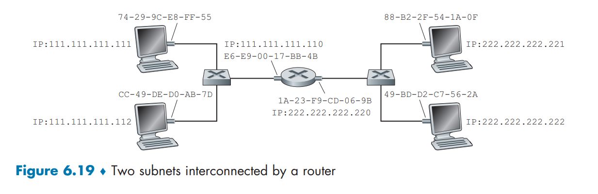

我们在[Fig6.19]展示的环境中讨论在跨子网的数据传送 .

>   关于[Fig6.19],有几点值得注意:每台主机都只有一个IP地址和一个适配器,路由器的每个接口都有一个IP地址 .
>
>   对于路由器的每个接口,都对应一个ARP模块和一个适配器 .
>
>   由于[Fig6.19]中的路由器具有两个接口,因此它拥有两个IP地址、两个ARP模块和两个适配器 .每个适配器也都有其唯一的MAC地址 .

现在我们来研究如何跨子网发送数据报.以`111.111.111.111`向`222.222.222.222`发送IP数据报为例.发送主机会照常将数据报传递给其适配器,但必须同时告知适配器一个合适的目标MAC地址.显然我们无法直接使用跨子网的MAC地址,因此会使用路由器接口`111.111.111.110`的MAC地址,这样IP数据报已成功从源主机传输到路由器！

但过程尚未结束.路由器通过查询路由器中的转发表来确定转发数据报的正确接口.转发表指示该数据报应通过路由器接口`222.222.222.220`进行转发.随后该接口将数据报传递给其适配器,适配器将数据报封装到新帧中并发送到子网2.此时帧的目标MAC地址才真正是最终目的地的MAC地址.

### 6.4.2 Ethernet

以太网几乎已经完全占据了有线局域网市场.在20世纪80年代和90年代初,以太网曾面临来自其他局域网技术的诸多挑战,包括令牌环网、FDDI和ATM.其中一些技术曾成功占据部分局域网市场数年之久.但自20世纪70年代中期发明以来,以太网持续演进发展,始终保持着其主导地位.如今,以太网是迄今为止最主流的有线局域网技术,并有望在可预见的未来继续保持这一地位.可以说,以太网之于局域网,就如同互联网之于全球网络.

以太网的成功有多方面原因.首先,以太网是首个被广泛部署的高速局域网技术.由于其早期部署,网络管理员对以太网的特性与局限了如指掌,当新技术出现时他们不愿轻易转换.其次,令牌环网、FDDI和ATM比以太网更复杂、更昂贵,这进一步降低了网络管理员更换技术的意愿.第三,转向其他局域网技术(如FDDI或ATM)最令人信服的理由通常是新技术具有更高的数据速率；然而以太网总能迎头赶上,推出具有相同或更高数据速率的版本.交换式以太网在90年代初问世,进一步提升了其有效数据传输速率.最后,由于以太网的普及,其硬件设备(特别是适配器和交换机)已成为标准化商品,价格极为低廉.

最初的以太网由鲍勃·梅特卡夫和大卫·博格斯在20世纪70年代中期发明.原始以太网采用同轴电缆总线互联节点.这种总线拓扑结构实际一直沿用到整个80年代直至90年代中期.采用总线拓扑的以太网属于广播式局域网——所有传输的帧都会送达并受总线连接的所有适配器处理.回顾我们在6.3.2节讨论过的以太网CSMA/CD多路访问协议及二进制指数退避算法.

到90年代末期,大多数企业和高校已将以太网升级为采用基于集线器的星型拓扑结构.在这种架构中,主机(和路由器)通过双绞铜线直接连接至集线器.集线作为物理层设备,作用于比特位而非帧.当代表0或1的比特从某个接口到达时,集线器会直接重建该比特,增强其信号强度,并将比特发送到所有其他接口.因此,基于集线器星型拓扑的以太网同样是广播式局域网——只要集线器从任一接口接收到比特,就会向所有其他接口发送副本.特别需要注意的是,若集线器同时从两个不同接口接收到帧,就会发生冲突,此时创建这些帧的节点必须重新传输.

进入21世纪初,以太网再次经历重大演进.虽然继续采用星型拓扑,但中心的集线器被交换机所取代.本章后续将深入探讨交换式以太网.在此需要说明的是,交换机不仅能够"避免冲突",更是真正的存储转发式分组交换机；但与运行至第三层的路由器不同,交换机仅运行至第二层.

#### Ethernet Frame Structure

以太网帧是数据传输的基本单元,其标准结构如图6-20所示,包含以下字段:

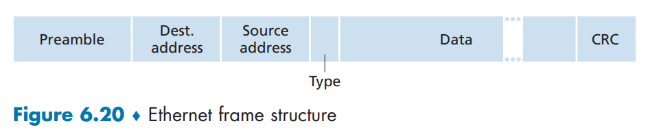

*   **数据字段 (46~1500字节)**:承载IP数据报等上层数据.以太网MTU为1500字节,不足46字节需填充.
*   **目的地址 (6字节)**:目标适配器的MAC地址.适配器只接收发往自己MAC地址或广播地址的帧.
*   **源地址 (6字节)**:发送适配器的MAC地址.
*   **类型字段 (2字节)**:标识所承载的网络层协议(如IP或ARP),实现多路复用.
*   **CRC (4字节)**:用于接收方检测帧传输是否出错.
*   **前同步码Preamble (8字节)**:前7字节用于同步接收方时钟,最后1字节的特定比特标记帧开始.

**服务特性**:

*   **无连接服务**:发送前无需握手.
*   **不可靠服务**:接收方不发送确认或否认；错误的帧直接被丢弃,由上层协议(如TCP)负责重传.

#### Ethernet Technologies

以太网并非单一标准,而是一个技术家族,其命名有规律可循(如 `[速率]BASE-[介质]`); 它也不单单针对链路层 , 也是物理层的规范.`BASE`表明该物理媒体只承载以太网流量 , 介质处的[T]一般指双绞铜线 .

*   **演进历史**:
    
    *   **初期**:基于同轴电缆的总线拓扑,是典型的广播网络,使用CSMA/CD协议解决冲突.
    *   **发展**:速率从10Mbps提升至100Mbps、1Gbps乃至10Gbps.物理介质从同轴电缆过渡到双绞线和光纤,拓扑结构也转变为星型.
    *   >   [!NOTE]
        >
        >   星型拓扑是一种网络结构,其中所有网络节点均独立连接至一个中央设备.该中央设备负责所有节点间的通信中转,节点之间不直接相连.这种结构的核心优势在于其高可靠性与易维护性——单一节点或线路的故障不会影响网络其他部分的正常运行.根据中央设备是集线器还是交换机的不同,网络会分别以广播方式工作或实现高效的点对点通信.尽管存在对中央设备的依赖性,星型拓扑因其稳定高效的特点,已成为现代局域网的主流架构.
    
*   **技术兼容性**:如[Fig6-21]所示,尽管物理层标准多样,但所有以太网技术在**链路层共享相同的MAC协议和帧格式**,确保了向后兼容.

    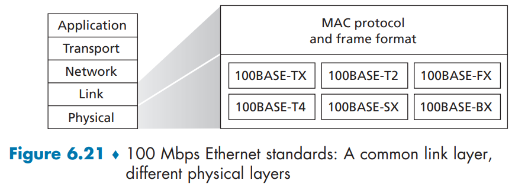

*   **现代交换式以太网**:
    *   在基于**交换机**的全双工星型网络中,碰撞得以避免.
    *   因此,传统的CSMA/CD MAC协议在多数场景下已不再需要.

**结论**:历经三十多年演变,以太网的速度、介质和拓扑均已巨变,但其**帧格式始终保持不变**,这被认为是其成功的关键.

>   [!NOTE]
>
>   在结束我们对以太网技术的讨论时,不妨提出一个可能已开始困扰您的问题.在总线型拓扑和基于集线器的星型拓扑时代,以太网显然是一种广播链路),当节点同时传输时会发生帧冲突.为了处理这些冲突,以太网标准包含了CSMA/CD协议,该协议对于覆盖小范围地理区域的有线广播局域网特别有效.
>
>   然而,若当今主流的以太网应用是基于交换机的星型拓扑,并采用存储转发分组交换,那么是否真的还需要以太网MAC协议呢？稍后我们将看到,交换机会协调其传输,绝不会在任何时间向同一接口转发多个帧.此外,现代交换机支持全双工通信,这意味着交换机和节点可以同时向对方发送帧而互不干扰.换言之,在基于交换机的以太局域网中,不存在冲突,因此也就不再需要MAC协议了！
>
>   正如我们所看到的,今天的以太网与40多年前Metcalfe和Boggs构想的原始以太网已大不相同——速度提升了三个数量级,以太网帧通过各种介质传输,交换式以太网已成为主流,如今甚至连MAC协议也常常不再必要！所有这些真的还能称为以太网吗？答案当然是"根据定义,是的".但有趣的是,我们注意到在所有这些变迁中,确实存在一个持续三十年保持不变的核心要素——以太网的帧格式.或许,这才是以太网标准真正永恒的核心精髓.

### 6.4.3 Link-Layer Switches

交换机的核心作用在于接收传入的链路层帧并将其转发至输出链路,我们将在本节深入探讨这种转发功能.

可以看到,交换机对于子网中的主机和路由器而言是透明存在的——它们不需要也不会感知到交换机 在它们眼中交换机就是"网线"的一部分

交换机输出接口设有缓冲区,其运作原理与路由器输出接口为数据报设置缓冲区的机制高度相似,这样可以避免输出接口的帧速率暂时超过该接口的链路容量.

>-   **帧速率**是指数据帧**抵达并等待通过**该输出接口的**总速率**.
>-   **链路容量**是指该输出接口**实际能够发送数据**的**最大物理速率**.

#### Forwarding and Filtering
- **过滤 filtering**是决定一个帧应该转发到某个接口还是应当将其丢弃的交换机功能；
- **转发 forwarding**是决定一个帧应该被导向哪个接口,并把该帧移动到那些接口的交换功能.
- 交换机的过滤和转发借助**交换表 switch table**完成.
  
- 交换表包含某局域网网段上某些主机和路由器(不必是全部)的表项,每个表项含: 1. MAC地址 2. 通向该MAC地址的交换机接口 3. 表项放置在表中的时间.例如 :
  
  |       地址        | 接口 | 时间 |
    | :---------------: | :--: | :--: |
    | 62-FE-F7-11-89-A3 |  1   | 9:32 |
    | 7C-BA-B2-B4-91-10 |  3   | 9:36 |
  
- 为了理解交换过滤和转发的工作过程,假定目的地址为DD-DD-DD-DD-DD-DD的帧从交换机接口x到达.交换机用MAC地址DD-DD-DD-DD-DD-DD做三种可能情况的判断:
  - 表中没有对于DD-DD-DD-DD-DD-DD的表项:交换机向除接口x外的所有接口前面的输出缓存转发该帧的副本,即广播该帧.
  - 表中有一个表项将DD-DD-DD-DD-DD-DD与接口x联系起来:该帧从包括适配器DD-DD-DD-DD-DD-DD的局域网网段到来,无需将该帧转发到任何其他接口,交换机过滤该帧.
  - 表中有一个表项将DD-DD-DD-DD-DD-DD与接口y(y≠x)联系起来:交换机通过将该帧放到接口y前面的输出缓存完成转发功能.
- 但是如何配置**交换表**呢?

#### Self-Learning
- 交换机是**自学习 self-learning**的,这点对早期的网络管理员非常友好,这种能力是通过如下方式实现的:
  
  1.   交换机表初始为空
  2.   交换机在每个接口接收到的每个入帧,在表中存储: ①MAC地址；②该帧到达的接口；③当前时间.这样对于每个发送过数据的主机都会在这张表中有所记录.
  
  3.   如果在一段**老化期 aging time**后,交换机没有接收到以该地址作为源地址的帧,就来中删除这个地址.
- 假设在时刻9:39,地址为01-12-23-34-45-56的一个帧从接口2到达,假设这个地址不在交换机表中,于是交换机在其表中增加一个新的表项.
- 假设该交换机的老化期是60min,在9:32 - 10:32期间源地址是62-FE-F7-11-89-A3的帧没有到达该交换机,那么在时刻10:32,这台交换机将从它的表中删除该地址.
- 交换机是**即插即用设备 plug-and-play device**,因为它们不需要网络管理员或用户的干预.安装交换机的网络管理员只需将局域网网段与交换机的接口相连,不需要做其他任何事.管理员在安装交换机或者当某主机从局域网网段之一被去除时,他没有必要配置交换表.
- 交换机也是双工的,这意味着任何交换机接口能够同时发送和接收.

#### Properties of Link-Layer Switching
- 在描述了链路层交换机的基本操作之后,现在来考虑交换机的特色和性质,能够指出使用交换机的几个优点,它们不同于如总线或基于集线器的星形拓扑那样的广播链路:
  - **消除碰撞**:在使用交换机时,交换机(不使用集线器)构建的局域网中,没有因碰撞而浪费的带宽！交换机缓存帧并且决不会在网段上同时传输多于一个的帧.就像使用路由器一样,交换机的最大聚合带宽是该交换机所有接口速率之和.因此,交换机提供了比使用广播链路的局域网高得多的性能改善.
  - **异质的链路**:交换机将链路彼此隔离,因此局域网中的不同链路能够以不同的速率运行并且能够在不同的媒体上运行.因此,对于有旧设备与新设备混用,交换机是理想的.
  - **管理**:除了提供强化的安全性,交换机也易于进行网络管理.例如,如果一个适配器工作异常并持续发送以太网帧(称为快而含糊的(jabbering)适配器),交换机能够检测到该问题,并在内部断开同适配器的连接,网络管理员不用起床并开车到工作场所去解决这个问题.类似地,一条割断的缆线仅使得使用该条缆线连接到交换机的主机断开连接.在使用同轴电缆的时代,许多网络管理员花费几个小时“沿轨迹检",以找到使整个网络瘫痪的电缆断开之处.交换机也收集带宽使用的统计数据、碰撞率和流量型,并用这些信息为网络管理者使用,这些信息能够用于调试和解决问题,并规划该局域网在未来应当演化的方式.

>   [!NOTE]
>
>   在交换式局域网中,交换机通过MAC地址表进行智能转发,只会将数据帧发送给特定的目标端口,而非像集线器那样广播到所有端口.例如,当主机A向主机B发送数据时,交换机仅将帧从B所连接的端口转发出去,这使得同一网络中的主机C即使运行嗅探器,通常也无法截获A与B之间的通信,从而相比集线器或无线局域网提供了更高的安全性.
>
>   然而,这种安全特性并非绝对.攻击者可以采用“交换机毒化"的手段进行破坏:通过向交换机发送大量携带伪造源MAC地址的数据包,迅速填满其MAC地址表的存储空间.当表中充满伪造条目后,交换机因无法记录合法设备的地址,便会将本应单播转发的帧以广播方式发送到所有端口.这样一来,处于监听状态的攻击者就能捕获到本应隔离的通信流量.由于实施这一攻击需要较高的技术能力,因此交换机环境下的嗅探难度仍然远大于集线器或无线网络.

#### Switches Versus Routers
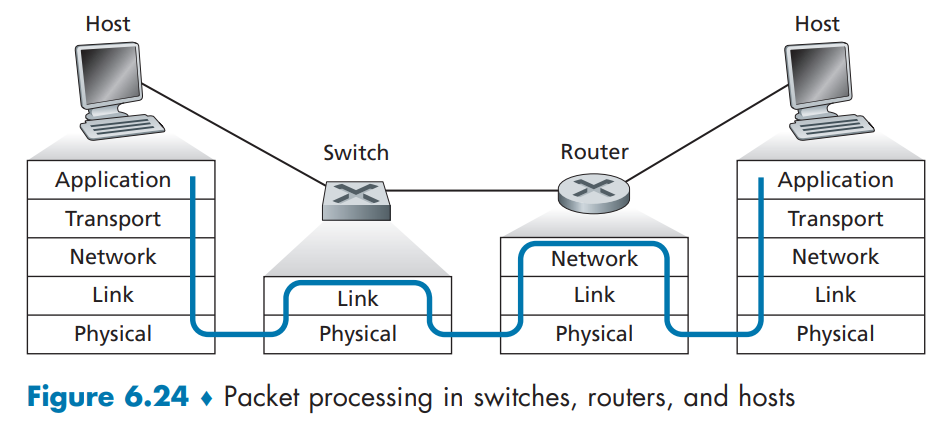

### 6.4.4 Virtual Local Area Networks (VLANs)

在之前讨论的分层交换式LAN架构中,存在三个缺陷:
- **缺乏流量隔离**:尽管分层架构能将组内流量局部化在单个交换机内,但广播流量(如携带ARP、DHCP消息的帧,或自学习交换机尚未学习目的地址的帧)仍需遍历整个机构网络.限制此类广播流量可提升LAN性能,且出于安全/隐私原因也需限制(例如,避免公司高管团队的流量被不满的员工用网络嗅探工具捕获).这种隔离可通过将中心交换机替换为路由器实现,也可通过支持VLAN的交换机实现.
- **交换机使用低效**:若有10个小组,则需要10台交换机.若每个小组足够小,用一台96端口交换机可容纳所有人,但这台交换机无法提供流量隔离.
- **管理变更困难**:若员工在小组间调动,物理线缆必须更换.属于两个小组的员工会让问题更复杂.

幸运的是,支持**虚拟局域网(VLAN)**的交换机可解决这些难题.顾名思义,支持VLAN的交换机允许在单一物理局域网基础设施上定义多个虚拟局域网.VLAN内的主机可相互通信,就像它们(且没有其他主机)连接到交换机一样.

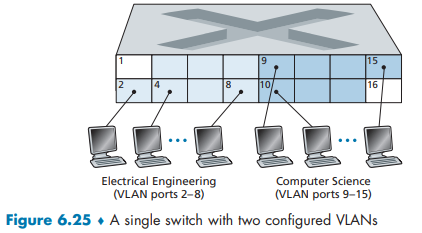

以端口为基础的VLAN中,交换机的端口被划分成组,每个组构成一个广播域(即VLAN).例如,图6.25展示了一台有16个端口的交换机,端口1-8属于EE VLAN,端口9-15属于CS VLAN,端口16未分配.该VLAN解决了上述两个缺陷——EE和CS的广播帧相互隔离,且员工调动时,网络管理员只需使用**交换机软件**将相应端口重新关联到新VLAN即可(未声明的端口属于默认VLAN).若要让EE VLAN的流量到达CS部门,一种方法是将外部路由器连接到两个VLAN(如EE和CS VLAN)的端口,将EE和CS视为不同的物理LAN,通过路由器互联.此时,从EE到CS的数据流会先到路由器,再由路由器转发到CS主机.幸运的是,厂商使这种配置变得容易——网络管理员只需在交换机上配置一个VLAN trunk端口,将两个交换机互联,就像有一个包含两个LAN的单一交换机,无需路由器.

假设EE和CS部门位于不同建筑,需要互联各自的VLAN.图中就展示了解决这个问题的两种方案 :

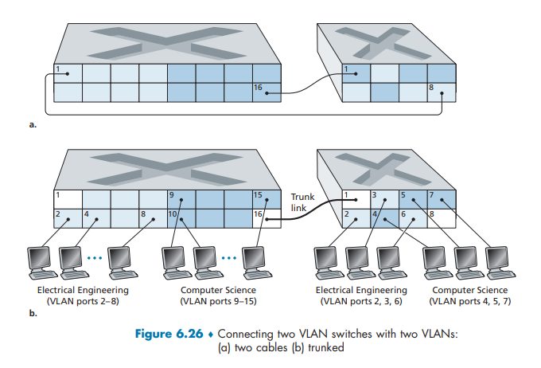

-   方法一:多端口直接互联(非干线方式)

    - **实现逻辑**:针对每个VLAN,在两台交换机上各定义一个属于该VLAN的端口,然后将两台交换机上对应VLAN的端口直接互联.例如,若有EE VLAN和CS VLAN,需在第一台交换机上分别配置属于EE、CS VLAN的端口,在第二台交换机上也配置对应EE、CS VLAN的端口,再将两台交换机上EE VLAN的端口互联、CS VLAN的端口互联(如图6-26a所示).

    - **扩展性缺陷**:若存在\( N \)个VLAN,每台交换机需要\( N \)个端口用于互联两台交换机,端口资源消耗随VLAN数量线性增长,无法满足大规模VLAN组网的需求.

-   方法二:VLAN干线连接(VLAN trunking)

    - **实现逻辑**:在每台交换机上配置一个**干线端口**(如左侧交换机端口16、右侧交换机端口1),该端口属于**所有VLAN**,通过单一链路互联两台VLAN交换机.发往任何VLAN的帧都会通过这条干线链路转发到另一台交换机(如图6-26b所示).

    - **帧识别机制(解决干线帧的VLAN归属问题)**:
      - 采用IEEE定义的**802.1Q标准**,对以太网帧进行扩展,添加4字节的**VLAN标签**.
      - VLAN标签的组成:
        - **标签协议标识符(TPID)**:2字节,固定十六进制值`81-00`,用于标识这是带VLAN标签的帧.
        - **标签控制信息**:2字节,包含12比特的**VLAN标识符(VLAN ID)**(用于标识帧所属的VLAN)和3比特的优先级字段(功能类似IP数据报的TOS字段).
      - 帧的处理流程:在VLAN干线的**发送侧交换机**,将VLAN标签添加到以太网帧中；在**接收侧交换机**,解析VLAN标签以确定帧所属的VLAN,然后删除标签,再进行后续转发.

- **扩展性优势**:仅需两台交换机各一个端口即可互联所有VLAN,端口资源消耗固定,能高效支持大规模VLAN组网.

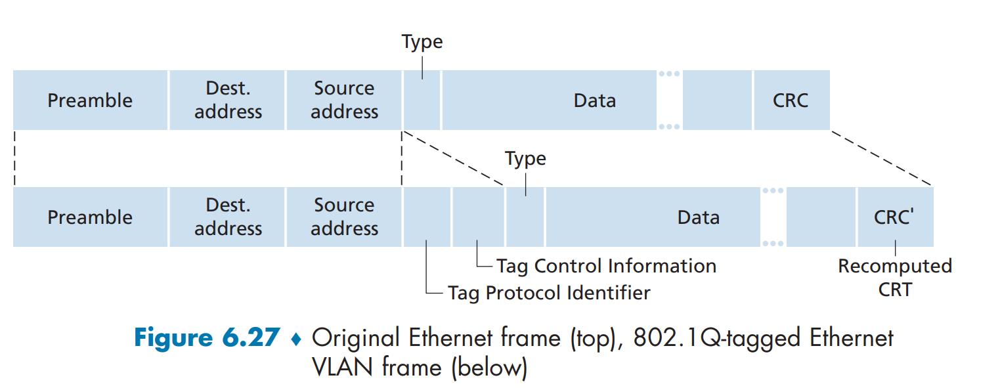

此外,VLAN还有其他定义方式,如基于MAC地址的VLAN(网络管理员根据设备的MAC地址将端口分配到相应VLAN)、基于IP的VLAN(根据IP地址)、基于应用的VLAN(根据应用)等.VLAN还可跨不同交换机,甚至跨广域网,形成可覆盖全球的单一VLAN(详见802.1Q标准).

>   [!CAUTION]
>
>   你此前关注的是互联VLAN交换机的两种方式,而Tailscale作为基于WireGuard的虚拟组网工具,其组网逻辑和你提到的两种VLAN交换机互联方式都不同,它采用**优先P2P直连、失败则通过DERP中继**的混合连接方式,以此实现不同设备跨网络组建虚拟局域网的效果,具体细节如下:
>   1.  **P2P直连(优先采用)**
>       这种方式类似无中心节点的设备直连模式,并非依赖交换机端口互联.Tailscale的设备登录后会先向控制服务器注册自身的公网IP、内网IP等信息,之后借助STUN协议探测彼此的真实网络位置和NAT类型,再通过UDP打洞技术穿透NAT,建立端到端的WireGuard加密隧道.此时数据无需经过第三方中转,直接在设备间传输,不仅速度快、延迟低,还能实现满带宽传输,且所有数据都是端到端加密的,安全性较高.比如同一账号下的两台家用电脑,在NAT环境宽松(如全锥型NAT)时,就能通过这种方式直接通信,就像处于同一物理局域网内一样.
>   2.  **DERP中继连接(兜底方案)**
>       当设备处于严格的防火墙环境、硬NAT等场景,UDP打洞失败无法建立直连时,Tailscale会自动切换到这种中继方式.它会利用全球部署的DERP服务器作为数据中转节点,设备先分别与DERP服务器建立加密连接,再通过服务器转发彼此的数据包.不过该方式下,DERP服务器仅负责中转数据,无法解密加密的流量,能保证数据隐私,但受服务器带宽和网络路由影响,速度会比P2P直连慢.此外,若同一虚拟网络内有其他可用设备,Tailscale也支持以这些设备作为中继节点实现间接通信.
>
>   另外,若需在Tailscale网络中实现类似VLAN的多网段隔离与互联,可通过子网路由功能配置,让一台接入Tailscale的设备作为网关,将其所在的物理子网路由暴露到虚拟网络中,从而实现整个子网设备与虚拟网络的互通,无需给子网内每台设备都安装Tailscale客户端.
>
>   ---
>
>   从你提供的 `tailscale netcheck` 输出结果中,可清晰解读 **网络环境特性、NAT 穿透能力、连接方案倾向** 三大核心信息,结合之前的 `tailscale status` 输出,完整分析如下:
>
>   ### 一、核心网络环境信息(关键结论:你的网络支持 P2P 直连,条件优秀)
>   #### 1. 基础网络支持(UDP/IP 能力)
>   - **UDP 支持**:`UDP: true` → Tailscale 依赖 UDP 协议实现 P2P 打洞和 WireGuard 隧道,这是直连的前提,你的网络已满足；
>   - **IPv4 状态**:`IPv4: yes, 59.175.30.205:6227` → 本地设备已获取公网 IPv4 地址(59.175.30.205)和映射端口(6227),无需依赖 IPv6 即可实现直连；
>   - **IPv6 状态**:`IPv6: no, but OS has support` → 网络未分配 IPv6 地址,但操作系统支持,不影响核心功能(Tailscale 优先用 IPv4 直连).
>
>   #### 2. NAT 穿透能力(重点:支持端口映射,属于「Easy NAT」,直连成功率极高)
>   - **端口映射支持**:`PortMapping: UPnP, NAT-PMP` → 路由器同时支持 UPnP 和 NAT-PMP 两种端口映射协议,Tailscale 可自动通过这两种协议申请端口映射,无需手动配置端口转发,极大提升 UDP 打洞成功率；
>   - **NAT 类型判断**:`MappingVariesByDestIP: false` → 这是「锥形 NAT」(全锥型/端口受限锥型)的关键特征(对称 NAT 会显示 `true`).结合端口映射支持,你的 NAT 属于「Easy NAT」(易穿透类型),而非难以直连的「Hard NAT」(对称 NAT)；
>     - 补充:输出中虽未直接标注「Full Cone」等具体 NAT 类型,但 `MappingVariesByDestIP: false` + 支持 UPnP/NAT-PMP,已明确是锥形 NAT,这类 NAT 与其他锥形 NAT、甚至部分对称 NAT 设备都能实现 P2P 直连.
>
>   #### 3. DERP 中继节点信息(兜底方案)
>   - **最近 DERP 节点**:`Nearest DERP: Tokyo` → Tailscale 自动识别到最近的中继节点是东京节点,延迟仅 165.3ms(属于低延迟中继,即使偶尔无法直连,中继体验也较好)；
>   - **其他节点延迟**:香港节点(hkg)187.9ms、新加坡节点(sin)256.9ms,均为亚洲低延迟节点,兜底效果有保障.
>
>   ### 二、当前 Tailscale 连接方案判断(结合两台设备状态)
>   你之前的 `tailscale status` 显示两台设备(Windows 的 `dragon`、Linux 的 `dragon-1`)已加入同一 Tailnet,但未显示连接状态.结合 `netcheck` 结果,可得出核心结论:
>   #### 大概率是「P2P 直连」,而非 DERP 中继
>   理由如下:
>   1. 网络满足直连的所有前提:UDP 支持 + 公网 IPv4 + 锥形 NAT(Easy NAT) + 自动端口映射(UPnP/NAT-PMP)；
>   2. 两台设备均在线(`status` 中无「offline」标注),且 Tailscale 会优先尝试直连,仅在打洞失败时才切换到 DERP 中继；
>   3. 若 `dragon-1` 设备的网络环境也支持 UDP 和端口映射(多数家用/办公网络都满足),则两台设备 99% 已建立 P2P 直连.
>
>   ### 三、补充:如何 100% 确认连接方案(解决之前 `--verbose` 无效的问题)
>   由于你的 Tailscale 版本不支持 `--verbose` 参数(部分旧版本或 Windows 端简化版可能无此 flag),可通过以下两种更简单的方式确认是否直连:
>
>   #### 方法 1:使用 `tailscale status --json` 解析连接状态
>   1. 在 PowerShell 中执行:`tailscale status --json` → 输出 JSON 格式的详细状态；
>   2. 查找 JSON 中的 `Peers` 字段(对应 `dragon-1` 设备的条目),重点看 `Connected` 和 `Relay` 字段:
>      - 若 `Connected: true` 且 `Relay: ""`(空字符串)→ 已 P2P 直连；
>      - 若 `Relay: "derp-tok"`(或其他 DERP 节点名)→ 正在使用 DERP 中继.
>
>   #### 方法 2:通过 Ping 虚拟 IP 测试延迟(直观判断)
>   1. 在 Windows 设备(`dragon`)上,Ping Linux 设备(`dragon-1`)的虚拟 IP(100.127.132.30):
>      - 执行命令:`ping 100.127.132.30 -t`(`-t` 持续 Ping,观察延迟)；
>      - 若延迟稳定在 **1-30ms**(取决于两台设备的物理距离,比如同城市/同局域网可能 1-10ms,跨城市可能 20-30ms)→ 肯定是 P2P 直连；
>      - 若延迟稳定在 **150-200ms**(接近东京 DERP 节点的 165ms)→ 是 DERP 中继.
>
>   ### 四、总结
>   你的网络环境对 Tailscale 非常友好:**支持 UDP、有公网 IPv4、锥形 NAT 且自动端口映射**,属于「易直连」网络,两台设备大概率已建立 P2P 直连(数据直接传输,速度快、延迟低).若需 100% 确认,执行 `tailscale status --json` 或 Ping 虚拟 IP 即可.
>
>   如果测试后发现是中继(概率极低),可检查 Linux 设备(`dragon-1`)的网络是否支持 UDP、路由器是否禁用了 UPnP,或重启两台设备的 Tailscale 客户端重新触发打洞.

## 6.5 Link Virtualization: A Network  as a Link Layer

1.   链路概念的演化

     - 本章初始:链路是**连接两台通信主机的物理线路**.

     - 多路访问协议学习后:链路更抽象为**信道**,可基于无线电频谱等媒体.

     - 以太网局域网学习后:互联媒体是复杂交换基础设施,但主机视图中仍为**链路层信道**(如以太网主机无需区分是单段局域网、交换局域网还是VLAN连接).

2.   因特网对其他网络的虚拟化,以**拨号调制解调器连接**为例:

     - 实际链路是电话网(有自己的交换机、链路和协议栈).

     - 从因特网链路层视角:电话网被视为**简单“线路"**,即因特网虚拟化了电话网,将其作为链路层技术提供链路层连接.

     - 类比:覆盖网络将因特网视为连接手段,类似因特网覆盖电话网的方式.

### Multiprotocol Label Switching (MPLS)

1.   MPLS的定位

     - MPLS是**分组交换的虚电路网络**,有自身分组格式和转发行为.

     - 从因特网链路层观点看:MPLS像电话网、ATM、帧中继一样,是**为IP设备提供互联服务的链路层技术**.

2. MPLS的演化与目标

    - 演化:20世纪90年代中后期发展,旨在**改善IP路由器的转发速度**.
    - 核心概念:采用**固定长度标签**(源自电路网络领域).

    - 目标:在保留基于目的地IP路由转发的基础上,通过**固定长度标签和虚电路技术**,使路由器基于标签转发数据报,增强转发功能(不放弃IP路由的灵活性).

    - 标准化:IETF通过RFC 3031、RFC 3032统一MPLS协议,将虚电路(VC)技术综合进路由选择.

3. MPLS帧格式 : MPLS首部位于**链路层和网络层首部之间**,结构如下:

    - 字段:标签、3比特实验字段、1比特S字段(指示“成栈"MPLS首部结束)、寿命字段(TTL).

    - 帧结构:`PPP或以太网首部 | MPLS首部 | IP首部 | 链路层的其余部分`
    - 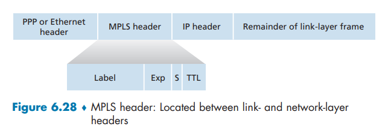

4. MPLS使能路由器的转发机制

    - MPLS使能路由器:能处理MPLS帧的路由器,非MPLS使能路由器遇到MPLS首部会报错.

    - 标签交换路由器(label-switched router, LSR):MPLS使能的路由器,通过**标签交换表**转发MPLS帧(无需提取IP地址,直接根据标签转发).

5. MPLS标签分发与转发示例 : 以路由器R1到R4(MPLS使能)、R5和R6(标准IP路由器)为例:

    - 标签通告:路由器间通告可达目的地及对应标签(如R1向R2、R3通告到A的标签6；R3向R4通告到A的标签8等).

    - 转发表:基于入标签、出标签、目的地、出接口建立转发规则(如R4的转发表中,入标签8、出标签-、目的地A、出接口0).

    - 类比:MPLS使能路由器的连接方式类似交换局域网或ATM网络,且转发时不接触IP首部.
    - 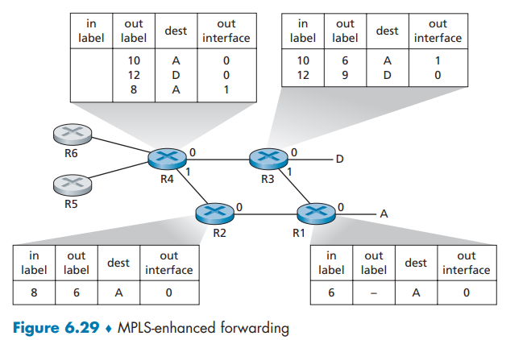

6. MPLS的优势与应用

    - **流量工程**:网络运行者可超越普通IP路由选择,**强制流量沿特定路径传输**(基于策略、性能等原因)MPLS 可以指定 "重要数据走快的那条路,普通数据走另一条"

    - **快速恢复**:可用于故障路径重路由,快速响应链路故障.

    - **虚拟专用网(VPN)**:实现虚拟专用网(VPN),如VPNR(IP使用MPLS使能网络将用户连接隔离,类似ATM和帧中继的寻呼方式).

>   [!NOTE]
>
>   传统 IP 路由是 "看地址找路"(比如快递员看收件地址逐个判断路线),速度慢.
>   MPLS 是"贴标签走捷径":给每个数据包贴一个固定长度的"标签",路由器只要看这个标签,就知道把数据包往哪个接口发,不用再分析复杂的 IP 地址了,速度就快了.
>
>   1.   MPLS 的帧格式[Fig 6.28]
>        就像快递包裹的结构:外层包装(链路层首部,比如以太网头)→ 快递标签(MPLS首部)→ 包裹内容单(IP首部)→ 里面的货物(链路层其余部分).
>   2.   MPLS 路由器的转发
>        每个 MPLS 路由器都有一张"标签转发表",比如 "收到标签 8 的包裹,就从 0 号接口发出去,并发给下一站标签 6".
>        路由器之间会提前"打招呼":“我能到目的地 A,给你个标签 6,你收到带标签 6 的包就往我这发".这样数据包就沿着贴好标签的路径快速传递,不用每一步都重新分析地址.

## 6.6 Data Center Networking

[这一段写的并不晦涩 考试应该也不会作为重点 我很推荐自己去看原文]

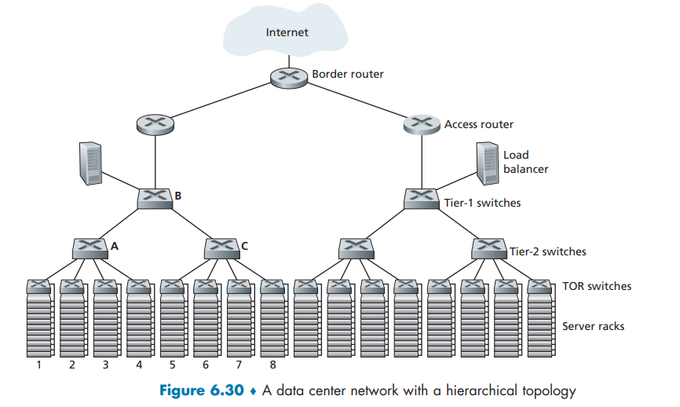

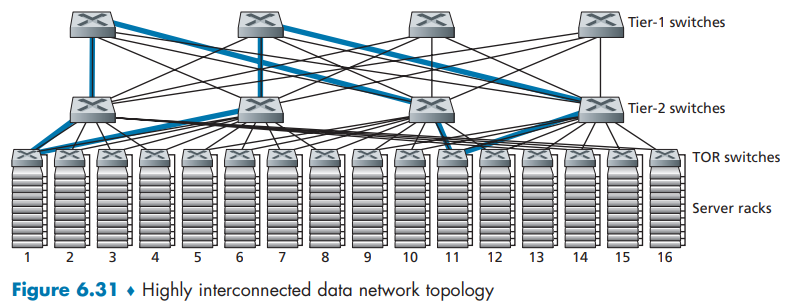

## 6.7 Retrospective: A Day in the Life of a Web  Page Request

以上就是本书第一部分的主要内容 在继续学习本书第二部分之前,我们总结一下沿协议栈向下的旅程.我们来完整的考虑如何下载一个 Web 页面.

[Fig6.32]展示了我们的场景:一名学生 Bob 将他的便携机与学校的以太网交换机相连,下载一个 Web 页面,比如``www.google.com``.

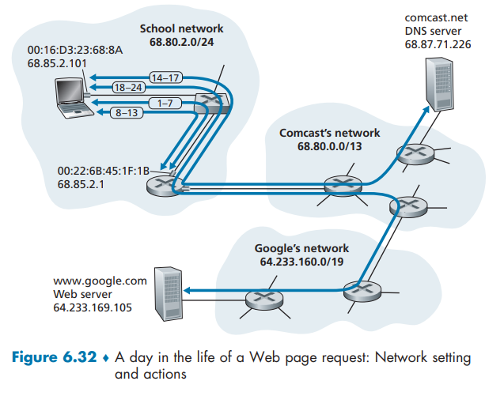

### 6.7.1 Getting Started: DHCP, UDP, IP, and Ethernet

假设鲍勃启动了他的笔记本电脑,然后通过以太网电缆连接到学校的以太网交换机,该交换机又连接到学校的路由器,如图6.32所示.学校的路由器连接到一个互联网服务提供商(ISP),在这个例子中是 comcast.net.在此场景中,comcast.net 为学校提供DNS服务；因此,DNS服务器位于康卡斯特(Comcast)的网络中,而不是学校的网络中.我们假设DHCP服务器运行在路由器内部,这种情况很常见.

当鲍勃首次将笔记本电脑连接到网络时,如果没有IP地址,他几乎无法进行任何操作.因此,鲍勃的笔记本电脑采取的第一个与网络相关的动作就是运行DHCP协议,从本地DHCP服务器获取一个IP地址以及其他信息：

1.  鲍勃笔记本电脑上的操作系统创建了一个DHCP请求消息(见4.3.3节),并将此消息放入一个UDP段(见3.3节)中,该UDP段的目的端口是67(DHCP服务器),源端口是68(DHCP客户端).然后,这个UDP段被放入一个IP数据报(见4.3.1节)中,该IP数据报的目的IP地址是广播地址(255.255.255.255),源IP地址是0.0.0.0,因为鲍勃的笔记本电脑此时还没有IP地址.
2.  包含DHCP请求消息的IP数据报随后被放入一个以太网帧(见6.4.2节)中.这个以太网帧的目的MAC地址是 FF:FF:FF:FF:FF:FF,以便该帧能够广播到所有连接到交换机的设备(希望其中包括DHCP服务器)；帧的源MAC地址则是鲍勃笔记本电脑的MAC地址,即 00:16:D3:23:68:8A.
3.  包含DHCP请求的广播以太网帧是鲍勃的笔记本电脑发送给以太网交换机的第一帧.交换机在所有出口端口上广播传入的帧,包括连接到路由器的那个端口.
4.  路由器在其MAC地址为 00:22:6B:45:1F:1B 的接口上接收到包含DHCP请求的广播以太网帧,并从以太网帧中提取出IP数据报.该数据报的广播IP目的地址表明,这个IP数据报应该由本节点的高层协议处理,因此数据报的有效载荷(一个UDP段)被解复用(见3.2节)上传到UDP层,并从UDP段中提取出DHCP请求消息.至此,DHCP服务器获得了DHCP请求消息.
5.  假设运行在路由器内的DHCP服务器能够分配在CIDR(见4.3.3节)地址块 68.85.2.0/24 范围内的IP地址.在这个例子中,学校内使用的所有IP地址因此都在康卡斯特的地址块内.假设DHCP服务器将地址 68.85.2.101 分配给了鲍勃的笔记本电脑.DHCP服务器创建一个DHCP ACK消息(见4.3.3节),其中包含这个IP地址、DNS服务器的IP地址(68.87.71.226)、默认网关路由器的IP地址(68.85.2.1)以及子网地址块(68.85.2.0/24)(等价于"网络掩码").这个DHCP消息被放入一个UDP段中,该UDP段又被放入一个IP数据报中,最后放入一个以太网帧中.该以太网帧的源MAC地址是路由器连接到学校网络的接口的MAC地址(00:22:6B:45:1F:1B),目的MAC地址是鲍勃笔记本电脑的MAC地址(00:16:D3:23:68:8A).
6.  包含DHCP ACK的以太网帧由路由器单播发送到交换机.因为交换机是自学习的(见6.4.3节),并且之前从鲍勃的笔记本电脑收到过一个以太网帧(包含DHCP请求),所以交换机知道将目的地址为 00:16:D3:23:68:8A 的帧只转发到连接鲍勃笔记本电脑的那个输出端口.
7.  鲍勃的笔记本电脑接收到包含DHCP ACK的以太网帧,从以太网帧中提取出IP数据报,从IP数据报中提取出UDP段,然后从UDP段中提取出DHCP ACK消息.鲍勃电脑上的DHCP客户端随后记录下其IP地址和DNS服务器的IP地址.它还将默认网关的地址安装到其IP转发表(见4.1节)中.鲍勃的笔记本电脑将会把所有目的地址不在其子网 68.85.2.0/24 范围内的数据报发送到默认网关.此时,鲍勃的笔记本电脑已经初始化了其网络组件,准备开始处理网页获取任务.(注意,实际上第四章中描述的四个DHCP步骤中,只有最后两个步骤在此是必要的.)

### 6.7.2 Still Getting Started: DNS and ARP

当鲍勃在网页浏览器中输入 ``www.google.com`` 的网址时,他便启动了一连串漫长的事件,这些事件最终将导致他的网页浏览器显示出谷歌的主页.鲍勃的网页浏览器首先创建一个 TCP 套接字(2.7节),该套接字将用于向 ``www.google.com`` 发送 HTTP 请求(2.2节).为了创建这个套接字,鲍勃的笔记本电脑需要知道 ``www.google.com`` 的 IP 地址.我们在 2.5 节学过,DNS 协议就是用来提供这种从名称到 IP 地址的转换服务的.

8.  因此,鲍勃笔记本电脑上的操作系统创建了一个 DNS 查询消息(2.5.3节),将字符串 "`www.google.com`" 放在 DNS 消息的"问题"部分.然后,这个 DNS 消息被放入一个目的端口为 53(DNS 服务器)的 UDP 段中.接着,该 UDP 段被放入一个 IP 数据报中,此 IP 数据报的目的 IP 地址是 68.87.71.226(在步骤 5 的 DHCP ACK 中返回的 DNS 服务器地址),源 IP 地址是 68.85.2.101.

9.  然后,鲍勃的笔记本电脑将包含 DNS 查询消息的数据报放入一个以太网帧中.这个帧将被发送(在链路层寻址)到鲍勃学校网络中的网关路由器.然而,尽管鲍勃的笔记本电脑通过上述步骤 5 中的 DHCP ACK 消息知道了学校网关路由器的 IP 地址(68.85.2.1),但它并不知道网关路由器的 MAC 地址.为了获取网关路由器的 MAC 地址,鲍勃的笔记本电脑需要使用 ARP 协议(6.4.1节).

10. 鲍勃的笔记本电脑创建了一个 ARP 查询消息,其目标 IP 地址为 68.85.2.1(默认网关),将该 ARP 消息放入一个目的地址为广播地址(FF:FF:FF:FF:FF:FF)的以太网帧中,并将该以太网帧发送给交换机,交换机再将这个帧递送给所有连接的设备,包括网关路由器.

11. 网关路由器在其连接学校网络的接口上接收到包含 ARP 查询消息的帧,并发现 ARP 消息中的目标 IP 地址 68.85.2.1 与其接口的 IP 地址相匹配.因此,网关路由器准备了一个 ARP 回复,指明其 MAC 地址 00:22:6B:45:1F:1B 对应 IP 地址 68.85.2.1.它将 ARP 回复消息放入一个以太网帧中,目的地址为 00:16:D3:23:68:8A(鲍勃的笔记本电脑),然后将该帧发送给交换机,交换机再将此帧递送给鲍勃的笔记本电脑.

12. 鲍勃的笔记本电脑接收到包含 ARP 回复消息的帧,并从 ARP 回复消息中提取出网关路由器的 MAC 地址(00:22:6B:45:1F:1B).

13. 鲍勃的笔记本电脑现在终于可以将包含 DNS 查询的以太网帧的目标地址填写为网关路由器的 MAC 地址了.请注意,该帧中的 IP 数据报的目的 IP 地址是 68.87.71.226(DNS 服务器),而该以太网帧的目的 MAC 地址是 00:22:6B:45:1F:1B(网关路由器).鲍勃的笔记本电脑将这个帧发送给交换机,交换机再将此帧递送给网关路由器.

### 6.7.3 Still Getting Started: Intra-Domain Routing to the  DNS Server

14.  网关路由器接收到该帧,并提取出包含 DNS 查询的 IP 数据报.路由器查找该数据报的目的地址 (68.87.71.226),并根据其转发表确定该数据报应发送到图 6.32 中康卡斯特网络最左侧的路由器.这个 IP 数据报被放入一个适合连接学校路由器和康卡斯特最左侧路由器之间链路的链路层帧中,然后通过该链路发送出去.

15.  康卡斯特网络中最左侧的路由器接收到该帧,提取出 IP 数据报,检查数据报的目的地址 (68.87.71.226),并根据其转发表确定转发出接口,以将数据报朝着 DNS 服务器的方向转发.该转发表已由康卡斯特的域内路由协议(如 RIP、OSPF 或 IS-IS,见 5.3 节)以及互联网的域间协议 BGP(见 5.4 节)所填充.

16.  最终,包含 DNS 查询的 IP 数据报到达了 DNS 服务器.DNS 服务器提取出 DNS 查询消息,在其 DNS 数据库(见 2.5 节)中查找名称 `www.google.com`,并找到包含 `www.google.com` 对应 IP 地址 (64.233.169.105) 的 DNS 资源记录(假设该记录当前已缓存在 DNS 服务器中).回想一下,此缓存数据源自 google.com 的权威 DNS 服务器(见 2.5.2 节).DNS 服务器形成一个包含此主机名到 IP 地址映射的 DNS 回复消息,并将该 DNS 回复消息放入一个 UDP 段中,再将此 UDP 段放入一个目的地址为鲍勃笔记本电脑 (68.85.2.101) 的 IP 数据报中.该数据报将通过康卡斯特网络转发回学校的路由器,再从那里经以太网交换机到达鲍勃的笔记本电脑.

17.  鲍勃的笔记本电脑从 DNS 消息中提取出服务器 `www.google.com` 的 IP 地址.最终,在经过大量工作之后,鲍勃的笔记本电脑现在准备连接 `www.google.com` 服务器了！

### 6.7.4 Web Client-Server Interaction: TCP and HTTP

18.  既然鲍勃的笔记本电脑已经获得了 `www.google.com` 的 IP 地址,它现在可以创建 TCP 套接字(2.7节),该套接字将用于向 `www.google.com` 发送 HTTP GET 消息(2.2.3节).当鲍勃创建 TCP 套接字时,他笔记本电脑中的 TCP 协议必须首先与 `www.google.com` 的 TCP 协议执行三次握手(3.5.6节).因此,鲍勃的笔记本电脑首先创建一个目的端口为 80(用于 HTTP)的 TCP SYN 段,将该 TCP 段放入一个目的 IP 地址为 64.233.169.105 (`www.google.com`) 的 IP 数据报中,再将这个数据报放入一个目的 MAC 地址为 00:22:6B:45:1F:1B(网关路由器)的帧中,然后将该帧发送给交换机.

19.  学校网络、康卡斯特网络和谷歌网络中的路由器,使用各自路由器中的转发表,将包含 TCP SYN 的数据报向 `www.google.com` 转发,如上述步骤 14-16 所述.回想一下,控制数据包在康卡斯特和谷歌网络之间的域间链路上转发的路由器转发表条目,是由 BGP 协议(第5章)决定的.

20.  最终,包含 TCP SYN 的数据报到达了 `www.google.com`.TCP SYN 消息从数据报中提取出来,并被解复用到与端口 80 关联的欢迎套接字.随后为谷歌 HTTP 服务器和鲍勃笔记本电脑之间的 TCP 连接创建一个连接套接字(2.7节).接着生成一个 TCP SYNACK(3.5.6节)段,将其放入一个目的地址为鲍勃笔记本电脑的数据报中,最后放入一个适合连接 `www.google.com` 与其第一跳路由器的链路的链路层帧内.

21.  包含 TCP SYNACK 段的数据报穿过谷歌、康卡斯特和学校网络进行转发,最终到达鲍勃笔记本电脑中的以太网控制器.该数据报在操作系统内被解复用到在步骤 18 中创建的 TCP 套接字,该套接字随之进入已连接状态.

22.  随着鲍勃笔记本电脑上的套接字现在(终于！)准备好向 `www.google.com` 发送字节,鲍勃的浏览器生成了包含要获取的 URL 的 HTTP GET 消息(2.2.3节).然后,该 HTTP GET 消息被写入套接字,GET 消息成为 TCP 段的有效载荷.该 TCP 段被放入一个数据报中,并按照上述步骤 18-20 的方式发送并传递到 `www.google.com`.

23.  `www.google.com` 的 HTTP 服务器从 TCP 套接字中读取 HTTP GET 消息,创建一个 HTTP 响应消息(2.2节),将请求的网页内容放入 HTTP 响应消息的正文中,然后将该消息发送到 TCP 套接字.

24.  包含 HTTP 回复消息的数据报穿过谷歌、康卡斯特和学校网络进行转发,到达鲍勃的笔记本电脑.鲍勃的网页浏览器程序从套接字中读取 HTTP 响应,从 HTTP 响应的正文中提取出网页的 HTML 代码,并最终(终于！)显示出该网页！

