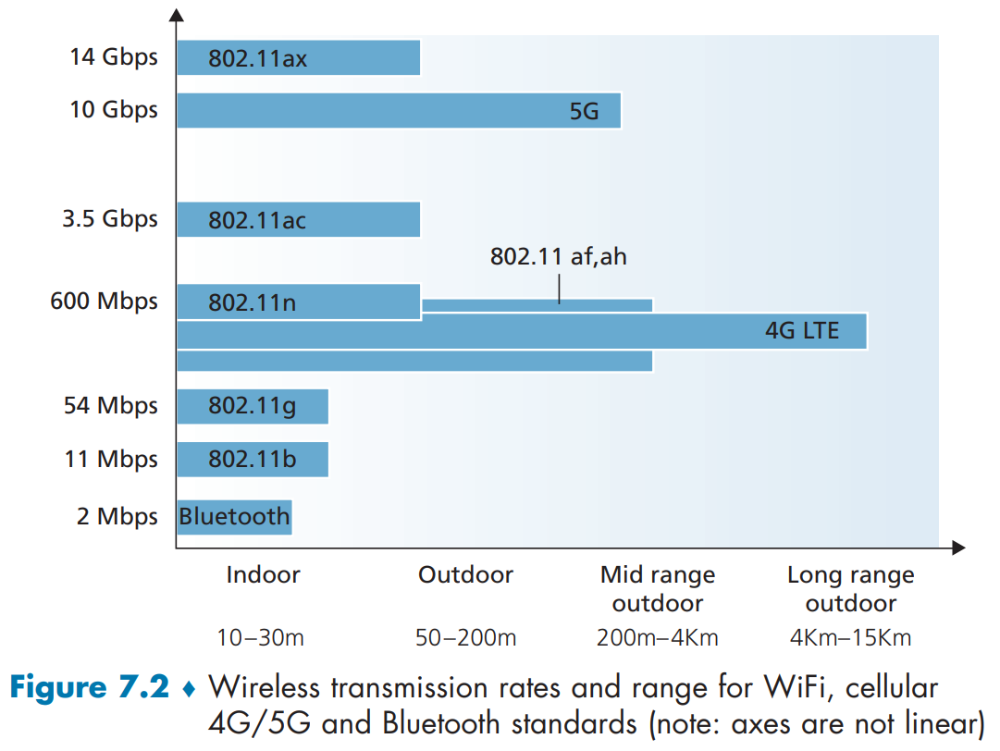
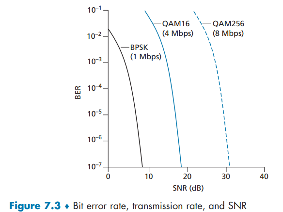
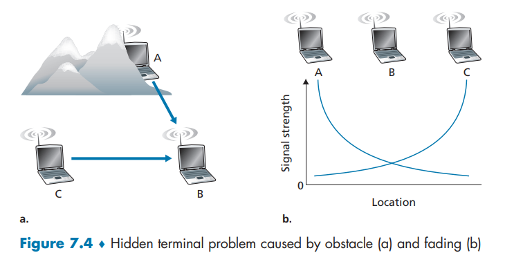
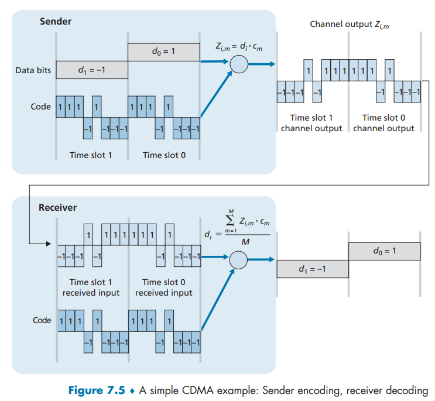
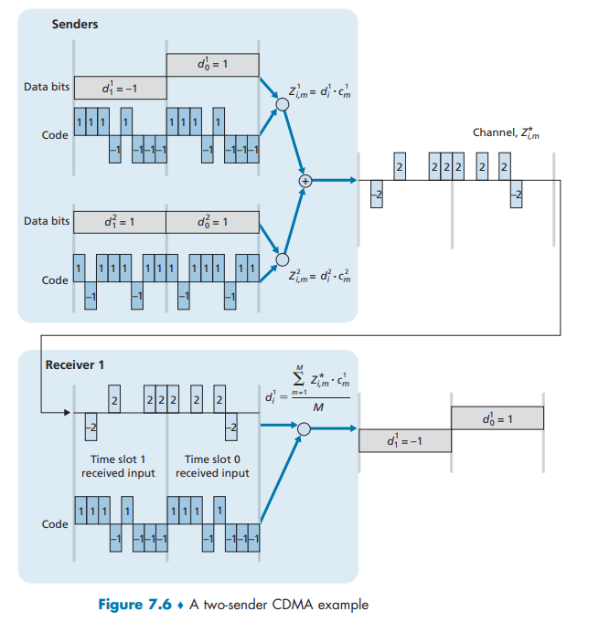

# Wireless and and Mobile Network

## 7.1 Introduction
无限网络重要到我们需要单独开一个章节来学习 尽管书中的内容已经相当过时 . 引言中直接给出大量专业的名词并不好 更何况我们并非毫无基础 这些概念你应该经常在日常生活中接触到 :

-   **无线主机 wireless host**：就是各种能连接到无线互联网的设备 是运行应用程序的端系统设备.主机本身可能移动,也可能不移动.
-   **无线链路 wireless communication link** : 无限主机通过无线链路连接到基站或者另一台无线主机.不同的无线链路技术具有不同的传输速率和能够传输不同的距离,大概能力如[Fig7.2]所示
    

在[Fig7.1]展示了无线网络的结构层次 下面是简单的说明 :

- **基站 base station** : 基站是无线网络基础设施的关键设备,作为无线主机与有线骨干网络之间的链路层中继,负责无线主机的数据收发、传输协调及移动管理,使无线主机能接入更大规模网络（如因特网）,典型如蜂窝网络的基站和WiFi的接入点.
    - 当我们说一台无线主机与某基站“相关联”时,则是指：
        1.   该主机位于该基站的无线通信覆盖范围
        2.   该主机通过该基站来中继它与更大网络之间的数据.比如蜂窝网络中的**蜂窝塔cell tower**和[Fig7.1]中的**无线接入点wireless access point**
    - 在无线 LAN 中,基站与更大网络相连,起着链路层基础设施的作用.

- 无线主机有两种运行模式
    1.   **基础设施模式**：传统网络服务（地址分配、路由等）由 “主机通过基站接入的更大网络” 提供,主机无需自行处理这些服务,仅需专注于数据收发和接入基站；
    2.   **自组织网络模式**：不依赖基站,上述所有传统网络服务（路由、地址分配、类似 DNS 的名字转换等）均需由网络中的无线主机自身协同提供,而非依赖外部网络基础设施.
- 当一台移动主机的移动超出一个基站的覆盖范围而到达另一个基站的覆盖范围后,它将改变其接入到更大网络的连接点（即改变与之相关联的基站）,这一过程称作**切换 handoff**.显然这会带来许多问题 都需要解决 .

我们能够根据两个最基本的准则来对无线网络分类:(1)无线网络中的分组仅经过一跳无线链路还是多跳无线链路;(2)网络中是否存在基站等基础设施.
1. 单跳、基于基础设施

    这类网络包含一个连接到更大规模有线网络的基站,且基站与无线主机之间的所有通信均通过单跳无线链路完成.这种类型占了大多数.

2. 单跳、无基础设施

    这类网络中不存在连接到有线网络的基站,但该单跳网络中的某个节点可能会协调其他节点的传输.蓝牙网络就属于单跳、无基础设施的网络.

3. 多跳、基于基础设施

    这类网络中存在一个通过有线方式连接到更大规模网络的基站,但部分无线节点可能需要通过其他无线节点中继通信数据.比如家庭中部署"无线网状网络 wireless mesh networks"

4. 多跳、无基础设施

    这类网络中没有基站,节点为了到达目标节点,可能需要在多个其他节点之间中继报文.节点也可能具备移动性,节点间的连接关系会动态变化 —— 这类网络被称为**移动自组织网络MANETs**.如果移动节点是车辆,则该网络称为**车载自组织网络 VANETs**

在本章中,我们将把主要学习内容限制在单跳网络,并且大多数是基于基础设施的网络.

## 7.2 Wireless Links and Network Characteristics

无线链路与有线链路在若干重要方面存在差异：

-   **信号强度衰减**.电磁波在穿越介质时会产生衰减,如穿透墙壁.即便在自由空间中,随着收发双方距离的增加,信号也会产生弥散现象,导致信号强度减弱（这常被称为**path loss路径损耗**
-   **外部干扰源**.工作在相同频段的无线电发射源会相互干扰.例如2.4GHz无线电话与802.11b无线局域网就处于相同频段.因此当802.11b无线局域网用户使用2.4GHz无线电话通话时,网络性能和通话质量都会显著下降.除了发射源干扰,环境中的电磁噪声（如附近运转的电机、微波炉）也会造成干扰.这正是后续802.11标准将工作频段转向5GHz的原因之一.
-   **多径传播**.当电磁波部分能量经物体或地面反射,形成发送端与接收端之间不同长度的传播路径时,就会产生多径传播现象.这会导致接收端信号出现模糊失真.比如在山谷之中你会收到这样的信号:"你好\~好\~好\~",不仅是有回声的问题,也会更加模糊,老式电视的雪花就是这么产生的(可能一架飞机经过造成了一定的反射面积都会造成雪花).若收发双方之间存在移动物体,多径传播效应还会随时间动态变化.

可以看出,我们需要更加慎重的考虑**比特错误**. 因此, 无线链路传输时不仅采用强大的 **CRC 错误检测码**, 还采用链路级可靠数据传输协议来重传损坏的帧,这都是很有必要的.

---

**信噪比 signal-to-noise ratio SNR** 是接收信号强度与噪声强度的相对度量.

信噪比的定义有很多形式 下面给出一种形式化定义(以分贝`dB`做单位) 和高中物理记号的一致 $P$表示功率 $A$表示振幅
$$
\text{SNR}_{\text{dB}} = 10 \log_{10} \left( \frac{P_{\text{signal}}}{P_{\text{noise}}} \right) = 10 \log_{10} \left( \frac{A_{\text{signal}}^2}{A_{\text{noise}}^2} \right) = 20 \log_{10} \left( \frac{A_{\text{signal}}}{A_{\text{noise}}} \right)
$$
显然,信噪比越大, 接收器从背景噪声中提取传输信号就越容易.

---

**比特差错率 bit error rate BER** 是数字传输系统中数据完整性的关键度量。

比特差错率定义为在特定时间间隔内，发生差错的比特数与传输总比特数之比。

$$
\text{BER} = \frac{\text{传输中出错的比特数}}{\text{传输的总比特数}}
$$
显然，比特差错率越低，代表通信系统的可靠性就越高！

---

**SNR 是原因，BER 是结果**。通常，更高的 SNR 会导致更低的 BER。

无线通信的性能核心，在于对信噪比、比特差错率与数据传输速率这三个关键参数的深刻理解与巧妙权衡。它们之间存在着内在的、无法绕开的制约关系，共同构成了无线系统设计的基本框架。

-   信噪比与比特差错率之间存在着直接的因果关系。对于任何一种固定的调制与编码方案，提升信噪比是降低比特差错率最直接的物理手段。这通常通过增加发射功率来实现。然而，这种关系并非线性无限延伸，它面临着两个主要的现实约束：
    1.   边际效益递减，当功率提升到一定程度后，对比特差错率的改善将变得微乎其微
    2.   代价高昂，增加功率不仅意味着更快的能耗，还会增大对同一共享信道中其他通信节点的干扰，从而降低整体网络容量。

-   在给定的信噪比水平下，传输速率与可靠性也需要取舍
    -   高阶调制技术能够在每个符号中承载更多比特，从而提供更高的数据传输速率。但是在相同的噪声环境下，更容易被干扰而发生判决错误，导致更高的比特差错率。
    -   反之，低阶调制方案虽然速率较低，但因其符号间距离大，抗干扰能力强，在恶劣信道条件下能提供更可靠的连接。
    -   不存在一种完美的调制方案。一个在低信噪比下无法使用的高阶调制方案，在高信噪比环境下可能恰恰是实现高速传输的最佳选择。

正是这种动态的、依赖于信道状态的权衡关系，催生了现代无线通信系统中一项至关重要的技术——**自适应调制与编码**。该技术的核心思想是，系统不再固定使用一种调制方式，而是持续地监测信道的瞬时信噪比质量，并据此动态地调整调制与编码方案。当接收端信噪比较高时，系统会自动选择高阶调制以最大化吞吐量；当信噪比下降时，系统则会稳健地回退到低阶调制，优先保证连接的可靠性。这种动态自适应机制，使得系统能够在时变的无线环境中，始终保持在逼近信道容量的状态下工作，它是当今Wi-Fi、4G/5G等所有先进无线网络实现高效通信的基石。

另外,如果考虑到多个节点的存在情况就会更加复杂 : 如果多个发射节点使用同一个频率的话 会产生碰撞 . 这些都需要在设计协议的时候解决 .

[Fig7.4]就展示了**隐藏终端问题 hidden terminal problem**的两种典型场景来

-   [Fig7.4(a)]障碍物导致的隐藏终端问题
    -   场景：站点 A 和站点 C 都向站点 B 传输数据。
    -   关键：物理障碍物（如山脉）阻挡了 A 和 C 之间的信号，使 A 和 C**无法感知到对方的传输**。
    -   结果：A 和 C 同时向 B 传输时，信号在 B 处发生碰撞，但 A 和 C 都不知道碰撞发生(彼此隐藏)

-   [Fig7.4(b)]衰减导致的隐藏终端问题

    -   场景：A 和 C 的信号强度随距离衰减。

    -   关键：A 和 C 的信号不足以让对方检测到，但**足以在 B 处产生干扰**。

    -   结果：同样导致 B 处发生碰撞，而 A 和 C 无法察觉(彼此隐藏)

### 7.2.1 CDMA

回顾第6章，当多个主机通过**共享介质**进行通信时，需要采用特定的协议来确保不同发送端产生的信号在接收端不会相互干扰。在第6章中，我们介绍了三类介质访问控制协议：**信道划分 Channel Partitioning**、**随机接入 Random Access** 和**轮询 Taking Turns**。码分多址 CDMA 属于信道划分协议家族，在**无线局域网 Wireless LAN**和**蜂窝网络 Cellular Network**中广泛应用

在CDMA协议中，每个待发送的数据比特会通过一个高速变化的信号,即**码序列 Code**,进行编码处理，这个信号的变换速率,即**码片速率 Chipping Rate**远高于原始数据比特的速率。

[Fig7.5]展示了一个简化的理想CDMA编码/解码场景。假设原始数据比特到达CDMA编码器的速率定义了基本时间单位，即每个原始数据比特的传输需要一个比特时隙。令 $d_i$ 表示第 $i$ 个时隙的数据比特值。为便于数学处理，我们将数值为0的数据比特表示为 $-1$。每个比特时隙又进一步划分为 $M$ 个更小的**迷你时隙 Mini-slots**（[Fig7.5]中 $M=8$，实际应用中 $M$ 值通常更大）。发送端使用的CDMA码是一个包含 $M$ 个元素的序列 $c_m$（$m=1,...,M$），每个元素的取值为 $+1$ 或 $-1$。在图7.5的示例中，发送端使用的 $M$ 位CDMA码为 $(1,1,1,-1,1,-1,-1)$。

为了具体说明CDMA的工作机制，我们重点关注第 $i$ 个数据比特 $d_i$ 的处理过程。在传输 $d_i$ 的第 $m$ 个迷你时隙期间，CDMA编码器的输出 $Z_{i,m}$ 是数据比特 $d_i$ 与指定CDMA码中第 $m$ 个码片 $c_m$ 的乘积：

$$
Z_{i,m} = d_i \times c_m \tag{7.1}
$$
在无干扰的理想情况下，接收端会接收到编码后的比特 $Z_{i,m}$，并通过以下计算还原原始数据比特 $d_i$：

$$
d_i = \frac{1}{M} \sum_{m=1}^{M} Z_{i,m} \times c_m \tag{7.2}
$$

>   [!NOTE]
>
>   以上是书中原文的表述方式 实际上用到的性质是 : $ d_i \oplus c_i \oplus c_i = d_i $ .

到目前为止我们仍然不知道这样做有什么用。**当数据比特与其他发送端的传输信号混合时，CDMA接收端如何还原出发送端的原始数据呢？**

CDMA技术基于一个关键特性：**干扰传输比特信号具有可加性**。只要我们使用对应的码序列解码,就可以不受干扰的得到正确的结果.

例如，如果在同一个迷你时隙内，三个发送端发送了数值 $1$，而第四个发送端发送了数值 $-1$，那么所有接收端在该迷你时隙内接收到的信号总和就是 $2$（因为 $1+1+1-1=2$）。

在存在多个发送端的情况下，发送端 $s$ 仍然按照[公式 7.1]的方式计算其编码输出 $Z^s_{i,m}$。但在接收端，第 $i$ 个比特时隙的第 $m$ 个迷你时隙内接收到的信号值，实际上是所有 $N$ 个发送端在该时隙传输信号的总和：

$$
Z^{total}_{i,m} = \sum_{s=1}^{N} Z^s_{i,m}
$$
令人惊叹的是，只要精心选择发送端的码序列，每个接收端都可以通过使用目标发送端的码序列，采用与公式(7.2)完全相同的方式，从聚合信号中恢复出特定发送端的数据：

$$
d_i = \frac{1}{M} \sum_{m=1}^{M} Z^{total}_{i,m} \cdot c_m \tag{7.3}
$$

>   [!CAUTION]
>
>   书上这一段讲得实在不好 我结合AI加人工审核给出以下说明 :
>
>   ---
>
>   我们沿用书中的语言 使用 $M=8$ 那么我们可以得到两个特定的Code :
>   $$
>   \mathbf{c}_1, \mathbf{c}_2 \in \{-1, +1\}^8
>   $$
>
>   满足以下性质(实际上产生Code的方式有很多 这里不介绍怎么产生 仅仅借用$\text{Walsh}$码的一些定义和性质)：
>
>   1. 正交性 **实际上是三角函数的正交性** ：  
>      $$
>      \langle \mathbf{c}_1, \mathbf{c}_2 \rangle 
>      = \mathbf{c}_1^T \mathbf{c}_2 
>      = \sum_{m=1}^{8} c_{1,m} c_{2,m} 
>      = 0
>      $$
>
>   2. 每个码自身能量为 $M$：  
>      $$
>      \|\mathbf{c}_1\|^2 = \mathbf{c}_1^T \mathbf{c}_1 = 8, \quad \|\mathbf{c}_2\|^2 = \mathbf{c}_2^T \mathbf{c}_2 = 8
>      $$
>
>   现在考虑发送端要发送的每**一个比特**（+1 表示逻辑1，-1 表示逻辑0）：
>
>   - 用户1要发送的比特：$ b_1 \in \{+1, -1\} $
>   - 用户2要发送的比特：$ b_2 \in \{+1, -1\} $
>
>   #### 1. 发送端扩频信号
>
>   用户1发送的扩频后向量(满足向量数乘)：  
>   $$
>   \mathbf{s}_1 = b_1 \mathbf{c}_1
>   $$
>
>   用户2发送的扩频后向量(满足向量数乘)：  
>   $$
>   \mathbf{s}_2 = b_2 \mathbf{c}_2
>   $$
>
>   #### 2. 信道叠加
>
>   接收端收到的**混合信号向量**（8个`chip` 本质可以类比正弦函数的叠加）：
>
>   $$
>   \mathbf{r} 
>   = \mathbf{s}_1 + \mathbf{s}_2 
>   = b_1 \mathbf{c}_1 + b_2 \mathbf{c}_2
>   $$
>
>   这就是[Fig7.6]最右边那一列$Z^{*}_{i,m}$ .
>
>   #### 3. 接收端1只用自己的码 c₁ 进行相关解扩
>
>   接收机1做标准的**匹配滤波/相关接收**（内积操作）：
>
>   $$
>   \hat{b}_1 
>   = \mathbf{c}_1^T \mathbf{r} 
>   $$
>
>   把 r 代入：
>
>   $$
>   \begin{align}
>   \hat{b}_1 
>   &= \mathbf{c}_1^T (b_1 \mathbf{c}_1 + b_2 \mathbf{c}_2) \\
>   &= b_1 (\mathbf{c}_1^T \mathbf{c}_1) + b_2 (\mathbf{c}_1^T \mathbf{c}_2) \\
>   &= b_1 \cdot 8 + b_2 \cdot 0 \\
>   &= 8 b_1
>   \end{align}
>   $$
>
>   所以：
>
>   $$
>   \hat{b}_1 = 8 b_1
>   \Rightarrow 
>   b_1 = \frac{1}{8} \mathbf{c}_1^T \mathbf{r} 
>   \quad \text{（完美无误码恢复）}
>   $$
>
>   同理，接收机2只用自己的码 c₂：
>
>   $$
>   \hat{b}_2 = \mathbf{c}_2^T \mathbf{r} = 8 b_2 
>   \Rightarrow 
>   b_2 = \frac{1}{8} \mathbf{c}_2^T \mathbf{r}
>   $$
>
>   可见 使用正交的`Code`的威力 . 只要满足正交性 我们都可以用这样的方法不受干扰的传递数据 .
>
>   ---
>
>   你可能会好奇(实际上就是我好奇 不过你的线代知识比我扎实的话应该很容易就能想到这些) :
>
>   **线性代数中 n 维空间有 n 个正交基 , 但是 CDMA 要求的不仅仅是正交基，而是全部由 ±1 构成的正交基！**
>
>   ### Hadamard 矩阵定理
>
>   **Hadamard 猜想（已被证明的充分必要条件）**：
>
>   长度为 n、元素为 ±1、且行两两正交的矩阵（Hadamard 矩阵）存在的充要条件是：
>
>   $$
>   n = 1 \quad \text{or} \quad n = 2 \quad \text{or} \quad n \equiv 0(mod \, 4)
>   $$
>   截至 2025 年 已经有几百个$n$阶Hadamard矩阵被构造出来 但还有一些没有被构造出来
>
>   #### 为什么"普通的 n 个正交基"不能直接拿来用 or 为什么一定要使用 ±1 的基
>
>   -   标准基 e₁ = (1,0,0,…,0) 含有大量 0 → 不能直接发送（发送 0 就浪费功率） 
>-   再例如 傅里叶基）坐标是 $e^{2πik/n} \in C$ 
>   -   使用 Gram-Schmidt 从随机向量正交化得到一组实正交基，坐标也几乎不可能全落在 ±1 上。
>   
>   所以书使用$M=8$做例子 它在满足条件的数中是一个不大不小的例子 现实中也经常使用 .
>
>   ---
>   
>   这里或许你还想知道为什么`发送0就浪费功率` 因为篇幅限制我就不写了 去问问ai吧 其实我感觉这个说法也不是很对 我毕竟没有学过电气知识 也很好理解

>   [!NOTE]
>
>   这个原理可以通过第6章提到的**鸡尾酒会效应 Cocktail Party Effect** 来类比：CDMA协议就像是在一个多种语言同时交流的聚会中，人们能够专注于理解自己熟悉的语言，同时过滤掉其他对话。
>
>   由此可见，CDMA本质上是一种空间划分协议，它通过分配不同的码序列（而非时间或频率资源）为每个节点提供独立的通信通道。
>
>   更详细的讨论书中未说明 .

## 7.3 WiFi: 802.11 Wireless LANs

无线局域网已遍布工作场所、家庭、教育机构、咖啡馆、机场和街头角落，成为当今互联网最重要的接入网络技术之一。尽管20世纪90年代开发了多种无线局域网技术和标准，但有一类标准已明显胜出：**IEEE 802.11无线局域网，即广为人知的WiFi**。本节将深入探讨802.11无线局域网，详细解析其帧结构、介质访问协议以及与有线以太网的互联互通。

| IEEE 802.11 standard | Year            | Max data rate | Range | Frequency                    |
| -------------------- | --------------- | ------------- | ----- | ---------------------------- |
| 802.11 b             | 1999            | 11 Mbps       | 30 m  | 2.4 Ghz                      |
| 802.11 g             | 2003            | 54 Mbps       | 30 m  | 2.4 Ghz                      |
| 802.11 n (WiFi 4)    | 2009            | 600           | 70 m  | 2.4, 5 Ghz                   |
| 802.11 αc (WiFi 5)   | 2013            | 3.47 Gpbs     | 70 m  | 5 Ghz                        |
| 802.11 αx (WiFi 6)   | 2020 (expected) | 14 Gbps       | 70 m  | 2.4, 5 Ghz                   |
| 802.11 af            | 2014            | 35–560 Mbps   | 1 Km  | unused IV bands (54–790 MHz) |
| 802.11 ah            | 2017            | 347 Mbps      | 1 Km  | 900 MHz                      |

1.  **主要技术特性（共同点）**
    -   **帧格式**： 所有`802.11 b/g/n/ac/ax`标准都使用相同的帧结构。
    -   **介质访问协议**： 普遍使用**CSMA/CA**。
    -   **向后兼容**： 新旧设备可以互操作（例如，802.11g设备可以连接802.11ax基站）。
2.  **各代标准概览**
    -   **802.11 b/g/n/ac/ax**： 面向短距离无线局域网，覆盖范围通常<70米。
    -   **品牌化**： 802.11n → WiFi 4；802.11ac → WiFi 5；802.11ax → WiFi 6。
    -   `802.11 af/ah`： 面向物联网和传感器网络，传输距离更长。
3.  **物理层关键差异**
    -   **工作频段**：
        -   **2.4 GHz**： 覆盖范围广，但易受微波炉、电话等同频段设备干扰。
        -   **5 GHz**： 速率更高，但在相同功率下传输距离较短，多径衰减更严重。
    -   **先进技术**：
        -   **MIMO（多输入多输出）**： 被802.11n/ac/ax采用，使用多根天线同时收发数据，提升速度和可靠性。
        -   **波束成形**： 被802.11ac/ax采用，将信号定向聚焦至接收设备，以减少干扰、增加距离和提升速率。
    -   **调度机制**： 802.11ax新增了基站对终端设备的**集中调度**功能。
4.  **重要提示**
    -   标准中宣传的**数据速率是理想环境下的理论值**。
    -   实际使用中的速度会因距离、干扰和环境因素而**大幅波动**。
    -   Your Mileage May Vary 你的里程可能会有所不同 YMMV

### 7.3.1 The 802.11 Wireless LAN Architecture

